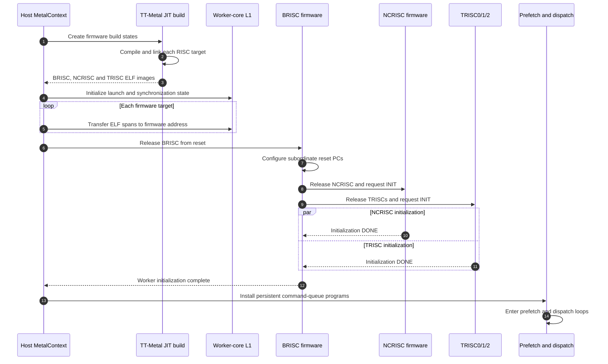
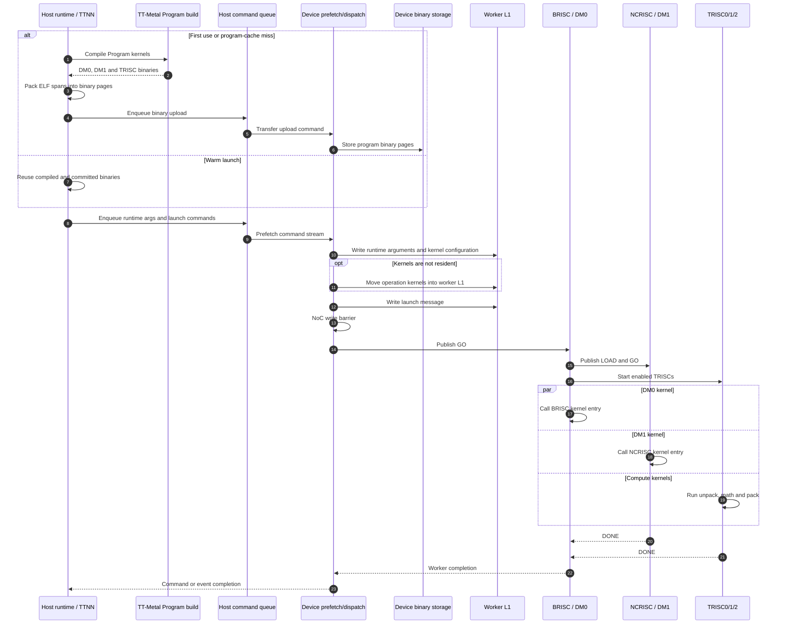
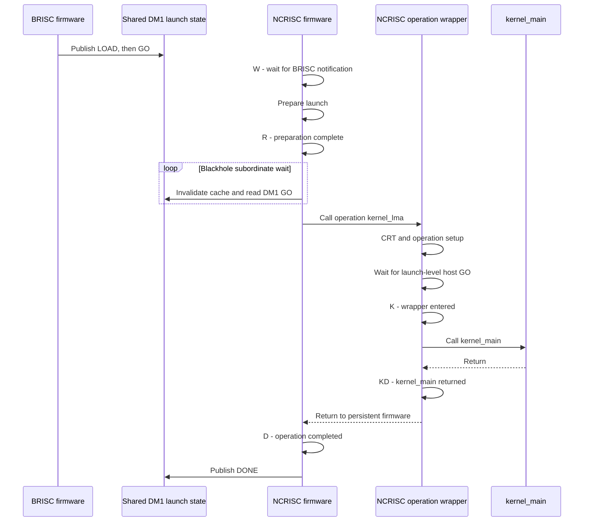
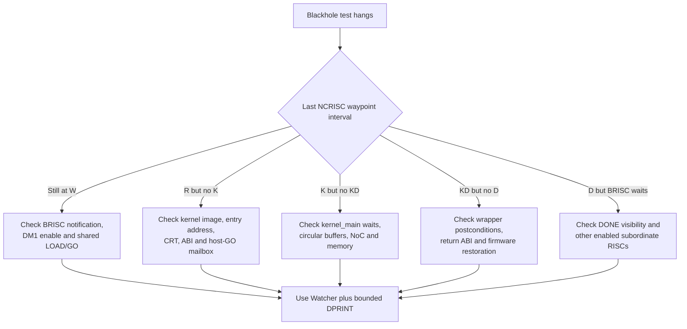
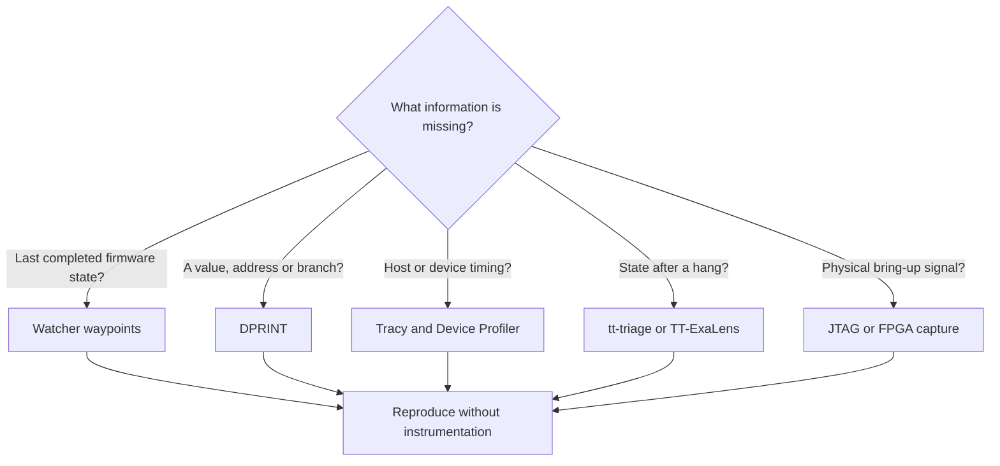
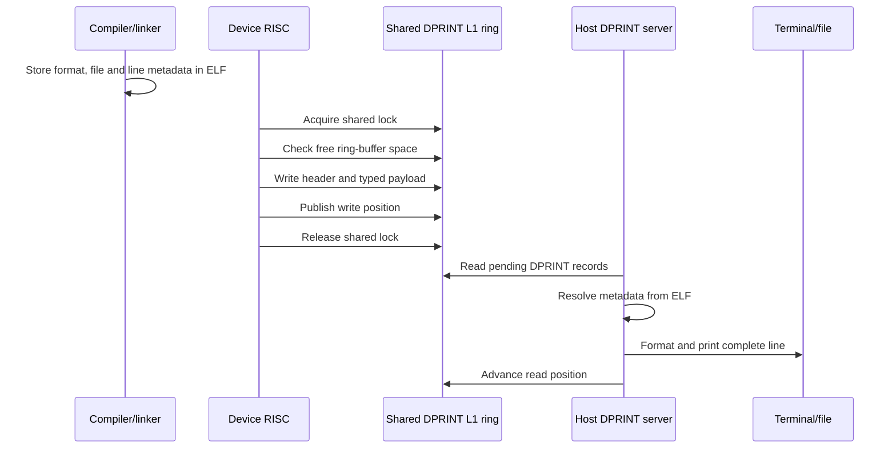

# Debug low-level kernel flow

**Discussion subpage 06 — host, firmware, operation wrapper and kernel debugging**

Interactive Mermaid page:
<https://buicongnguyen.github.io/tt-sim/debug-low-level-kernel-flow.html>

Source baseline:
[`tt-metal@50a82f835593512c4176546b4af68d7e91315a86`](https://github.com/tenstorrent/tt-metal/tree/50a82f835593512c4176546b4af68d7e91315a86)

This page consolidates the low-level diagrams that are otherwise distributed
between the firmware-flow, Blackhole bring-up and synchronization guides. It
does not introduce a new execution model. Its purpose is to keep the code,
launch boundary and debugging decision visible together.

## Waypoint definitions

| Waypoint | Meaning |
|---|---|
| `W` | NCRISC persistent firmware waits for BRISC `LOAD` / `GO`. |
| `R` | NCRISC launch preparation completed; operation handoff follows. |
| `K` | The operation wrapper is about to call `kernel_main`. |
| `KD` | `kernel_main` returned to the operation wrapper. |
| `D` | Control returned to persistent NCRISC firmware and completion is published. |

`R` without `K` and `K` without `KD` are different failures. The first is
before operation-wrapper entry; the second is inside `kernel_main` or the code
it calls.

## 1. Firmware build and Blackhole cold boot

Code: [firmware build targets](https://github.com/tenstorrent/tt-metal/blob/50a82f835593512c4176546b4af68d7e91315a86/tt_metal/jit_build/build.cpp#L628-L790),
[host firmware placement](https://github.com/tenstorrent/tt-metal/blob/50a82f835593512c4176546b4af68d7e91315a86/tt_metal/impl/device/firmware/risc_firmware_initializer.cpp#L1053-L1199),
[BRISC subordinate initialization](https://github.com/tenstorrent/tt-metal/blob/50a82f835593512c4176546b4af68d7e91315a86/tt_metal/hw/firmware/src/tt-1xx/brisc.cc#L181-L275).

## 2. First operation and warm relaunch

Code: [operation-binary generation](https://github.com/tenstorrent/tt-metal/blob/50a82f835593512c4176546b4af68d7e91315a86/tt_metal/impl/kernels/kernel.cpp#L900-L955),
[dispatch command sequence](https://github.com/tenstorrent/tt-metal/blob/50a82f835593512c4176546b4af68d7e91315a86/tt_metal/impl/program/dispatch.cpp#L3169-L3277),
[BRISC run loop](https://github.com/tenstorrent/tt-metal/blob/50a82f835593512c4176546b4af68d7e91315a86/tt_metal/hw/firmware/src/tt-1xx/brisc.cc#L389-L592).

## 3. NCRISC operation handoff

Code: [NCRISC persistent loop](https://github.com/tenstorrent/tt-metal/blob/50a82f835593512c4176546b4af68d7e91315a86/tt_metal/hw/firmware/src/tt-1xx/ncrisc.cc#L77-L192),
[NCRISC operation wrapper](https://github.com/tenstorrent/tt-metal/blob/50a82f835593512c4176546b4af68d7e91315a86/tt_metal/hw/firmware/src/tt-1xx/ncrisck.cc#L38-L95),
[launch-level host-GO wait](https://github.com/tenstorrent/tt-metal/blob/50a82f835593512c4176546b4af68d7e91315a86/tt_metal/hw/inc/internal/firmware_common.h#L194-L206).

NCRISC does not call BRISC. BRISC is the supervisor that publishes shared
launch state; NCRISC observes that state and calls its own operation wrapper.

## 4. First missing waypoint boundary

Code: [four-byte Watcher waypoint](https://github.com/tenstorrent/tt-metal/blob/50a82f835593512c4176546b4af68d7e91315a86/tt_metal/hw/inc/api/debug/waypoint.h#L8-L41),
[NCRISC firmware markers](https://github.com/tenstorrent/tt-metal/blob/50a82f835593512c4176546b4af68d7e91315a86/tt_metal/hw/firmware/src/tt-1xx/ncrisc.cc#L77-L192),
[operation-wrapper markers](https://github.com/tenstorrent/tt-metal/blob/50a82f835593512c4176546b4af68d7e91315a86/tt_metal/hw/firmware/src/tt-1xx/ncrisck.cc#L38-L95).

## 5. Debugging-tool selection

References: [Watcher](https://docs.tenstorrent.com/tt-metal/latest/tt-metalium/tools/watcher.html),
[Device Print](https://docs.tenstorrent.com/tt-metal/latest/tt-metalium/tools/device_print.html),
[Device Program Profiler](https://docs.tenstorrent.com/tt-metal/latest/tt-metalium/tools/device_program_profiler.html),
[Tracy](https://docs.tenstorrent.com/tt-metal/latest/tt-metalium/tools/tracy_profiler.html).

## 6. DPRINT mechanism

Code: [DPRINT API contract](https://github.com/tenstorrent/tt-metal/blob/50a82f835593512c4176546b4af68d7e91315a86/tt_metal/hw/inc/api/debug/dprint.h#L9-L29),
[device serializer/ring protocol](https://github.com/tenstorrent/tt-metal/blob/50a82f835593512c4176546b4af68d7e91315a86/tt_metal/hw/inc/api/debug/device_print.h#L168-L244),
[host DPRINT server](https://github.com/tenstorrent/tt-metal/blob/50a82f835593512c4176546b4af68d7e91315a86/tt_metal/impl/debug/dprint_server.cpp#L565-L680).

## Logic review

- Cold boot and operation launch are separate lifetimes.
- BRISC supervises subordinate worker RISCs; NCRISC does not call BRISC.
- `R` is firmware-side launch preparation, not proof that `kernel_main` ran.
- `K` without `KD` moves the investigation into the operation kernel.
- A NoC barrier orders the relevant NoC engine state; it is not interchangeable
  with a compiler barrier or a generic RISC-V `fence`.
- DPRINT, Watcher and profiling perturb execution differently. Capture a clean
  reproduction and normally run them separately.

For the longer analysis and smaller per-paragraph diagrams, continue with
[the firmware-to-kernel flow](./RISC_FIRMWARE_TO_KERNEL_FLOW.md),
[the Blackhole bring-up chain](./DISCUSSION_BLACKHOLE_BRINGUP.md), and
[the Blackhole synchronization field guide](./DISCUSSION_BLACKHOLE_SYNCHRONIZATION.md).
