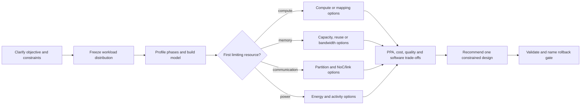
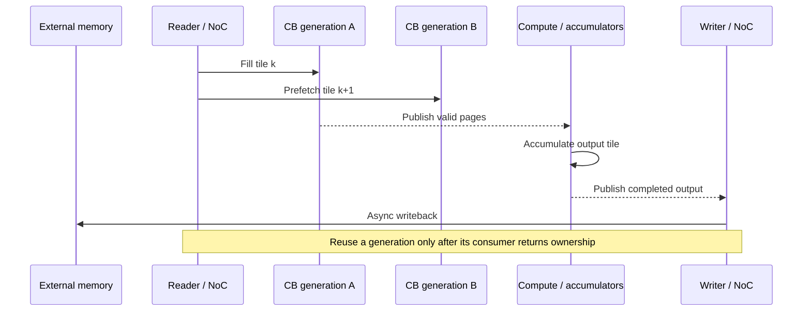
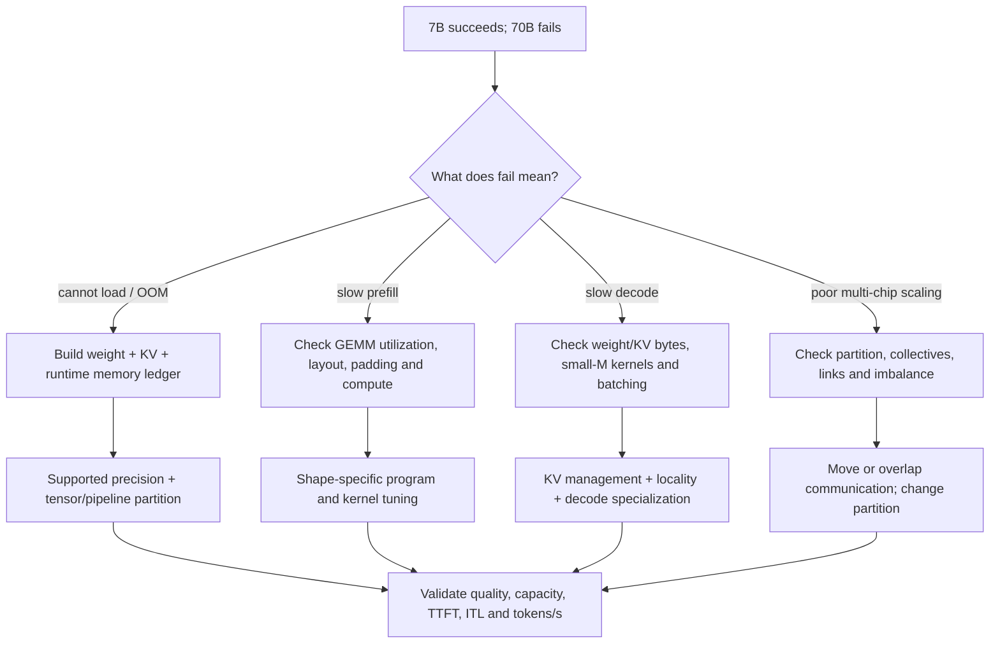
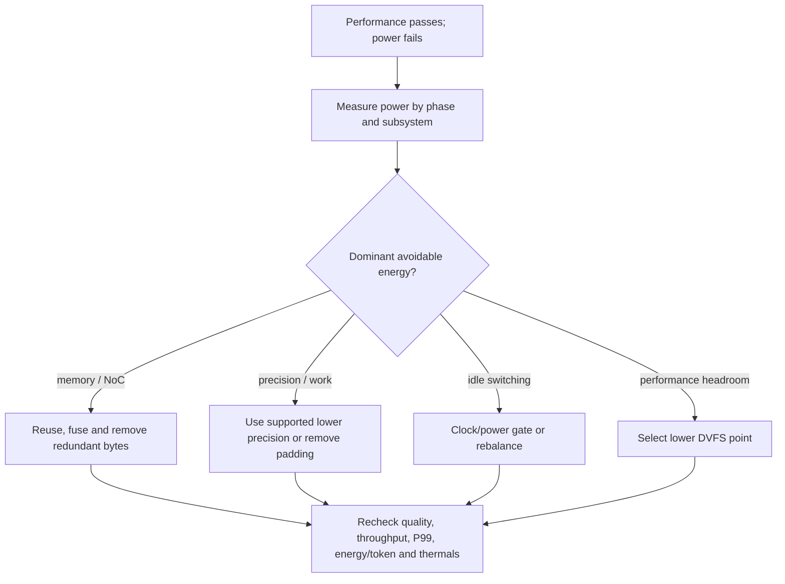

# NPU architecture interview workbench

**Discussion subpage 07 — bottleneck, evidence, options, trade-offs,
recommendation and validation**

Interactive page:
<https://buicongnguyen.github.io/tt-sim/discussion-architecture-interview.html>

TT-Metal source baseline:
[`50a82f835593512c4176546b4af68d7e91315a86`](https://github.com/tenstorrent/tt-metal/tree/50a82f835593512c4176546b4af68d7e91315a86)

This guide turns the thirteen preparation topics into a principal-level study
plan, then expands six architecture trade-off questions in depth. The original
answers are useful openings, but a senior answer needs two additional pieces:

1. **Evidence:** how the proposed bottleneck will be proved.
2. **Validation:** what must improve, and what must not regress.

The resulting answer structure is **BETRV**:

| Step | Meaning | Interview sentence |
|---|---|---|
| **B** | Bottleneck | “The design is limited by ___ during ___.” |
| **E** | Evidence | “I would prove that with ___.” |
| **O** | Options | “The credible choices are A, B and C.” |
| **T** | Trade-offs | “A improves ___ but costs ___; B does ___.” |
| **R** | Recommendation | “Under the stated constraint, I choose ___.” |
| **V** | Validation | “I accept it only if ___ while ___ stays within budget.” |

## 0. Thirteen-topic preparation plan

Use every row in the same way: learn the model, rehearse a spoken answer, and
name the evidence that would prove or falsify it. The memory line is the phrase
to reconstruct the longer answer under pressure.

| # | Topic and priority | Learn | Spoken drill | Proof standard | Memory line |
|---:|---|---|---|---|---|
| 1 | Architecture + memory ★★★★★ | Compute, registers, SRAM/L1, NoC, DRAM/HBM, host; arithmetic intensity; tiling; DMA; two-buffer ownership | “HBM is saturated. What now?” Separate compulsory and avoidable bytes | Per-phase roofline, bandwidth, compute occupancy, local-memory high-water mark, NoC stalls, end-to-end SLO | More bandwidth feeds bytes; reuse removes bytes |
| 2 | Transformer / LLM ★★★★☆ | QKᵀ, online softmax, V; prefill/decode; KV cache; MHA/MQA/GQA; FlashAttention-style tiling; partitioning | Diagnose 7B → 70B as capacity, prefill, decode or scale-out before proposing a fix | TTFT, inter-token latency, tokens/s, weight/KV bytes, utilization, collective time, quality | Capacity first; then split prefill, decode and communication |
| 3 | Quantization ★★★★☆ | Affine quantization, scale/zero point, calibration, outliers, PTQ/QAT, FP8, block floating point and mixed precision | Explain why MinMax can waste INT8 resolution when a few outliers stretch the range | Float oracle, layer/logit/task error, bytes, conversions, supported kernel and warm performance | Name format, scale policy, accumulator and quality gate |
| 4 | Compiler flow ★★★★☆ | Framework/ONNX → graph IR → canonicalization/fusion → quantization → layout/tiling → placement/schedule → kernels → runtime | For each pass, state the preserved invariant, cost removed, target constraint and output artifact | Compare IR, schedule, placement, memory plan, kernels and trace under numerical equivalence | Preserve semantics; expose constraints; lower after legality |
| 5 | Operator fusion ★★★★☆ | Intermediate traffic, launch cost, live state, layout, accumulator lifetime, spills and lost parallelism | Give one win case and one case where fusion hurts | DRAM/NoC bytes, launch count, SRAM pressure, spills, occupancy, code size and latency | Fuse to remove a boundary; stop when the working set breaks the machine |
| 6 | Scheduling / clustering / dataflow ★★★★☆ | Core grids, shards, multicast, pipelines, barriers, tails, load balance and collectives | Explain why 16 cores can lose to fewer cores | Per-core work/wait, imbalance, traffic, synchronization and end-to-end throughput | Useful parallel work divided by coordination cost |
| 7 | Tenstorrent experience ★★★★★ | Exact ownership across retargeting, model conversion, scheduling/resource fit, dispatch/L1/RISC debug and ARM-host integration | Separate personal work, Tenstorrent-authored platform work and confidential employer facts | Résumé-supported four model families plus public, pinned TT-Metal concepts | Integrated and debugged the stack; do not claim platform authorship |
| 8 | Huawei CANN + MindSpore ★★★☆☆ | Framework, graph/compiler, operator, Ascend C tiling/kernel, runtime stream and hardware boundaries | Walk one operator from semantics and tiling through compile, run, profile and optimize | Current official documentation; no unmeasured Ascend performance claim | Map the stack; run one operator; profile the real boundary |
| 9 | Performance analysis ★★★★★ | Host, dispatch, compute, memory, NoC/collectives, synchronization, allocation and tail costs | Diagnose “the model is slow” without naming an optimization first | Warm baseline, pinned workload, profiler artifacts, repeated result, correctness and rollback gate | Measure → localize → change one mechanism → prove |
| 10 | Owned projects ★★★★★ | Bos NPU, PIE CUDA/DMA, Cadence routing and Samsung production vision | Prepare a 45-second opening and five-minute drill-down for each | Four model families; real-time acquisition beyond C#; 80% routing reduction; shipped vision metrics | Problem → evidence → decision → outcome → boundary |
| 11 | Principal question bank ★★★★★ | The seventeen prompts on the interactive page | Answer each in 45 seconds, then take two follow-ups for three minutes | Score all six BETRV elements; remove claims without metric, constraint or ownership | Make a falsifiable decision under constraints |
| 12 | Simulator vs hardware ★★★☆☆ | Correctness/sequence/resource-accounting claims versus timing, power, thermals and contention | Give a two-gate plan: simulator shortlist, hardware acceptance test | Pinned simulator/TT-Metal revisions, golden and negative tests, later named hardware metrics | Simulate to shortlist; measure hardware to claim performance |
| 13 | Scope and restraint ★★☆☆☆ | Purpose of CANN/MindSpore/compiler stages; defer obscure APIs, ISA and unverified chip detail | Practice: “I have not measured that; here is the experiment that changes my decision” | One-page recall sheet, spoken answers and adequate rest | Know the boundary; show the method; do not bluff |

### One-day execution sequence

1. **90 minutes — owned evidence:** portfolio slides 6–10, résumé outcomes,
   four project stories and the exact Tenstorrent ownership boundary.
2. **120 minutes — machine model:** memory hierarchy, roofline, tiling, double
   buffering, fusion and core-count trade-offs on a blank whiteboard.
3. **120 minutes — workload and compiler:** Transformer prefill/decode, KV
   ledger, quantization/outliers, and graph-to-runtime flow.
4. **60 minutes — Huawei mapping:** CANN, Ascend C, runtime and MindSpore nouns;
   rehearse one custom-operator bring-up without claiming hands-on results.
5. **90 minutes — pressure practice:** six deep cases plus all seventeen prompts;
   record the 45-second opening and one three-minute drill-down.
6. **30 minutes — recall sheet:** BETRV, six formulas, four outcomes, three
   evidence boundaries and a first-30-days Huawei learning plan.

Supporting candidate evidence:

- [Technical portfolio](https://bui-cong-nguyen-acim.piernd2.chatgpt.site/)
- [Outcome-first portfolio](https://bui-cong-nguyen-acim.piernd2.chatgpt.site/portfolio)
- [Performance method](https://bui-cong-nguyen-acim.piernd2.chatgpt.site/performance-method)
- [Public résumé PDF](https://bui-cong-nguyen-acim.piernd2.chatgpt.site/BuiCongNguyen_ResumeEN_202607.pdf)

Huawei ecosystem references used for the study boundary:

- [Ascend C operator-development guide](https://www.hiascend.com/document/detail/en/canncommercial/850/opdevg/Ascendcopdevg/atlas_ascendc_map_10_0004.html)
- [Ascend C performance-optimization guide](https://www.hiascend.com/document/detail/en/CANNCommunityEdition/850/opdevg/Ascendcopdevg/atlas_ascendc_best_practices_10_0001.html)
- [CANN operator runtime flow](https://www.hiascend.com/document/detail/en/CANNCommunityEdition/850/opdevg/Ascendcopdevg/atlas_ascendc_10_00043.html)
- [MindSpore position in the Ascend full stack](https://www.mindspore.cn/tutorials/en/stable/beginner/introduction.html)

## 1. The reusable architecture-decision flow



Before answering, clarify:

- Is the objective throughput, latency, time-to-first-token, inter-token
  latency, energy/token, area efficiency or cost?
- Is the constraint chip area, package area, board power, thermal density,
  memory capacity, die-edge bandwidth, yield or software compatibility?
- Which workloads and shape distributions count, and how are they weighted?
- Is the question about one kernel, one inference phase, one model or a product
  portfolio?

A recommendation made before those questions is a preference, not an
architecture decision.

---

## Question 1 — Fixed silicon area: compute, SRAM or memory bandwidth?

### 45-second answer

> I would freeze the workload mix and SLO, then place every important phase on
> a roofline that distinguishes external-memory and local-SRAM intensity. If
> sustained compute is high and operands arrive on time, more compute may help.
> If the working set narrowly misses local capacity, more banked SRAM may remove
> repeated external reads. If external bandwidth is already saturated after
> reuse is optimized, I would examine more memory channels or a different
> package. I would sweep those options at equal area **and power**, then choose
> the smallest balanced design that improves the weighted workload without
> violating thermal, package, cost or programmability constraints.

### Bottleneck

Use a multi-level roofline:

```text
Pachieved ≤ min(Ppeak,
                Bexternal × Iexternal,
                Bsram × Isram,
                Ppower_limit)
```

`Iexternal` and `Isram` are different. A kernel may have good external-memory
reuse but still stall on local banking, or have enough peak bandwidth but fail
to use it because of access shape and synchronization.

Classify each workload phase as one of:

- compute throughput;
- external bandwidth;
- on-chip SRAM/NoC bandwidth;
- storage capacity;
- latency or launch overhead;
- inter-chip communication;
- power/thermal throttling.

Do this separately for Transformer prefill and decode. An average utilization
can hide a compute-friendly prefill phase and bandwidth/small-matrix-limited
decode phase.

### Evidence

Collect:

- achieved operations/s and compute-active cycles;
- external bytes/s and fraction of sustainable bandwidth;
- local SRAM/NoC bytes, bank conflicts and queue stalls;
- working-set size and reuse distance;
- power and temperature over a sustained run;
- shape, batch, context, prefill/decode and latency distributions;
- die/package constraints: memory PHY, package pins, board power and cost.

TT-Metal anchors:
[TTNN operation profiling](https://docs.tenstorrent.com/tt-metal/latest/ttnn/ttnn/profiling_ttnn_operations.html),
[Device Program Profiler](https://docs.tenstorrent.com/tt-metal/latest/tt-metalium/tools/device_program_profiler.html),
and [Tenstorrent card specifications](https://tenstorrent.com/en/hardware/cards).

### Options and trade-offs

| Option | Use when | Benefit | Cost / risk |
|---|---|---|---|
| More compute | Weighted phases are compute-bound and already fed | More peak and potentially sustained throughput | Area/power; worse memory wall when feed rate does not scale |
| More SRAM | A reusable working set narrowly misses capacity | Fewer external reads, lower energy/op | Displaces compute; banking, routing and access latency |
| More external bandwidth | Measured traffic saturates the controller after reuse work | Relieves weight/KV/streaming bottlenecks | PHY/die edge, package, board, memory-device cost and I/O power |
| Better NoC/data movement | Raw bandwidth exists but topology/multicast/banks waste it | Higher effective bandwidth | Buffering/control/verification complexity |
| Compression | Capacity and bytes dominate; quality allows | Reduces storage and transfer | Scales, conversion, accuracy and kernel-support cost |

An HBM or GDDR interface cannot be treated as an ordinary block of freed core
area. Die edge, PHYs, package substrate, memory devices and board power may be
the binding resources.

### Recommendation

Sweep architecture points under the same:

- die-area envelope;
- power/thermal envelope;
- package and memory technology;
- compiler/runtime capability;
- weighted workload suite.

Recommend the smallest balanced change that satisfies the product metric. Do
not recommend “more compute” merely because compute utilization is low; low
utilization may show that existing compute is already underfed.

### Validation

- Per-phase roofline position moves as predicted.
- P50/P99 latency and throughput improve for the frozen workload mix.
- Power, thermals, die/package cost and software mapping remain within budget.
- No previously healthy workload becomes the new product-limiting regression.

---

## Question 2 — How should matrix multiplication data flow be designed?

### 45-second answer

> I would choose the stationary operand and tile sizes from the actual M, N and
> K distribution, datatype, array shape, accumulator width and local capacity.
> I would normally keep output partial sums local across K, then compare
> weight-stationary and activation-multicast reuse for prefill versus decode.
> Reader, compute and writer run as a pipeline through circular buffers. Double
> buffering is used only when two generations fit and independent movement and
> compute engines can overlap. I would validate bytes/output tile, stage
> overlap, tail utilization and numerical correctness.

### Bottleneck

First name the shape regime:

- large-M prefill GEMM;
- small-M decode GEMV/GEMM;
- batched GEMM;
- skinny projection;
- uneven/tail tiles;
- grouped or mixture-of-experts GEMM.

The useful stationary choice changes by regime. Decode may reward weight reuse
and shape specialization; large prefill may expose much more data parallelism.

### Local-capacity model

A simplified two-generation input-buffer constraint is:

```text
2 × (Mt×Kt×bytesA + Kt×Nt×bytesB)
+ Mt×Nt×bytesAccumulator
+ output/CB metadata/alignment
≤ usable SRAM
```

The accumulator often uses a wider format than input storage. “Double buffer
the tiles” is incomplete if it ignores accumulation registers, output queues,
alignment and other live buffers.

### Options and trade-offs

| Dataflow | Main reuse | Strength | Limit |
|---|---|---|---|
| Output stationary | Keep partial sums local across K | Avoids partial-sum memory traffic | Accumulator capacity limits M×N blocking |
| Weight stationary | Reuse weight blocks across tokens/batch | Useful for repeated decode weights | Activation/output movement and capacity |
| Activation stationary/multicast | Fan one activation block to output-channel groups | Avoids replicated reads | NoC fan-out, routing and synchronization |
| Split-K | Parallelize a long reduction | More parallel work for limited M/N | Partial-result reduction traffic and accuracy/order |

### Reader/compute/writer pipeline



In the steady state:

```text
Tpipeline ≈ max(Treader, Tcompute, Twriter)
```

instead of the sequential sum. Fill/drain, tail work and synchronization remain.

On TT-Metal, the important contracts are:

- [`cb_reserve_back`, `cb_push_back`, `cb_wait_front`, `cb_pop_front`](https://github.com/tenstorrent/tt-metal/blob/50a82f835593512c4176546b4af68d7e91315a86/tt_metal/hw/inc/api/dataflow/dataflow_api.h#L832-L1223)
  express buffer ownership;
- [typed NoC barriers](https://github.com/tenstorrent/tt-metal/blob/50a82f835593512c4176546b4af68d7e91315a86/tt_metal/hw/inc/api/dataflow/dataflow_api.h#L1743-L1917)
  express transfer completion;
- the [Tensix dataflow guide](https://docs.tenstorrent.com/tt-metal/latest/tt-metalium/tt_metal/advanced_topics/compute_engines_and_dataflow_within_tensix.html)
  explains unpack/math/pack roles.

Do not publish CB pages before the async read completes, and do not reuse pages
until the consumer returns ownership.

### Recommendation

Start with output-stationary accumulation. Select blocking with the complete
capacity model. Compare weight and activation reuse using the real prefill and
decode shape distribution. Use a two-entry CB as the first overlap experiment;
increase depth only when a measured burst or stage imbalance benefits.

### Validation

- Output matches a wider-precision reference under the declared tolerance.
- External and NoC bytes fall by the predicted amount.
- The Device Profiler shows reader/compute/writer overlap.
- CB credits balance; Watcher reports no CB/NoC violations.
- Tail and non-multiple-of-32 shapes are correct.

---

## Question 3 — 7B runs well, but 70B does not

### 45-second answer

> I would first define the failure: load/OOM, prefill throughput, decode
> latency, or multi-chip scaling. Capacity is the first gate: 70B raw weights
> are roughly 140 GB at 16-bit, 70 GB at 8-bit and 35 GB at 4-bit, before
> metadata, runtime buffers and KV cache. If the model does not fit, I choose a
> supported precision and a partition before kernel tuning. If it fits but
> decode is slow, I profile weight and KV traffic plus small-M efficiency. If
> single-device phases are healthy but scaling is poor, I change partitioning
> or collective placement. Prefill and decode get separate recommendations.

### Capacity comes before performance

| Raw weights | 7B lower bound | 70B lower bound |
|---|---:|---:|
| BF16 / 16-bit | 14 GB | 140 GB |
| 8-bit | 7 GB | 70 GB |
| 4-bit | 3.5 GB | 35 GB |

These decimal-GB lower bounds exclude:

- quantization scales and zero points;
- layout padding and replication;
- KV cache;
- activation and temporary buffers;
- program/runtime state;
- allocator fragmentation and required safety headroom.

### KV-cache model

For a conventional attention cache:

```text
KV bytes = batch
         × cached tokens
         × layers
         × 2                 # K and V
         × number of KV heads
         × head dimension
         × bytes per value
```

Use the exact checkpoint. Grouped-query attention changes the number of KV
heads. Parameter count alone does not determine KV-cache size.

### Diagnostic branch



### Partition choices

| Parallelism | What it splits | Advantage | Main cost |
|---|---|---|---|
| Data parallel | Requests/replicas | Simple aggregate throughput | Does not reduce one replica’s model memory |
| Tensor parallel | A layer’s tensor/compute | Splits per-layer weights | Frequent collectives, latency and bandwidth |
| Pipeline parallel | Layer groups | Model capacity with less intra-layer communication | Bubbles, microbatching and activation transfers |
| Context/sequence parallel | Token/context dimension | Splits attention/KV work | Attention communication and synchronization |
| Expert parallel | MoE experts | Natural sparse-expert distribution | Routing imbalance and all-to-all traffic |

TT-Metal references:
[Blackhole Transformer configurations](https://github.com/tenstorrent/tt-metal/blob/50a82f835593512c4176546b4af68d7e91315a86/models/tt_transformers/tt/model_config.py#L528-L680),
[SDPA decode validation](https://github.com/tenstorrent/tt-metal/blob/50a82f835593512c4176546b4af68d7e91315a86/ttnn/cpp/ttnn/operations/transformer/sdpa_decode/sdpa_decode.cpp#L41-L178),
and [SDPA decode program construction](https://github.com/tenstorrent/tt-metal/blob/50a82f835593512c4176546b4af68d7e91315a86/ttnn/cpp/ttnn/operations/transformer/sdpa_decode/device/sdpa_decode_program_factory.cpp#L510-L1035).

### Recommendation

1. Freeze exact checkpoint, batch, prompt/context and output distributions.
2. Build the full memory ledger and keep headroom.
3. Select only precision paths supported by the required operators.
4. Choose partitioning from capacity and communication equations.
5. Profile prefill, decode and multi-chip communication separately.
6. Tune the first dominant phase rather than “the 70B model” as one block.

### Validation

- Worst-case runtime state fits with headroom.
- Tokens/logits/perplexity/task quality pass a predeclared budget.
- Time-to-first-token, inter-token latency and throughput meet separate SLOs.
- Communication overlap and scaling efficiency are measured.

---

## Question 4 — FP8 or INT8?

### First correct the terminology

These are not one generic “8-bit format”:

| Format | Scaling/range idea | Important qualification |
|---|---|---|
| FP8 E4M3 | Per-value exponent with more mantissa than E5M2 | Exact hardware/operator support required |
| FP8 E5M2 | More exponent range, less mantissa precision | Often more useful where range dominates precision |
| INT8 | Integer value plus tensor/channel/group scale; optional zero point | Calibration and scale granularity define error |
| Tenstorrent `BFLOAT8_B` | Block values share exponent metadata | It is Block Float 8, not IEEE FP8 |

### 45-second answer

> I would name the exact formats and supported operator first. I prefer FP8 for
> a role whose values have changing dynamic range that a per-value exponent
> handles better, and INT8 when per-channel or group scaling captures the
> distribution and efficient integer kernels exist. But dynamic range is not
> the only decision: I compare calibration, outliers, accumulator precision,
> conversion cost, accuracy and end-to-end traffic. On the pinned Tenstorrent
> LLM path, the practical first step is BF16 to BFLOAT8_B by tensor role—not a
> blanket switch to generic FP8 or INT8.

### Options and trade-offs

| Choice | Strength | Cost/risk |
|---|---|---|
| FP8 E4M3 | Floating range with more mantissa than E5M2 | Specialized support/scaling; not automatically best accuracy |
| FP8 E5M2 | Wider exponent range | Only two mantissa bits; support and inference quality |
| INT8 symmetric | Simple zero point and efficient dot products | Outlier sensitivity and scale selection |
| INT8 asymmetric | Uses range around a nonzero center | Zero-point arithmetic and metadata overhead |
| Block Float 8 | Amortized shared exponent; efficient block representation | A block outlier can reduce resolution of smaller values |

Relevant pinned TT-Metal evidence:

- [`DataType` includes distinct `BFLOAT8_B`, `INT8` and `FP8_E4M3`](https://github.com/tenstorrent/tt-metal/blob/50a82f835593512c4176546b4af68d7e91315a86/tt_metal/api/tt-metalium/tensor/tensor_types.hpp#L26-L40);
- the [official tensor page](https://docs.tenstorrent.com/tt-metal/latest/ttnn/ttnn/tensor.html)
  explains Block Float representation;
- the [official `ttnn.linear` contract](https://docs.tenstorrent.com/tt-metal/latest/ttnn/ttnn/api/ttnn.linear.html)
  must be checked rather than inferring legality from the enum;
- [TT-Transformers precision policy](https://github.com/tenstorrent/tt-metal/blob/50a82f835593512c4176546b4af68d7e91315a86/models/tt_transformers/tt/model_config.py#L128-L237)
  applies reduced precision by tensor role;
- Blackhole LLK contains an [INT8-format predicate](https://github.com/tenstorrent/tt-metal/blob/50a82f835593512c4176546b4af68d7e91315a86/tt_metal/tt-llk/tt_llk_blackhole/common/inc/ckernel_defs.h#L279-L284),
  but low-level capability does not prove generic model-path support.

### Recommendation

For this TTNN/TT-Metal baseline:

1. establish BF16 correctness;
2. move supported weight/activation/KV roles to `BFLOAT8_B`;
3. test selected insensitive roles at `BFLOAT4_B`;
4. use INT8 or FP8_E4M3 only where the exact operator, layout, target and
   accumulator contract prove support;
5. restore the first sensitive tensor role rather than widening everything.

For a generic NPU interview, say “FP8 for variable-range activations” or “INT8
for efficient calibrated inference” only after specifying scale granularity,
accumulation and quality validation.

### Validation

- Operator and layout legality.
- Calibration represents real inputs and sequence regimes.
- Saturation/overflow and layer-error checks.
- Logit/token/task quality.
- End-to-end performance after conversion and scale traffic.

---

## Question 5 — How do you keep the NPU busy?

### 45-second answer

> I treat utilization as a pipeline-balance problem. I profile reader, compute,
> writer, synchronization and host gaps. If the reader dominates, I reduce
> bytes, multicast or prefetch. If compute dominates, I improve tile occupancy
> or parallel work. If writer/backpressure dominates, I drain or fuse outputs.
> I start with two buffer generations, issue asynchronous transfers early, and
> wait at the first consumer or reuse boundary. I validate CB ownership, NoC
> completion, warm throughput, tail latency, SRAM and power.

### Bottleneck

Low compute occupancy may be caused by:

- external-memory or NoC stalls;
- CB empty/full waits;
- writer backpressure;
- small or skinny shapes;
- padding and partial tiles;
- core/load imbalance;
- broad barriers;
- host dispatch gaps;
- too many unfused Programs;
- SRAM bank conflicts.

Asynchronous issue alone does not create overlap. Overlap needs:

1. independent movement and compute engines;
2. independent work after issue;
3. enough local storage for multiple live generations;
4. correct completion and buffer-ownership contracts.

### Options and trade-offs

| Option | Helps when | Trade-off |
|---|---|---|
| Double buffering | Transfer and compute can overlap | More SRAM and generation bookkeeping |
| Triple buffering | Long/bursty latency exceeds two-generation tolerance | More capacity and complexity; often no benefit |
| Fusion/persistent execution | Launches/intermediates dominate | Larger kernel, register/SRAM pressure, less modularity |
| Better sharding | Core imbalance/tails dominate | Communication and compiler/runtime complexity |
| Batching | Work is too small for the array | Queueing latency and more activation/KV memory |
| Narrower barriers | Independent traffic is over-serialized | Harder correctness proof |

TT-Metal rule: **issue broadly, wait narrowly, publish only completed data, and
reuse only returned storage**. See the [typed NoC waits](https://github.com/tenstorrent/tt-metal/blob/50a82f835593512c4176546b4af68d7e91315a86/tt_metal/hw/inc/api/dataflow/dataflow_api.h#L1743-L1917)
and [circular-buffer API](https://github.com/tenstorrent/tt-metal/blob/50a82f835593512c4176546b4af68d7e91315a86/tt_metal/hw/inc/api/dataflow/dataflow_api.h#L832-L1223).

The SDPA decode implementation provides a real reader/compute/writer study:
[reader](https://github.com/tenstorrent/tt-metal/blob/50a82f835593512c4176546b4af68d7e91315a86/ttnn/cpp/ttnn/operations/transformer/sdpa_decode/device/kernels/dataflow/reader_decode_all.cpp),
[compute](https://github.com/tenstorrent/tt-metal/blob/50a82f835593512c4176546b4af68d7e91315a86/ttnn/cpp/ttnn/operations/transformer/sdpa_decode/device/kernels/compute/sdpa_flash_decode.cpp),
and [writer](https://github.com/tenstorrent/tt-metal/blob/50a82f835593512c4176546b4af68d7e91315a86/ttnn/cpp/ttnn/operations/transformer/sdpa_decode/device/kernels/dataflow/writer_decode_all.cpp).

### Recommendation

1. Warm the same Program and collect a device timeline.
2. Identify the largest stage or bubble.
3. Change one dependency or buffer depth.
4. Keep the completion boundary immediately before consumption/reuse.
5. Recheck correctness, CB balance, SRAM and power.

The objective is useful throughput and latency, not 100% compute utilization at
any cost. A design can report high compute activity while performing padded,
duplicated or low-value work.

---

## Question 6 — Performance passes, but power is over budget

### 45-second answer

> I would optimize energy for the required SLO rather than reduce frequency
> blindly. First I align power with profiler regions and attribute compute,
> SRAM, NoC, external-memory and leakage contributions. I remove redundant
> movement and padded work, improve locality/fusion, narrow supported tensor
> roles, then gate idle resources. Only then do I choose the lowest DVFS point
> that still passes throughput and P99 latency. I validate energy/token and
> thermal steady state, not only average watts.

### Power and energy are different

```text
Ptotal = Pleakage + Pcompute + Psram + Pnoc + Pexternal_memory + Pother

Erequest = integral(P(t), dt)
```

Reducing frequency can lower instantaneous power but lengthen execution. The
longer runtime may increase leakage energy or violate the latency SLO. Voltage
reduction is often the larger dynamic-power lever, but available voltage/frequency
states and safe margins are platform-specific.

### Decision flow



### Options and trade-offs

| Option | Potential gain | Cost / failure mode |
|---|---|---|
| Reuse/fusion/locality | Can lower both energy and latency | More local capacity; larger kernels; occupancy risk |
| Lower precision | Fewer bytes and potentially cheaper math | Accuracy, calibration, conversion, unsupported paths |
| Clock/power gating | Reduces idle switching/leakage | Wake-up latency, control complexity and jitter |
| DVFS | Power headroom becomes energy saving if voltage falls | Longer runtime, leakage energy and tail-latency risk |
| Cap concurrency | Reduces peak switching/thermal excursion | Lower throughput or more queueing |
| Rebalance work | Removes hot/idle regions | More routing/communication and software complexity |

### Recommendation

Keep throughput and P99 latency fixed. Rank actions by joules saved per unit of
quality and engineering cost:

1. eliminate redundant bytes, padding and work;
2. increase reuse and fuse only when local capacity allows;
3. narrow supported tensor roles under a quality gate;
4. gate idle resources;
5. select DVFS using a sustained thermal run;
6. cap concurrency only if peak power, rather than energy, is the constraint.

### Validation

- Named power measurement and sampling method.
- Energy/token or energy/request under the same workload/SLO.
- Throughput and P99 latency.
- Model quality.
- Sustained temperature and absence of throttling.
- Whole-device memory/interconnect power, not only compute estimates.

---

## Logic review — common weak answers

| Weak statement | Why it fails | Better statement |
|---|---|---|
| “Compute utilization is low, so add compute.” | Existing compute may be underfed | Classify stalls and roofline phase first |
| “More SRAM improves bandwidth.” | Capacity helps only if it captures reuse or working set | Predict which external reads disappear |
| “70B is a KV-cache problem.” | Raw weights may not fit first | Build the complete memory ledger |
| “FP8 preserves range; INT8 is efficient.” | Missing exact format, scaling, accumulator and operator support | Name E4M3/E5M2/INT8/BFLOAT8_B and role |
| “Use async DMA and double buffering.” | Async issue may not overlap; buffers can race | Prove independent work, capacity, completion and ownership |
| “Lower frequency to save power.” | Longer runtime can increase energy or miss P99 | Optimize waste, then sweep DVFS under SLO |

## Interview closing pattern

Finish each answer with a decision rather than an unranked menu:

> “Given the stated workload and constraint, my current recommendation is
> **X**, because counter/model **Y** identifies bottleneck **Z**. I would not
> choose alternative **A** because its cost is **B** under this workload. I
> would validate the choice with **C**, and roll it back if **D** regresses.”

That sentence demonstrates architecture ownership: measurement, prioritization,
trade-off, decision and falsifiability.
