# Discussion chain 01 — Blackhole BRISC/NCRISC bring-up

Started: **18 August 2026**<br>
Architecture: **Blackhole Tensix**<br>
Source baseline: **`tenstorrent/tt-metal@50a82f835593512c4176546b4af68d7e91315a86`**<br>
Status: **reproduction and root-cause proof plan; historical compiler details still required**

Interactive view:
<https://buicongnguyen.github.io/tt-sim/discussion-blackhole-bringup.html>

This is the first question-and-answer chain promoted from the
[Discussion workbench](./DISCUSSION.md). It turns a remembered bring-up symptom
into a reproducible, evidence-gated investigation.

> Case memory: “While bringing up Blackhole, NCRISC could not call BRISC. It
> seemed that a third-party compiler compiled the kernel incorrectly.”

The memory is useful, but two parts must be corrected before debugging:

1. On the inspected Blackhole path, **NCRISC does not call BRISC**. BRISC is the
   supervisor. BRISC publishes `LOAD` and `GO` in shared subordinate state;
   NCRISC observes those messages, invokes its own operation-kernel entry point,
   and publishes `DONE`.
2. A run that changes when the optimization level or compiler changes is
   **compiler-sensitive**, but it is not yet proof of a compiler bug. The same
   preprocessed input, flags, linker inputs, load image and runtime conditions
   must move from fail to pass with the compiler variable.

The historical record supplied so far does not name the failing compiler
version, the known-good version, the bad instruction sequence or the final
patch. This guide therefore does not invent them. It gives the exact process
that would justify the root-cause statement and the fix record that should be
completed when those artifacts are recovered.

## Short answer

Debug the smallest boundary first:

```text
host launch → BRISC sends LOAD/GO → NCRISC sees GO → NCRISC operation entry
            → kernel_main → NCRISC DONE → BRISC observes all subordinates DONE
```

Use Watcher waypoints to locate the first missing transition. If execution
reaches NCRISC operation waypoint `K` but not `KD`, the failure is inside
`kernel_main`; if it reaches NCRISC firmware `R` but never operation `K`, inspect
the shared GO wait, operation handoff, ELF entry, CRT/data initialization, load
image and ABI. Only after
binary readback matches and the same build input fails with compiler A but
passes with compiler B should the investigation be reduced to a compiler
reproducer.

## Plan

| Step | Decision | Evidence produced | Stop condition |
|---|---|---|---|
| 0 | Can the failure be reproduced on one core? | commit, board, commands, launch inputs, clean logs | no stable reproduction |
| 1 | Is this initialization, launch or operation execution? | BRISC/NCRISC Watcher waypoints | first missing boundary found |
| 2 | Did NCRISC observe the BRISC `LOAD/GO` state? | subordinate state plus `GW/GD/W/R` markers | handshake branch classified |
| 3 | Did the intended NCRISC ELF reach the expected address unchanged? | host ELF hash, readback, sections, map | transport/load mismatch found |
| 4 | Did control enter the operation wrapper and `kernel_main`? | `R/K/KD/D` markers and failing PC | exact code interval found |
| 5 | Is the symptom source-, optimization- or toolchain-sensitive? | minimized input and controlled build matrix | one variable moves outcome |
| 6 | Does the result follow only the compiler? | compiler path/version/hash A/B | root cause is proven or rejected |
| 7 | Does the fix survive clean rebuild and regression? | matched firmware/kernel rebuild plus negative tests | closure criteria pass |

### Logic review of the plan

- **Corrected direction:** BRISC signals NCRISC; NCRISC does not make a normal
  C/C++ call into BRISC.
- **Separate firmware from operation code:** Blackhole runs persistent NCRISC
  firmware and then calls the NCRISC operation entry at `kernel_lma`. The
  operation wrapper subsequently calls the user `kernel_main`.
- **Do not jump from hang to compiler:** a missing GO, stale launch state,
  incorrect enable mask, corrupt load, linker/ABI mismatch, CRT failure and user
  kernel deadlock can look similar from the host.
- **Treat `-O0` as a locator:** `O0` passing while `O2` fails narrows the case to
  optimization-sensitive code. It does not distinguish undefined behavior,
  inline assembly constraints, an LTO/link problem or a compiler defect.
- **Control cache state:** normal JIT keys include compiler version, but build-map
  mode deliberately omits it to make compiler logs comparable. Use a different
  `TT_METAL_CACHE` directory for every compiler and force recompilation.
- **Rebuild a matched pair:** the operation ELF links against symbols from a
  weakened firmware ELF. Do not mix a firmware image from compiler A with an
  operation image from compiler B when claiming a clean A/B.

### Code review of the plan

The decision points correspond to real code boundaries in the pinned source:

- [BRISC writes `LOAD`, initializes firmware configuration, starts NCRISC, runs
  its own kernel and waits for subordinate completion](https://github.com/tenstorrent/tt-metal/blob/50a82f835593512c4176546b4af68d7e91315a86/tt_metal/hw/firmware/src/tt-1xx/brisc.cc#L354-L590).
- [Blackhole BRISC publishes NCRISC `GO` through `subordinate_sync->dm1`](https://github.com/tenstorrent/tt-metal/blob/50a82f835593512c4176546b4af68d7e91315a86/tt_metal/hw/firmware/src/tt-1xx/brisc.cc#L290-L298).
- [NCRISC waits for BRISC notification, invokes `kernel_lma`, then signals
  completion](https://github.com/tenstorrent/tt-metal/blob/50a82f835593512c4176546b4af68d7e91315a86/tt_metal/hw/firmware/src/tt-1xx/ncrisc.cc#L77-L192).
- [The NCRISC operation wrapper initializes data, waits for its run message and
  brackets `kernel_main` with `K`/`KD`](https://github.com/tenstorrent/tt-metal/blob/50a82f835593512c4176546b4af68d7e91315a86/tt_metal/hw/firmware/src/tt-1xx/ncrisck.cc#L38-L95).
- [Blackhole HAL assigns independent BRISC and NCRISC firmware bases and reset
  launch values](https://github.com/tenstorrent/tt-metal/blob/50a82f835593512c4176546b4af68d7e91315a86/tt_metal/llrt/hal/tt-1xx/blackhole/bh_hal_tensix.cpp#L97-L147).
- [The JIT selects the TT-packaged RISC-V compiler and composes common flags](https://github.com/tenstorrent/tt-metal/blob/50a82f835593512c4176546b4af68d7e91315a86/tt_metal/jit_build/build.cpp#L124-L205).
- [Build-map mode emits saved temporaries and compiler dumps; link-map mode
  emits the linker map](https://github.com/tenstorrent/tt-metal/blob/50a82f835593512c4176546b4af68d7e91315a86/tt_metal/jit_build/build.cpp#L628-L767).

## STAR case study — first Blackhole unit-test bring-up

### Evidence status

This STAR record is a **source-backed reconstruction and repeatable lab**, not a
claim that the missing historical compiler artifacts have been recovered. It
separates:

- **source fact** — visible in the pinned TT-Metal revision;
- **experiment** — a command to run on the Blackhole system;
- **result** — an artifact actually captured from that run;
- **open** — evidence still required before making a historical root-cause
  claim.

That distinction matters in STAR format: the `Result` cannot be invented merely
to make the story sound complete.

### S — Situation

During first Blackhole bring-up, assume the smallest failing observation is a
one-worker unit test involving both data-movement RISCs. Host-side kernel
creation succeeds and the JIT produces an ELF for both processor selections,
but the run hangs or returns wrong data. The remembered hypothesis is that a
third-party compiler generated incorrect NCRISC code.

The hypothesis is not yet a root cause because four different states can look
like “the kernel compiled but did not run”:

```text
ELF exists → bytes delivered → entry executed → kernel_main returned → data correct
```

The existing
[`TensixTestEquivalentDataMovementKernelsWithDifferentProcessors`](https://github.com/tenstorrent/tt-metal/blob/50a82f835593512c4176546b4af68d7e91315a86/tests/tt_metal/tt_metal/api/test_kernel_compile_cache.cpp#L32-L68)
checks that separate `RISCV_0` and `RISCV_1` ELF files exist. It does **not**
load, enter or execute those ELFs. Conversely,
[`TensixSingleCoreDirectDramReaderWriter`](https://github.com/tenstorrent/tt-metal/blob/50a82f835593512c4176546b4af68d7e91315a86/tests/tt_metal/tt_metal/api/test_direct.cpp#L564-L577)
executes a `RISCV_1` reader and `RISCV_0` writer together and verifies returned
DRAM data. A combined failure does not, by itself, identify which RISC failed.

### T — Task

Find the **first broken boundary**, not merely the last visible symptom:

1. prove the test executables and observation tools are usable;
2. separate host API creation from compilation;
3. execute BRISC and NCRISC independently with known data;
4. combine them only after each individual path passes;
5. add synchronization and TRISC compute one layer at a time;
6. classify the missing firmware/operation waypoint interval;
7. prove binary identity and the failing PC;
8. vary the compiler only after every earlier boundary is controlled.

The deliverable is an evidence bundle containing the command, exit status,
Watcher/DPRINT output, compiler identity, ELF/map/disassembly, input and output
hashes, and the first failing ladder rung.

### Terminology used in this case

| Term | Small definition |
|---|---|
| host test | C++ GTest code running on Ubuntu; it creates Programs, buffers and kernels and checks results |
| device kernel | RISC-V operation code selected by the host test and executed on a Tensix processor |
| firmware | persistent BRISC/NCRISC supervisory code already running around operation launches |
| operation wrapper | per-operation entry that performs CRT/setup, calls `kernel_main`, performs postchecks and returns |
| `RISCV_0` | Blackhole/Wormhole host API selection that maps to the BRISC data-movement processor in the reviewed path |
| `RISCV_1` | Blackhole/Wormhole host API selection that maps to the NCRISC data-movement processor in the reviewed path |
| compile pass | proves a build artifact exists; it says nothing about device delivery or execution |
| execution pass | proves control ran far enough to complete; it can still produce incorrect data |
| data-verification pass | compares returned bytes/words with a known expected result |
| isolation test | runs one processor or one mechanism so another processor cannot hide the cause |

The processor mapping is encoded when TT-Metal converts reader/writer data
movement configurations into processor classes; see
[`program.cpp`](https://github.com/tenstorrent/tt-metal/blob/50a82f835593512c4176546b4af68d7e91315a86/tt_metal/impl/program/program.cpp#L415-L432)
and
[`kernel_types.cpp`](https://github.com/tenstorrent/tt-metal/blob/50a82f835593512c4176546b4af68d7e91315a86/tt_metal/impl/kernels/kernel_types.cpp#L13-L43).

### A — Action: build and run a module-isolation ladder

At audit time the local `build/test/tt_metal` directory contained only
`unit_tests_legacy`; the source defines the newer `unit_tests_api` and
`unit_tests_debug_tools` targets. Build the exact suites before treating “test
not found” as a device failure:

```bash
cd ~/src/tt-metal
cmake --build build --target unit_tests_api unit_tests_debug_tools -j"$(nproc)"

API=./build/test/tt_metal/unit_tests_api
DBG=./build/test/tt_metal/unit_tests_debug_tools
```

The target names come from
[`tests/tt_metal/tt_metal/CMakeLists.txt`](https://github.com/tenstorrent/tt-metal/blob/50a82f835593512c4176546b4af68d7e91315a86/tests/tt_metal/tt_metal/CMakeLists.txt#L70-L86),
the [API test CMake file](https://github.com/tenstorrent/tt-metal/blob/50a82f835593512c4176546b4af68d7e91315a86/tests/tt_metal/tt_metal/api/CMakeLists.txt#L1-L43)
and the [debug-tools CMake file](https://github.com/tenstorrent/tt-metal/blob/50a82f835593512c4176546b4af68d7e91315a86/tests/tt_metal/tt_metal/debug_tools/CMakeLists.txt#L1-L19).

#### Action flow

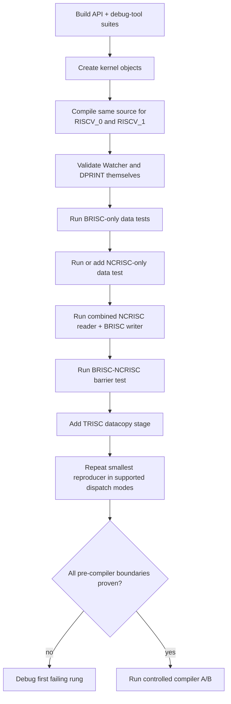

#### Ladder and decision at every rung

| Level | Command or change | Processor/module | What a pass proves | What a failure means next |
|---|---|---|---|---|
| L0 | build both suites | host build | required test binaries exist | repair configuration/build before device diagnosis |
| L1 | `MeshDispatchFixture.TensixCreateKernelsOnComputeCores` | host API | kernel creation/config validation succeeds | inspect `CreateKernel`, core range and configuration; compilation is not reached |
| L2 | `MeshDeviceFixture.TensixTestEquivalentDataMovementKernelsWithDifferentProcessors` | RISCV_0 + RISCV_1 build | separate processor ELFs exist | compare build state, flags, target output and JIT cache; still no execution proof |
| L3 | `MeshWatcherFixture.TestWatcherWaypoints` | Watcher | firmware/operation progress markers can be observed | do not interpret silence in the target test until Watcher works |
| L3b | `DevicePrintOutputFixture.PrintConcurrentAllRiscs` and `PrintCallstackPcFull` | DPRINT | messages from all RISCs and device call-stack symbolization work | fix DPRINT/debug-info path before relying on printed values or stacks |
| L4 | `MeshDeviceFixture.TensixSingleCoreDirectDramReaderOnly` and `…WriterOnly` | RISCV_0 / BRISC | real DRAM↔L1 kernels execute and every returned word matches | stay on BRISC, memory addressing, NoC or dispatch; NCRISC is not the first problem |
| L5 | add/adapt one one-core `RISCV_1` known-pattern test | RISCV_1 / NCRISC | NCRISC alone enters, transfers data, completes and returns correct output | classify `W/R/K/KD/D`; this is the missing isolation rung in the reviewed set |
| L6 | `MeshDeviceFixture.TensixSingleCoreDirectDramReaderWriter` | RISCV_1 reader + RISCV_0 writer | both DM processors cooperate through L1 and return correct DRAM data | if L4/L5 pass, inspect cross-RISC buffer and ordering contracts |
| L7 | `KernelThreadSyncTest.BarrierSynchronizesThreads` | BRISC ↔ NCRISC | the explicit two-RISC barrier produces verified L1 state | inspect synchronization, semaphore state and NoC visibility |
| L8 | `AnyDispatchMeshDeviceFixture.TensixSingleCoreDirectDramReaderDatacopyWriter` | DM + TRISC | reader → compute/datacopy → writer works | the first new boundary is circular buffers, compute setup or TRISC |
| L9 | repeat the smallest reproducer through every mode it actually supports | dispatch | failure is or is not command-delivery-specific | do not use a test hard-coded to `slow_dispatch::LaunchProgram` as proof of fast/slow equivalence |

Run the existing rungs separately so the first failed command remains obvious:

```bash
"$API" --gtest_filter='MeshDispatchFixture.TensixCreateKernelsOnComputeCores'

"$API" --gtest_filter='MeshDeviceFixture.TensixTestEquivalentDataMovementKernelsWithDifferentProcessors'

"$DBG" --gtest_filter='MeshWatcherFixture.TestWatcherWaypoints'
"$DBG" --gtest_filter='DevicePrintOutputFixture.PrintConcurrentAllRiscs'
"$DBG" --gtest_filter='DevicePrintOutputFixture.PrintCallstackPcFull'

"$API" --gtest_filter='MeshDeviceFixture.TensixSingleCoreDirectDramReaderOnly'
"$API" --gtest_filter='MeshDeviceFixture.TensixSingleCoreDirectDramWriterOnly'
"$API" --gtest_filter='MeshDeviceFixture.TensixSingleCoreDirectDramReaderWriter'
"$API" --gtest_filter='KernelThreadSyncTest.BarrierSynchronizesThreads'
"$API" --gtest_filter='AnyDispatchMeshDeviceFixture.TensixSingleCoreDirectDramReaderDatacopyWriter'
```

Host and device source locations for review:

- kernel creation host test:
  [`test_kernel_creation.cpp:36–53`](https://github.com/tenstorrent/tt-metal/blob/50a82f835593512c4176546b4af68d7e91315a86/tests/tt_metal/tt_metal/api/test_kernel_creation.cpp#L36-L53);
- two-processor compile host test:
  [`test_kernel_compile_cache.cpp:32–68`](https://github.com/tenstorrent/tt-metal/blob/50a82f835593512c4176546b4af68d7e91315a86/tests/tt_metal/tt_metal/api/test_kernel_compile_cache.cpp#L32-L68),
  device source
  [`reader_unary_push_4.cpp`](https://github.com/tenstorrent/tt-metal/blob/50a82f835593512c4176546b4af68d7e91315a86/tests/tt_metal/tt_metal/test_kernels/dataflow/reader_unary_push_4.cpp);
- BRISC-only host setup and verification:
  [`test_direct.cpp:46–175`](https://github.com/tenstorrent/tt-metal/blob/50a82f835593512c4176546b4af68d7e91315a86/tests/tt_metal/tt_metal/api/test_direct.cpp#L46-L175),
  [reader kernel](https://github.com/tenstorrent/tt-metal/blob/50a82f835593512c4176546b4af68d7e91315a86/tests/tt_metal/tt_metal/test_kernels/dataflow/unit_tests/dram/direct_reader_dram_to_l1.cpp)
  and [writer kernel](https://github.com/tenstorrent/tt-metal/blob/50a82f835593512c4176546b4af68d7e91315a86/tests/tt_metal/tt_metal/test_kernels/dataflow/unit_tests/dram/direct_writer_l1_to_dram.cpp);
- combined NCRISC-reader/BRISC-writer mapping:
  [`test_direct.cpp:193–317`](https://github.com/tenstorrent/tt-metal/blob/50a82f835593512c4176546b4af68d7e91315a86/tests/tt_metal/tt_metal/api/test_direct.cpp#L193-L317),
  [reader kernel](https://github.com/tenstorrent/tt-metal/blob/50a82f835593512c4176546b4af68d7e91315a86/tests/tt_metal/tt_metal/test_kernels/dataflow/unit_tests/dram/direct_reader_unary_2_0.cpp)
  and [writer kernel](https://github.com/tenstorrent/tt-metal/blob/50a82f835593512c4176546b4af68d7e91315a86/tests/tt_metal/tt_metal/test_kernels/dataflow/unit_tests/dram/direct_writer_unary_2_0.cpp);
- explicit BRISC/NCRISC barrier host test:
  [`test_kernel_thread_sync.cpp:77–130`](https://github.com/tenstorrent/tt-metal/blob/50a82f835593512c4176546b4af68d7e91315a86/tests/tt_metal/tt_metal/api/test_kernel_thread_sync.cpp#L77-L130),
  [barrier device kernel](https://github.com/tenstorrent/tt-metal/blob/50a82f835593512c4176546b4af68d7e91315a86/tests/tt_metal/tt_metal/test_kernels/dataflow/kernel_thread_barrier.cpp);
- Watcher self-test:
  [`test_waypoint.cpp:54–220`](https://github.com/tenstorrent/tt-metal/blob/50a82f835593512c4176546b4af68d7e91315a86/tests/tt_metal/tt_metal/debug_tools/watcher/test_waypoint.cpp#L54-L220);
- DPRINT and call-stack self-tests:
  [`test_print_output.cpp:226`](https://github.com/tenstorrent/tt-metal/blob/50a82f835593512c4176546b4af68d7e91315a86/tests/tt_metal/tt_metal/debug_tools/device_print/test_print_output.cpp#L226-L231)
  and
  [`test_print_output.cpp:640–658`](https://github.com/tenstorrent/tt-metal/blob/50a82f835593512c4176546b4af68d7e91315a86/tests/tt_metal/tt_metal/debug_tools/device_print/test_print_output.cpp#L640-L658).

#### The missing NCRISC-only rung

Do not relabel the L2 compile test as an NCRISC execution test. Add or adapt a
minimal test with:

```cpp
DataMovementConfig{
    .processor = DataMovementProcessor::RISCV_1,
    .noc = NOC::RISCV_1_default,
};
```

Use one worker, a fixed input pattern, a small aligned transfer and explicit
host readback. Record the selected kernel ELF and output hash. Parameterize the
same test over the suspected optimization level only after the baseline passes.
This test should become a permanent regression if it reproduces the failure.

#### Interpret `R`, `K` and `KD` as different code intervals

These are Watcher waypoint strings, not function names:

| Marker | Small meaning | If it is the last marker |
|---|---|---|
| `I` | RISC firmware entered initialization | reset PC, firmware load or early initialization |
| `GW` | BRISC waits for host launch `GO` | host/dispatch launch message has not been accepted |
| `GD` | BRISC observed host `GO` | host-to-BRISC launch boundary passed |
| `W` | NCRISC firmware waits for BRISC `LOAD/GO` | DM1 enable, shared state or visibility problem |
| `R` | NCRISC prepared the launch; operation handoff is next | shared GO wait, `kernel_lma` handoff, image/entry, CRT or ABI |
| `K` | operation wrapper completed CRT/setup and is immediately before `kernel_main` | failure is in `kernel_main`: wait, CB, NoC, bad address or generated instruction |
| `KD` | `kernel_main` returned | user body completed; inspect post-kernel checks and wrapper return |
| `NKFW` / `NKFD` | post-kernel NoC check begins / ends | distinguish the postamble from the user kernel |
| `D` | operation returned to persistent NCRISC firmware | NCRISC completed; inspect DONE visibility or another subordinate |
| `NTW` / `NTD` | BRISC waits for / sees all enabled subordinates done | identify supervisor completion versus an unfinished TRISC/NCRISC |

The important diagnostic sentence is therefore:

> **`R` without `K` and `K` without `KD` are different problems.** `R→K`
> covers operation handoff, image/entry, CRT and ABI. `K→KD` covers the user
> `kernel_main` body and its waits, memory traffic and generated instructions.

One nuance: in the reviewed `ncrisc.cc`, `R` appears before the Blackhole loop
that waits for subordinate `GO` and before the `kernel_lma` call. Therefore an
`R`-without-`K` result must not be described too narrowly as “bad ELF entry”; it
also includes a shared-GO value that never arrives.

```mermaid
sequenceDiagram
    participant B as BRISC firmware
    participant S as Shared DM1 sync
    participant N as NCRISC firmware
    participant O as NCRISC operation wrapper
    participant U as kernel_main
    B->>S: publish LOAD, then GO
    N->>N: waypoint W while waiting
    N->>N: launch preparation; waypoint R
    loop Blackhole subordinate wait
        N->>S: invalidate + read shared GO
    end
    N->>O: call kernel_lma
    O->>O: CRT and operation setup
    O->>O: waypoint K
    O->>U: call kernel_main
    U-->>O: return
    O->>O: waypoint KD, then NKFW/NKFD
    O-->>N: return to firmware
    N->>N: waypoint D
    N->>S: publish DONE
```

Code beside the sequence:

- [BRISC launch and `NTW/NTD` completion wait](https://github.com/tenstorrent/tt-metal/blob/50a82f835593512c4176546b4af68d7e91315a86/tt_metal/hw/firmware/src/tt-1xx/brisc.cc#L354-L590)
- [NCRISC firmware `W/R/D`, GO polling and `kernel_lma`](https://github.com/tenstorrent/tt-metal/blob/50a82f835593512c4176546b4af68d7e91315a86/tt_metal/hw/firmware/src/tt-1xx/ncrisc.cc#L109-L192)
- [NCRISC operation `K/KD/NKFW/NKFD`](https://github.com/tenstorrent/tt-metal/blob/50a82f835593512c4176546b4af68d7e91315a86/tt_metal/hw/firmware/src/tt-1xx/ncrisck.cc#L38-L95)

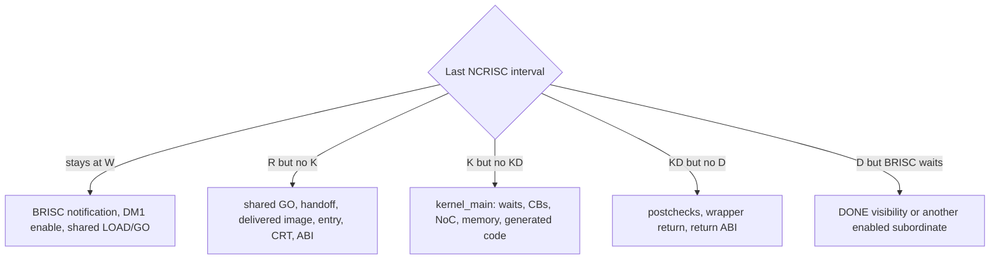

### R — Result

The result available now is a **code-review result**, not a completed historical
hardware diagnosis:

| Result item | State | Evidence |
|---|---|---|
| correct control direction | proven from source | BRISC supervises with shared `LOAD/GO/DONE`; NCRISC does not call BRISC as a normal C++ function |
| compilation proof boundary | proven from source | the two-processor compile test checks only ELF-file existence |
| BRISC data test | available | reader-only and writer-only explicitly select `RISCV_0` and verify returned data |
| combined DM test | available | reader selects `RISCV_1`, writer selects `RISCV_0`, and the output is compared |
| synchronization test | available | barrier test names BRISC writer and NCRISC reader and verifies L1 state |
| NCRISC-only data isolation | **gap found** | add/adapt a one-core `RISCV_1` test with host result verification |
| historical failing/pass compiler identities | **open** | paths, versions and hashes were not supplied |
| wrong instruction and final fix | **open** | failing PC, minimized input, disassembly difference and patch are not supplied |

The first useful completion record should look like this:

```text
first failing rung: L5 NCRISC-only data verification
last interval:      NC:R, no NC:K
host ELF hash:      <sha256>
device bytes hash:  <sha256 or readback artifact>
failing PC:         <address resolved in the exact ELF>
compiler A:         <path, version, sha256, flags, result>
compiler B:         <path, version, sha256, flags, result>
root cause:         OPEN until all compiler A/B gates pass
```

### L — Learning

1. **Build success is not runtime success.** A generated ELF proves neither
   transfer nor entry.
2. **Test one processor before their interaction.** BRISC-only and NCRISC-only
   data tests make the combined failure interpretable.
3. **Validate the debugger before trusting silence.** Watcher and DPRINT have
   their own unit tests.
4. **Use the first missing interval.** `R` without `K` is an entry/handoff class;
   `K` without `KD` is a `kernel_main` class.
5. **Dispatch mode is a controlled experiment.** Run only a reproducer that
   supports both paths; a hard-coded slow-dispatch call cannot test fast
   dispatch.
6. **Optimization sensitivity is not compiler proof.** Source undefined
   behavior, inline assembly constraints, link/LTO and ABI mismatches remain
   alternatives.
7. **Turn the minimal failure into a regression.** Keep known input/output,
   processor selection, ELF identity, waypoint expectation and negative case.

## Large overview — use this only to orient the case

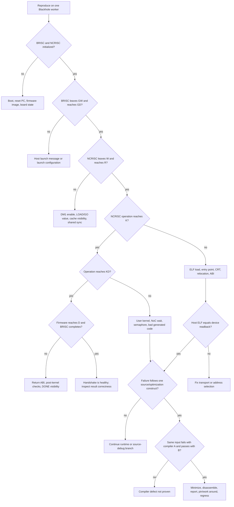

The rest of this page breaks that graph into smaller decisions and keeps code
links beside each graph.

## Q1 — What actually happens between BRISC and NCRISC?

**Answer:** BRISC is the supervisor in this path. After initialization it
publishes launch state in shared memory. On Blackhole, `start_ncrisc_kernel_run_early`
writes `RUN_SYNC_MSG_GO` to the DM1 subordinate field. NCRISC invalidates its L1
cache while polling, observes the state, and eventually calls its own operation
entry. When the operation returns, NCRISC writes `RUN_SYNC_MSG_DONE`; BRISC waits
until all enabled subordinates are done.

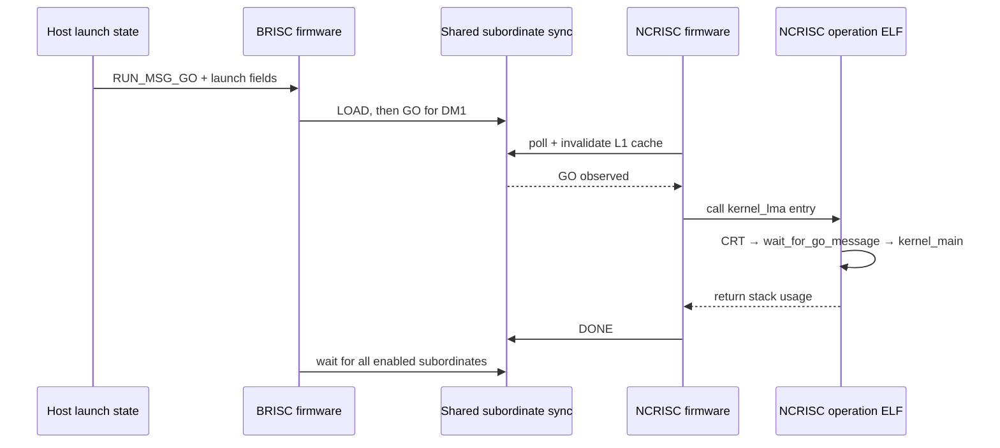

Code beside the graph:

- [BRISC `start_ncrisc_kernel_run_early`](https://github.com/tenstorrent/tt-metal/blob/50a82f835593512c4176546b4af68d7e91315a86/tt_metal/hw/firmware/src/tt-1xx/brisc.cc#L290-L298)
- [BRISC launch loop and completion wait](https://github.com/tenstorrent/tt-metal/blob/50a82f835593512c4176546b4af68d7e91315a86/tt_metal/hw/firmware/src/tt-1xx/brisc.cc#L390-L590)
- [NCRISC wait/call/complete path](https://github.com/tenstorrent/tt-metal/blob/50a82f835593512c4176546b4af68d7e91315a86/tt_metal/hw/firmware/src/tt-1xx/ncrisc.cc#L77-L192)

## Q2 — What is the first decision I make?

**Answer:** reproduce on one worker core and freeze the environment. Multi-core
bring-up hides whether the first failure is local, multicast-related or caused
by another core. Record the following before adding prints:

```bash
cd ~/src/tt-metal
git rev-parse HEAD
git status --short
tt-smi -s

TT_CASE_COMPILER=runtime/sfpi/compiler/bin/riscv-tt-elf-g++
realpath "$TT_CASE_COMPILER"
"$TT_CASE_COMPILER" --version
sha256sum "$TT_CASE_COMPILER"
```

At the inspected checkout, the selected local compiler reports
`riscv-tt-elf-g++ (tenstorrent/sfpi:7.69.0[822]) 15.1.0`; its observed SHA-256
was `063f7076c71b36200631acee16790b38c52b27bbc1e0e8933efaae9992fafea4`.
That is a snapshot of this checkout, **not** the unknown historical failing
compiler.

The JIT prefers
`$TT_METAL_HOME/runtime/sfpi/compiler/bin/riscv-tt-elf-g++`, then the compiler
under `/opt/tenstorrent/sfpi`. Thus “third-party compiler” should be recorded as
the exact Tenstorrent SFPI-packaged RISC-V toolchain, not as the host `g++`.

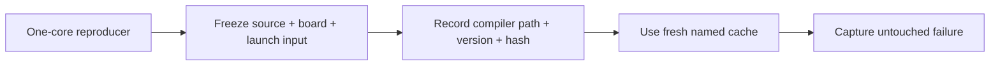

Code beside the graph:

- [Compiler selection precedence and flags](https://github.com/tenstorrent/tt-metal/blob/50a82f835593512c4176546b4af68d7e91315a86/tt_metal/jit_build/build.cpp#L124-L205)
- [Runtime cache environment handling](https://github.com/tenstorrent/tt-metal/blob/50a82f835593512c4176546b4af68d7e91315a86/tt_metal/llrt/rtoptions.cpp#L416-L429)

## Q3 — Which observation separates handshake problems from kernel problems?

**Answer:** the latest Watcher waypoint on BRISC and NCRISC. Run Watcher alone
first; do not combine the first classification run with DPRINT or the Device
Profiler.

```bash
export TT_METAL_WATCHER=5
export TT_METAL_WATCHER_APPEND=1
unset TT_METAL_DPRINT_CORES
unset TT_METAL_DEVICE_PROFILER

./path/to/one_core_reproducer
```

The log is normally under `generated/watcher/watcher.log`. A five-second poll is
appropriate for a hang investigation but too invasive for performance work.
`TT_METAL_WATCHER_DUMP_ALL=1` can itself access unsafe state while a kernel is
running, so leave it off for the first pass.

| Last useful boundary | Interpretation | Next branch |
|---|---|---|
| BRISC never reaches `I` | BRISC firmware/reset/load problem | firmware image and reset PC |
| BRISC `GW`, NCRISC `W` | BRISC is waiting for host GO; NCRISC is idle | host launch/dispatch state |
| BRISC `GD` or `R`, NCRISC remains `W` | host GO reached BRISC, NCRISC did not start | DM1 enable, shared `LOAD/GO`, cache visibility |
| NCRISC firmware `R`, no operation `K` | launch preparation ran, but operation entry is not proven | shared GO, `kernel_lma` handoff, load address, ELF entry, CRT/ABI |
| NCRISC operation `K`, no `KD` | entered `kernel_main`, did not return | user kernel, wait, memory fault, generated instructions |
| operation `KD`, no firmware `D` | user body returned; postamble/return failed | NOC flush assertions, wrapper return, ABI |
| NCRISC firmware `D`, BRISC does not finish | NCRISC ran; supervisor did not observe completion | DONE visibility or another enabled subordinate |

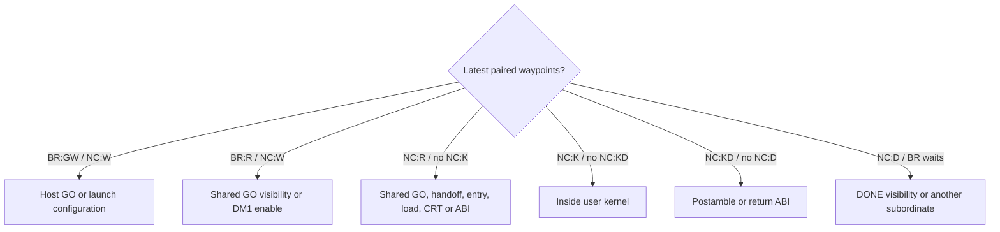

Code beside the graph:

- [BRISC waypoints and launch decisions](https://github.com/tenstorrent/tt-metal/blob/50a82f835593512c4176546b4af68d7e91315a86/tt_metal/hw/firmware/src/tt-1xx/brisc.cc#L354-L590)
- [NCRISC firmware `W`, `R`, `D`](https://github.com/tenstorrent/tt-metal/blob/50a82f835593512c4176546b4af68d7e91315a86/tt_metal/hw/firmware/src/tt-1xx/ncrisc.cc#L109-L192)
- [NCRISC operation `K`, `KD`, `NKFW`, `NKFD`](https://github.com/tenstorrent/tt-metal/blob/50a82f835593512c4176546b4af68d7e91315a86/tt_metal/hw/firmware/src/tt-1xx/ncrisck.cc#L69-L95)
- [Official Watcher documentation](https://docs.tenstorrent.com/tt-metal/latest/tt-metalium/tools/watcher.html)

## Q4 — When do I add DPRINT?

**Answer:** after Watcher identifies one short interval. DPRINT is for values and
addresses; it should not replace the lower-overhead waypoint classifier. Run it
as a separate build/run and include a newline on every message.

```bash
unset TT_METAL_WATCHER
unset TT_METAL_DEVICE_PROFILER
export TT_METAL_DPRINT_CORES=0,0
export TT_METAL_DPRINT_RISCVS=BR+NC
export TT_METAL_DPRINT_ONE_FILE_PER_RISC=1
export TT_METAL_FORCE_JIT_COMPILE=1

./path/to/one_core_reproducer
```

Good temporary values are the core, kernel ID, DM1 enable state, `kernel_lma`,
launch message value and the shared subordinate state before/after the write.
Avoid printing in a tight polling loop; it changes timing and can fill the
device print buffer.

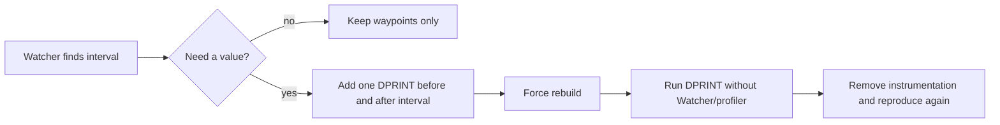

References beside the graph:

- [Official Device Debug Print guide](https://docs.tenstorrent.com/tt-metal/latest/tt-metalium/tools/device_print.html)
- [JIT DPRINT and Watcher compile defines](https://github.com/tenstorrent/tt-metal/blob/50a82f835593512c4176546b4af68d7e91315a86/tt_metal/jit_build/build.cpp#L224-L265)

## Q5 — How do I prove the correct NCRISC binary was sent and entered?

**Answer:** preserve the host build, inspect the ELF and linker map, explicitly
read back a supported device L1/config-buffer range, and map the failing PC to
that same image.

`TT_METAL_KERNEL_READBACK_ENABLE=1` is **not blanket proof** for a normal
Blackhole worker-operation image. The helper in `llrt.cpp` can compare supported
unicast writes, but the Blackhole Tensix firmware path uses multicast and its
source warns that multicast readback is unsupported. The ordinary operation
binary configuration path also calls the write helper without establishing an
automatic readback result. Treat the environment flag as a useful check only
when the exact call path supports it; otherwise add an explicit, bounded L1 or
configuration-buffer readback before `GO` and preserve the compared bytes.

Use a dedicated cache for this compiler. Do not reuse it for compiler B.

```bash
export TT_METAL_CACHE=/tmp/tt-metal-bh-ncrisc-compiler-a
export TT_METAL_FORCE_JIT_COMPILE=1
export TT_METAL_KERNEL_MAP=1
export TT_METAL_LOG_KERNELS_COMPILE_COMMANDS=1
export TT_METAL_LOG_KERNEL_COMPILE=1
export TT_METAL_RISCV_DEBUG_INFO=1
export TT_METAL_KERNEL_READBACK_ENABLE=1

./path/to/one_core_reproducer
```

Locate the NCRISC ELF, map and saved compiler intermediates under that cache.
Use the matching tools from the same SFPI compiler directory:

```bash
TT_CASE_TOOLS=runtime/sfpi/compiler/bin

"$TT_CASE_TOOLS/riscv-tt-elf-readelf" -hSW path/to/ncrisc.elf
"$TT_CASE_TOOLS/riscv-tt-elf-nm" -nC path/to/ncrisc.elf
"$TT_CASE_TOOLS/riscv-tt-elf-objdump" -drSC path/to/ncrisc.elf > /tmp/ncrisc.dis
"$TT_CASE_TOOLS/riscv-tt-elf-addr2line" -e path/to/ncrisc.elf -fC 0xFAILING_PC
```

Do not subtract a guessed base blindly. First inspect the ELF type and section
virtual addresses. The Blackhole HAL has separate BRISC and NCRISC firmware
bases and programs NCRISC's reset PC to its firmware base; those values are the
authoritative architecture mapping for this revision.

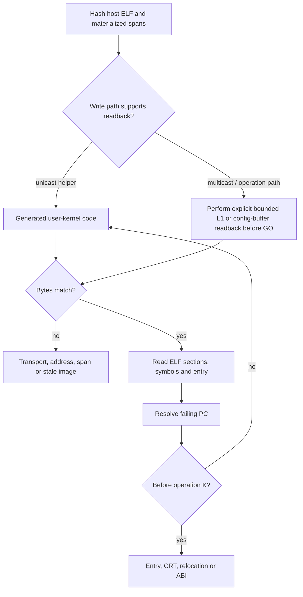

Code beside the graph:

- [Blackhole BRISC/NCRISC bases and launch values](https://github.com/tenstorrent/tt-metal/blob/50a82f835593512c4176546b4af68d7e91315a86/tt_metal/llrt/hal/tt-1xx/blackhole/bh_hal_tensix.cpp#L97-L147)
- [Unicast write/readback helper](https://github.com/tenstorrent/tt-metal/blob/50a82f835593512c4176546b4af68d7e91315a86/tt_metal/llrt/llrt.cpp#L169-L246)
- [Blackhole Tensix firmware multicast write and readback caveat](https://github.com/tenstorrent/tt-metal/blob/50a82f835593512c4176546b4af68d7e91315a86/tt_metal/impl/device/firmware/risc_firmware_initializer.cpp#L1143-L1165)
- [Worker operation binary write path](https://github.com/tenstorrent/tt-metal/blob/50a82f835593512c4176546b4af68d7e91315a86/tt_metal/impl/kernels/kernel.cpp#L1079-L1092)
- [Operation wrapper entry and CRT](https://github.com/tenstorrent/tt-metal/blob/50a82f835593512c4176546b4af68d7e91315a86/tt_metal/hw/firmware/src/tt-1xx/ncrisck.cc#L38-L74)

## Q6 — What evidence is sufficient to suspect generated code?

**Answer:** the failure must be after the correct operation image has been
verified and localized to a generated instruction interval. Then reduce the
input in this order:

1. Keep one core and one NCRISC data-movement kernel.
2. Remove NoC operations and shared-state accesses not required to reproduce.
3. Replace the body with a return; add source statements back until it fails.
4. Compare `KernelBuildOptLevel::O0`, `O1`, `O2`, `Os` through
   `DataMovementConfig::opt_level`.
5. Preserve `.ii`, assembly, ELF, map and disassembly for the smallest failing
   and passing pair.
6. Check source undefined behavior, alignment, `volatile`, aliasing and inline
   assembly constraints before filing a compiler bug.

Example host-side optimization toggle:

```cpp
DataMovementConfig config{
    .processor = DataMovementProcessor::RISCV_1,
    .noc = NOC::RISCV_1_default,
    .opt_level = KernelBuildOptLevel::O0,
};
```

Use the processor value that your pinned API maps to NCRISC; confirm the
program's processor assignment rather than copying the example blindly.

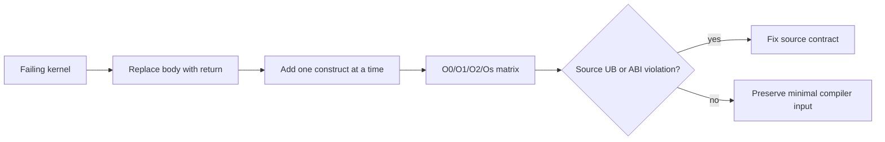

Code beside the graph:

- [`KernelBuildOptLevel` and `DataMovementConfig::opt_level`](https://github.com/tenstorrent/tt-metal/blob/50a82f835593512c4176546b4af68d7e91315a86/tt_metal/api/tt-metalium/kernel_types.hpp#L53-L102)
- [Default common JIT flags, including LTO](https://github.com/tenstorrent/tt-metal/blob/50a82f835593512c4176546b4af68d7e91315a86/tt_metal/jit_build/build.cpp#L165-L205)
- [Saved intermediates in build-map mode](https://github.com/tenstorrent/tt-metal/blob/50a82f835593512c4176546b4af68d7e91315a86/tt_metal/jit_build/build.cpp#L628-L677)

## Q7 — How do I prove or reject the compiler root cause?

**Answer:** run a two-toolchain matrix in which the preprocessed input, flags,
linker script, firmware/kernel pairing, device, launch arguments and runtime
state remain fixed.

| Test | Compiler | Optimization | Cache | Purpose |
|---|---|---|---|---|
| A1 | suspected | failing level | unique A1 | reproduce failure |
| A2 | suspected | `O0` | unique A2 | locate optimization sensitivity |
| B1 | known-good | same failing level | unique B1 | compiler-variable A/B |
| B2 | known-good | `O0` | unique B2 | matrix control |

If replaying logged commands outside TT-Metal, switch the compiler **and its
matching assembler/linker/plugin set together**. Keep two artifact directories.
Compare preprocessed source hashes before comparing assembly.

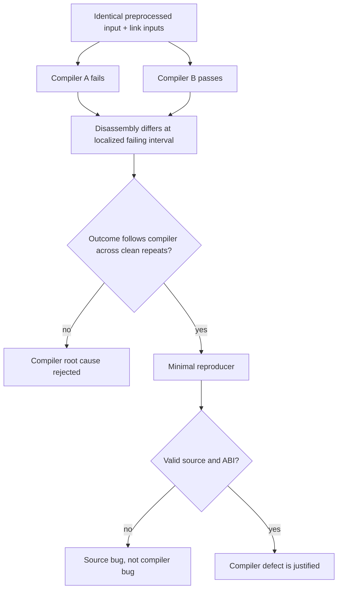

The compiler conclusion is justified only when all of these gates pass:

- the input `.ii` hashes match;
- compile/link commands differ only by the intended toolchain paths/version;
- host materialized spans and a supported explicit device readback agree;
- the failure stays at the same source/instruction boundary;
- the outcome follows the compiler on clean repeated runs;
- a minimized valid input reproduces it;
- the known-good compiler or compiler patch removes the wrong instruction
  sequence without changing the source contract.

Build-key warning: [the normal key includes compiler version, but build-map
mode omits it](https://github.com/tenstorrent/tt-metal/blob/50a82f835593512c4176546b4af68d7e91315a86/tt_metal/jit_build/build.cpp#L369-L388).
This is why the matrix requires separate cache directories in addition to
`TT_METAL_FORCE_JIT_COMPILE=1`.

## Q8 — Which decision path do I choose for this remembered case?

**Answer:** choose the path that disproves cheaper explanations before the
compiler branch:

1. Rewrite the symptom as “BRISC reached/failed to reach a shared launch
   transition, or NCRISC failed before/after its own operation entry.”
2. Reproduce on one core without added prints.
3. Use the BRISC/NCRISC waypoint pair to choose exactly one interval.
4. If NCRISC reaches `K`, stop investigating BRISC-to-NCRISC startup and debug
   the user kernel interval.
5. If it reaches firmware `R` but not operation `K`, verify the operation ELF,
   readback, entry point, CRT and ABI.
6. Only if the image is correct and the PC lands in generated code, preserve
   the compiler inputs and run the A/B matrix.
7. If the A/B proof gates pass, reduce the compiler defect and apply the fix
   ladder below.

This ordering is chosen because each step divides the hypothesis space while
changing as little device behavior as possible.

## Q9 — How is a confirmed compiler-caused case fixed?

**Answer:** use a layered fix, then rebuild and retest the complete matched
image set.

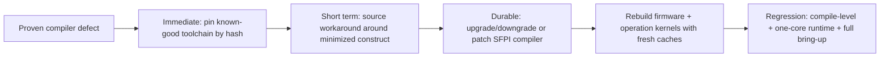

1. **Containment:** pin the known-good compiler path, version and SHA-256 in the
   bring-up environment. Fail early if the hash differs.
2. **Workaround:** if necessary, rewrite only the minimized triggering construct
   and document why. Do not globally disable optimization without measuring the
   code-size/performance effect.
3. **Durable correction:** consume the compiler version containing the upstream
   fix, or carry a reviewed compiler patch.
4. **Clean rebuild:** use new cache directories; rebuild base BRISC/NCRISC
   firmware and the operation kernels with one coherent toolchain.
5. **Regression:** retain the minimized compile test, a one-core handshake test
   covering `W → R → K → KD → D`, result verification and the broader bring-up
   test.

The matched rebuild matters because the JIT [weakens firmware symbols and links
operation kernels against the firmware ELF](https://github.com/tenstorrent/tt-metal/blob/50a82f835593512c4176546b4af68d7e91315a86/tt_metal/jit_build/build.cpp#L721-L790).

## Root-cause closure record

The process above is executable now. The historical statement “the compiler was
the root cause and this fixed it” remains **unverified** until this record is
filled with actual artifacts:

| Field | Current value |
|---|---|
| failing TT-Metal commit | not supplied |
| Blackhole board/stepping | not supplied |
| failing compiler path/version/hash | not supplied |
| passing compiler path/version/hash | not supplied |
| last BRISC/NCRISC waypoint pair | not supplied |
| failing PC and ELF/source mapping | not supplied |
| minimized valid compiler input | not supplied |
| wrong versus correct instruction sequence | not supplied |
| final toolchain patch/version or source workaround | not supplied |
| clean-rebuild regression logs | not supplied |

Until those fields exist, the responsible conclusion is:

> The remembered Blackhole failure is compatible with a toolchain-sensitive
> NCRISC operation-kernel problem, but the available evidence does not yet
> distinguish a compiler defect from source undefined behavior, ABI/link/load
> mismatch or a launch-synchronization fault.

## Artifact layout for the repeatable case

```text
experiments/blackhole-ncrisc-bringup/
├── README.md
├── environment/
│   ├── tt-metal-commit.txt
│   ├── board.txt
│   └── compiler-a-b.txt
├── source/
│   ├── reproducer.cpp
│   └── minimized.ii
├── build-a/
│   ├── compile-command.txt
│   ├── link-command.txt
│   ├── kernel.elf
│   ├── kernel.map
│   └── kernel.dis
├── build-b/
├── logs/
│   ├── watcher-a.log
│   ├── watcher-b.log
│   └── readback-hashes.txt
└── result.md
```

Commit small text artifacts and scripts. Store large compiler dump families as
a compressed release artifact or an external artifact with a recorded hash.
Never publish proprietary board logs, firmware or toolchain binaries without
permission.

## Tool selection

- **Watcher first:** classify hangs and the last per-RISC waypoint.
- **DPRINT second:** inspect a small number of values inside the chosen
  interval; run separately from Watcher/Device Profiler.
- **ELF/binutils next:** prove image, symbol and failing-PC identity.
- **GDB for host control:** stop around compile, binary write and launch-message
  generation. Standard host GDB does not single-step Blackhole RISC firmware.
- **Device Profiler/Tracy later:** performance tools are useful after
  correctness. They are not the primary root-cause tools for a pre-entry hang.

Official tool references:

- [TT-Metalium tools index](https://docs.tenstorrent.com/tt-metal/latest/tt-metalium/tools/index.html)
- [Watcher](https://docs.tenstorrent.com/tt-metal/latest/tt-metalium/tools/watcher.html)
- [Device Debug Print](https://docs.tenstorrent.com/tt-metal/latest/tt-metalium/tools/device_print.html)
- [Device Program Profiler](https://docs.tenstorrent.com/tt-metal/latest/tt-metalium/tools/device_program_profiler.html)
- [Tracy Profiler](https://docs.tenstorrent.com/tt-metal/latest/tt-metalium/tools/tracy_profiler.html)

## Closure checklist

- [ ] one-core failure repeats from a fresh cache
- [ ] source revision, board identity and compiler hashes recorded
- [ ] last BRISC/NCRISC waypoints recorded
- [ ] host ELF equals device readback
- [ ] failing PC maps to the saved ELF and source
- [ ] valid minimized source reproduces the issue
- [ ] compiler A/B changes only the toolchain
- [ ] clean repeats make the outcome follow the compiler
- [ ] fix rebuilds firmware and operation kernels coherently
- [ ] compile-level, one-core and full bring-up regressions pass
- [ ] historical closure record above is complete
