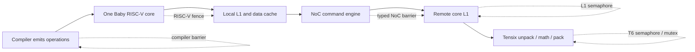
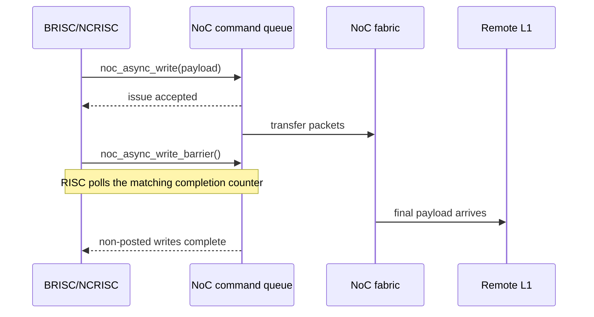
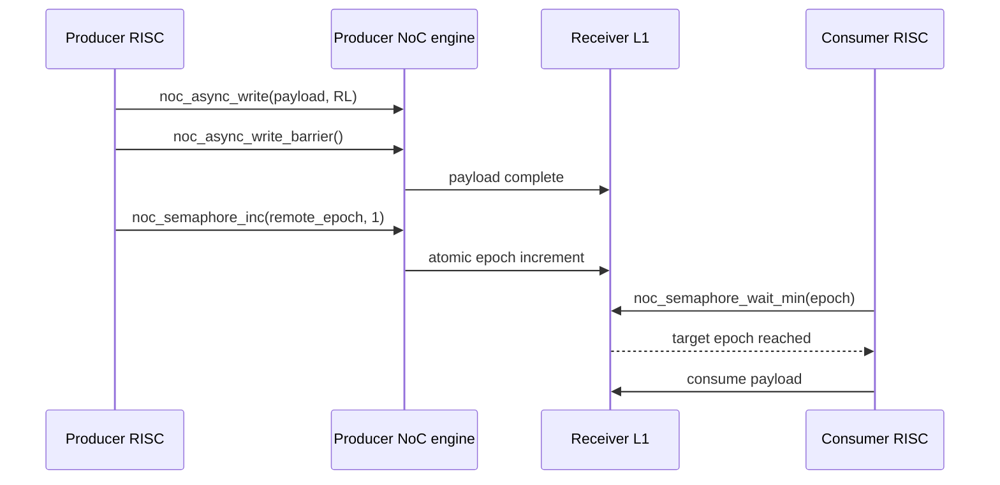
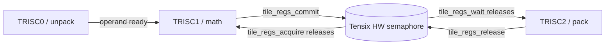
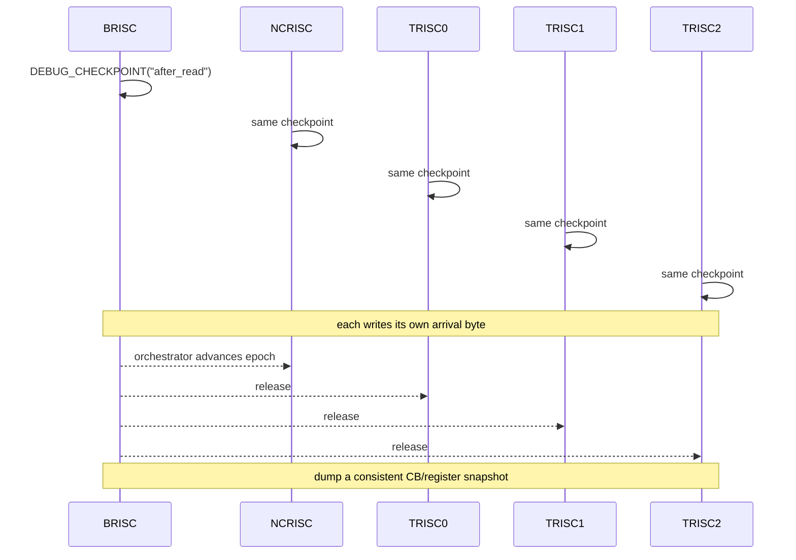
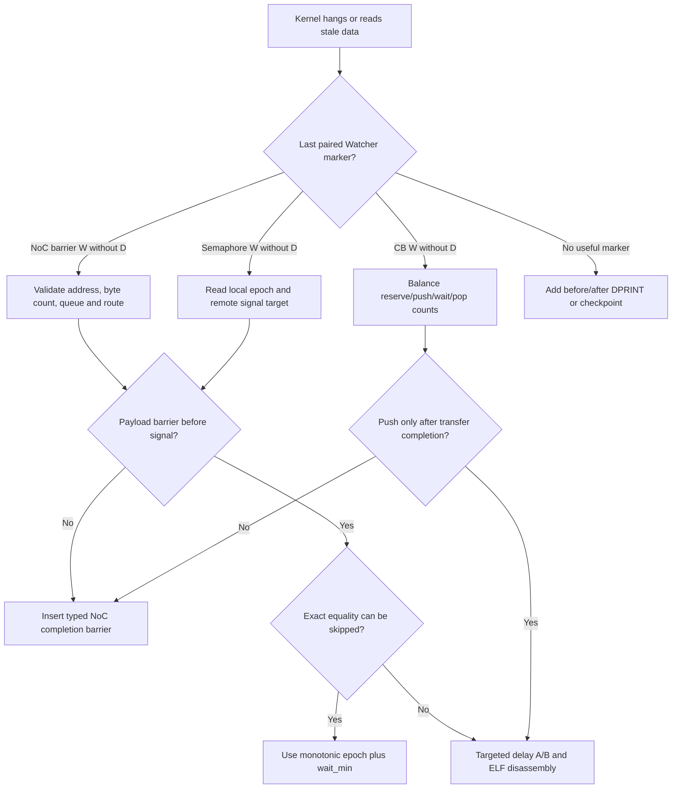

# Blackhole synchronization field guide

**Discussion subpage 03 — fence, semaphore, hardware waits and race debugging**

Research date: **19 August 2026**

Source baseline: [`tenstorrent/tt-metal@50a82f835593512c4176546b4af68d7e91315a86`](https://github.com/tenstorrent/tt-metal/tree/50a82f835593512c4176546b4af68d7e91315a86)

Interactive page: <https://buicongnguyen.github.io/tt-sim/discussion-blackhole-synchronization.html>

This guide answers four related questions:

1. Is `fence` an assembly instruction, and what does it synchronize?
2. Are Tenstorrent semaphores hardware or software?
3. What hardware-assisted mechanisms avoid doing the transfer in software?
4. How do we debug a hang or stale-data race without changing the bug beyond recognition?

The short answer is that **“synchronization” is not one mechanism**. A compiler
barrier, a RISC-V fence, a NoC completion barrier, an L1 semaphore, a Tensix
hardware semaphore and a circular-buffer credit solve different ordering or
ownership problems. Replacing one with another by name is a common source of
Blackhole bugs.

## Scope and evidence boundary

The code statements below were checked against the local WSL checkout at the
pinned commit. Public TT-Metal kernel APIs are distinguished from LLK internals.
The RISC-V statements are cross-checked with the ratified ISA documentation.

This is **not** a claim that every Blackhole microarchitectural detail is public.
In particular, the pinned public Blackhole dataflow API contains polling waits
and NoC counter barriers; this audit did not find a generic public
interrupt-and-`wfi` event API for an ordinary Blackhole user kernel. That is an
absence finding for this revision—not proof that no interrupt exists anywhere
in Blackhole firmware or hardware.

## Terminology

| Term | Definition in this guide |
|---|---|
| **ordering** | Constraining which operation may become visible before another operation. |
| **completion** | Proving that an issued operation reached the completion condition defined by that API. |
| **visibility** | The point at which the intended observer reads the new value rather than a stale copy. |
| **ownership** | Which producer or consumer may reuse a buffer, register bank or slot. |
| **compiler barrier** | A constraint on compiler reordering; it need not generate a machine instruction. |
| **RISC-V `fence`** | A real Baby RISC-V instruction that orders selected memory/I/O operations. Blackhole also assigns it a local data-cache side effect in TT-Metal. |
| **NoC barrier** | A TT-Metal call that waits on NoC engine state; it is not interchangeable with a local RISC-V fence. |
| **L1 semaphore** | A four-byte program-visible value in a Tensix core's L1, commonly changed by a remote NoC atomic and polled locally. |
| **Tensix hardware semaphore** | One of eight internal four-bit LLK semaphores used by Tensix pipeline engines/TRISC roles. It is not the same object as an L1 semaphore allocated by `CreateSemaphore`. |
| **mutex** | An internal hardware exclusion primitive for shared Tensix resources such as register read-modify-write or SFPU access. |
| **CB credit** | Circular-buffer received/acknowledged counts that express producer/consumer ownership and backpressure. |
| **waypoint** | A short Watcher-visible marker placed before and after important waits. |

## 1. Start with the ordering boundary

Do not start by asking “which semaphore should I add?” Start by asking which
edge is missing.



The smallest correct primitive is the one whose guarantee crosses the broken
edge. A stronger-looking primitive in the wrong domain is still wrong.

### Mechanism selection table

| Required contract | Use first | Do not assume |
|---|---|---|
| Keep C++ memory operations on opposite sides of a source boundary | `fence_compiler()` or an API that contains a compiler clobber | That hardware has completed anything |
| Order/commit local Blackhole RISC loads/stores as defined by its memory path | Blackhole local blocking helpers or the required RISC-V `fence` path | That a remote NoC transfer has arrived |
| Wait for async NoC reads | `noc_async_read_barrier()` | A compiler barrier or L1 semaphore makes the read complete |
| Wait for non-posted NoC writes | `noc_async_write_barrier()` | `noc_async_writes_flushed()` means remote completion |
| Wait only until writes have departed the issue queue | `noc_async_writes_flushed()` | That the destination can consume the payload |
| Wait for non-posted NoC atomics | `noc_async_atomic_barrier()` | That it also completes earlier writes from another queue |
| Signal another core | Remote `noc_semaphore_inc()` after the payload's required barrier | That signaling before payload completion is safe |
| Wait for a cross-core epoch | `noc_semaphore_wait_min()` on the receiver's local L1 word | That it sleeps the RISC; it polls |
| Exchange CB page ownership | `cb_reserve_back/push_back` and `cb_wait_front/pop_front` | That CB push completes an outstanding NoC read |
| Hand destination registers from math to pack | `tile_regs_acquire/commit` and `tile_regs_wait/release` | That user code should manipulate internal LLK semaphore IDs |

## 2. “Fence” is three different things here

### 2.1 Compiler-only fence: no opcode

The common LLK helper is exactly:

```cpp
inline void fence_compiler()
{
    asm volatile("" ::: "memory");
}
```

Source: [`ckernel_fence.h:10–17`](https://github.com/tenstorrent/tt-metal/blob/50a82f835593512c4176546b4af68d7e91315a86/tt_metal/tt-llk/common/ckernel_fence.h#L10-L17).

The empty assembly string means there is no hardware instruction to execute.
In other words, `fence_compiler()` emits no instruction.
The `memory` clobber tells the compiler that memory may have changed, so it must
not move relevant accesses across that point. Therefore:

- `objdump` should **not** show an instruction for `fence_compiler()`;
- it cannot wait for a NoC queue;
- it cannot make a stale remote payload arrive;
- it is still important when compiler reordering is the only missing edge.

### 2.2 RISC-V `fence`: a real instruction

Blackhole's `memcpy_blocking()` performs stores, reads the destination back,
then executes:

```cpp
asm volatile("fence" ::: "memory");
```

The source explains that the destination read is ordered after the store and
the `fence` blocks until outstanding loads complete, thereby committing the
copy to the underlying local memory path. See
[`ckernel.h:91–134`](https://github.com/tenstorrent/tt-metal/blob/50a82f835593512c4176546b4af68d7e91315a86/tt_metal/tt-llk/tt_llk_blackhole/common/inc/ckernel.h#L91-L134).

The ratified RISC-V ISA defines `FENCE` as an ordering instruction for selected
memory and device-I/O predecessor/successor sets. It does not define a
Tenstorrent NoC transaction-completion contract. See the
[RISC-V memory-ordering instructions](https://docs.riscv.org/reference/isa/v20260120/unpriv/rv32.html#memory-ordering-instructions)
and [RVWMO explanatory material](https://docs.riscv.org/reference/isa/unpriv/mm-eplan.html#fences-rule-4).

Blackhole adds an implementation-specific reason to notice this instruction:
TT-Metal's local cache helper uses `fence` to invalidate the RISC data cache.
This matters when a NoC agent writes an L1 address that this RISC previously
read. See [`risc_common.h:145–160`](https://github.com/tenstorrent/tt-metal/blob/50a82f835593512c4176546b4af68d7e91315a86/tt_metal/hw/inc/internal/tt-1xx/risc_common.h#L145-L160).

### 2.3 `fence.i`: instruction visibility, not a data-race cure

`FENCE.I` orders prior data stores before later instruction fetches on the same
RISC-V hart. It is for code/instruction-stream visibility, not for proving that
a tensor payload crossed the NoC. The standard also says it does not by itself
make another hart fetch the writer's updated instructions. See the
[RISC-V Zifencei specification](https://docs.riscv.org/reference/isa/unpriv/zifencei.html).

The pinned Blackhole public kernel path does not use `fence.i` as its ordinary
data synchronization primitive. Do not add it to fix a CB, L1 semaphore or NoC
race.

### 2.4 NoC barriers: transaction-domain completion

The dataflow API exposes separate waits for reads, writes and atomics:

- [`noc_async_read_barrier()`](https://github.com/tenstorrent/tt-metal/blob/50a82f835593512c4176546b4af68d7e91315a86/tt_metal/hw/inc/api/dataflow/dataflow_api.h#L1743-L1758)
  polls the NoC read completion state;
- [`noc_async_write_barrier()`](https://github.com/tenstorrent/tt-metal/blob/50a82f835593512c4176546b4af68d7e91315a86/tt_metal/hw/inc/api/dataflow/dataflow_api.h#L1773-L1788)
  waits for outstanding non-posted writes to complete;
- [`noc_async_writes_flushed()`](https://github.com/tenstorrent/tt-metal/blob/50a82f835593512c4176546b4af68d7e91315a86/tt_metal/hw/inc/api/dataflow/dataflow_api.h#L1802-L1815)
  waits only for writes to depart, not to complete;
- [`noc_async_atomic_barrier()`](https://github.com/tenstorrent/tt-metal/blob/50a82f835593512c4176546b4af68d7e91315a86/tt_metal/hw/inc/api/dataflow/dataflow_api.h#L1855-L1868)
  waits for non-posted atomics;
- [`noc_async_full_barrier()`](https://github.com/tenstorrent/tt-metal/blob/50a82f835593512c4176546b4af68d7e91315a86/tt_metal/hw/inc/api/dataflow/dataflow_api.h#L1879-L1917)
  drains all relevant queue classes and is usually broader than needed.

These waits are implemented as RISC polling of NoC hardware status. The NoC
engine performs the transfer asynchronously; the waiting RISC is not asleep on
a generic event interrupt.



### Relaxed ordering diagnostic

Blackhole firmware can disable relaxed memory ordering when
`TT_METAL_DISABLE_RELAXED_MEM_ORDERING=1` is converted into the JIT define
`DISABLE_RELAXED_MEM_ORDERING`. The firmware then sets the relevant CSR bit.

Sources:

- [`rtoptions.cpp:640–644`](https://github.com/tenstorrent/tt-metal/blob/50a82f835593512c4176546b4af68d7e91315a86/tt_metal/llrt/rtoptions.cpp#L640-L644)
- [`build.cpp:284–291`](https://github.com/tenstorrent/tt-metal/blob/50a82f835593512c4176546b4af68d7e91315a86/tt_metal/jit_build/build.cpp#L284-L291)
- [`firmware_common.h:311–325`](https://github.com/tenstorrent/tt-metal/blob/50a82f835593512c4176546b4af68d7e91315a86/tt_metal/hw/inc/internal/firmware_common.h#L311-L325)

If a failure disappears with that flag, treat it as evidence that a local
memory-order edge is missing. Do not ship the flag as a substitute for finding
the missing contract. Because it affects JIT compilation, rebuild from a clean
or isolated cache before comparing.

## 3. Tenstorrent has two different semaphore families

### 3.1 Program-visible L1 semaphore: public, cross-core, polled

`noc_semaphore_wait()` loops over a local four-byte L1 word, invalidating the
local cache before checking equality. `noc_semaphore_wait_min()` does the same
until the value is greater than or equal to a target.

Source:

- [`noc_semaphore_wait():1935–1943`](https://github.com/tenstorrent/tt-metal/blob/50a82f835593512c4176546b4af68d7e91315a86/tt_metal/hw/inc/api/dataflow/dataflow_api.h#L1935-L1943)
- [`noc_semaphore_wait_min():1961–1969`](https://github.com/tenstorrent/tt-metal/blob/50a82f835593512c4176546b4af68d7e91315a86/tt_metal/hw/inc/api/dataflow/dataflow_api.h#L1961-L1969)
- [official `noc_semaphore_wait_min` documentation](https://docs.tenstorrent.com/tt-metal/latest/tt-metalium/tt_metal/apis/kernel_apis/data_movement/noc_semaphore_wait_min.html)

This wait is **software polling** on the receiver RISC. The fast part is the
remote notification: `noc_semaphore_inc()` issues a hardware NoC atomic
increment with 32-bit wrap. See
[`dataflow_api.h:2254–2272`](https://github.com/tenstorrent/tt-metal/blob/50a82f835593512c4176546b4af68d7e91315a86/tt_metal/hw/inc/api/dataflow/dataflow_api.h#L2254-L2272).

Use a monotonically increasing epoch plus `wait_min` when repeated phases may
overtake an exact equality check. This is also the pattern used by current
[global debug checkpoints](https://docs.tenstorrent.com/tt-metal/latest/tt-metalium/tools/checkpoint.html).

### Correct data-before-signal protocol



Minimal pattern:

```cpp
// Producer
noc_async_write(src_l1, remote_payload, bytes);
noc_async_write_barrier();              // payload is complete first
noc_semaphore_inc(remote_epoch_addr, 1); // then publish readiness

// Only if the producer itself must know the non-posted atomic completed:
noc_async_atomic_barrier();

// Consumer; target_epoch increases monotonically per phase
noc_semaphore_wait_min(local_epoch, target_epoch);
```

The write barrier before the atomic is the critical edge. An atomic barrier
after the increment answers a different question: whether the sender's atomic
completed.

### 3.2 Tensix hardware semaphore: internal LLK pipeline mechanism

Blackhole exposes eight internal four-bit semaphores to LLK code. Their values
range from 0 to 15. The mapping includes FPU↔SFPU, math↔pack and unpack↔math
coordination. See
[`ckernel_structs.h:12–33`](https://github.com/tenstorrent/tt-metal/blob/50a82f835593512c4176546b4af68d7e91315a86/tt_metal/tt-llk/tt_llk_blackhole/common/inc/ckernel_structs.h#L12-L33).

The low-level operations include:

- `TTI_SEMPOST` and `TTI_SEMGET` for token release/acquire;
- `TTI_SEMWAIT` to stall selected Tensix resources until zero or max;
- `TTI_SEMINIT` to initialize the counter;
- `TTI_ATGETM` and `TTI_ATRELM` for internal hardware mutex acquire/release.

Source: [`ckernel.h:250–340`](https://github.com/tenstorrent/tt-metal/blob/50a82f835593512c4176546b4af68d7e91315a86/tt_metal/tt-llk/tt_llk_blackhole/common/inc/ckernel.h#L250-L340).

These are true Tensix instruction-level synchronization mechanisms. They can
stall hardware resources without a C++ `while` loop over an L1 word. But they
are **reserved pipeline machinery**, not a drop-in cross-core public semaphore.
Ordinary compute kernels should use the public destination-register contract:

```cpp
tile_regs_acquire(); // math waits until destination registers are available
// compute into destination registers
tile_regs_commit();  // math publishes the completed register section

tile_regs_wait();    // pack waits for the math commit
// pack the destination registers
tile_regs_release(); // pack releases the section for reuse
```

Source: [`reg_api.h:40–89`](https://github.com/tenstorrent/tt-metal/blob/50a82f835593512c4176546b4af68d7e91315a86/tt_metal/hw/inc/api/compute/reg_api.h#L40-L89).



### Do not confuse the two “eight semaphore” limits

The program API's allocation limit and the LLK hardware bank both use the
number eight in this revision, but they are different namespaces, storage and
protocols:

| Property | Program L1 semaphore | LLK Tensix hardware semaphore |
|---|---|---|
| Storage | Four-byte word in L1 | Internal four-bit counter |
| Typical scope | Across cores via NoC | Inside one Tensix pipeline |
| Wait | RISC polling loop | `TTI_SEMWAIT` hardware-resource stall |
| Signal | Local store or NoC atomic increment | `TTI_SEMPOST/SEMGET` |
| Public user abstraction | `CreateSemaphore`, `get_semaphore`, `noc_semaphore_*` | Normally `tile_regs_*`/LLK wrapper, not raw IDs |
| Counter behavior | 32-bit atomic wrap for `noc_semaphore_inc` | Saturates/floors within 0…15 |

## 4. Other hardware-assisted synchronization

### 4.1 Asynchronous NoC engines and transaction IDs

The Baby RISC issues a transfer and can perform useful work before a typed
barrier. Hardware moves the packets and maintains status counters. When APIs
support transaction IDs, a transaction-specific barrier can wait for only the
dependency that matters rather than draining unrelated traffic.

Rule: issue broadly, wait narrowly, and place the wait immediately before the
first consumer or buffer reuse.

### 4.2 Circular-buffer credits

A CB is an ownership protocol:

- producer calls `cb_reserve_back()` before filling pages;
- producer calls `cb_push_back()` only after pages are valid;
- consumer calls `cb_wait_front()` before reading pages;
- consumer calls `cb_pop_front()` only after it has finished with them.

The reserve and wait calls are polling operations. The push/pop updates move
received/acknowledged counts and pointers:

- [`cb_push_back` and `cb_pop_front`](https://github.com/tenstorrent/tt-metal/blob/50a82f835593512c4176546b4af68d7e91315a86/tt_metal/hw/inc/api/dataflow/dataflow_api.h#L208-L274)
- [`cb_reserve_back`](https://github.com/tenstorrent/tt-metal/blob/50a82f835593512c4176546b4af68d7e91315a86/tt_metal/hw/inc/api/dataflow/dataflow_api.h#L404-L423)
- [`cb_wait_front`](https://github.com/tenstorrent/tt-metal/blob/50a82f835593512c4176546b4af68d7e91315a86/tt_metal/hw/inc/api/dataflow/dataflow_api.h#L474-L485)
- [official `cb_wait_front` documentation](https://docs.tenstorrent.com/tt-metal/latest/tt-metalium/tt_metal/apis/kernel_apis/circular_buffers/cb_wait_front.html)

`cb_push_back()` does **not** complete a prior NoC read. The reader must first
wait for that read, then publish the pages:

```cpp
cb_reserve_back(cb_in, tiles);
noc_async_read(remote_src, get_write_ptr(cb_in), bytes);
noc_async_read_barrier();
cb_push_back(cb_in, tiles);
```


### 4.3 Hardware mutexes

The Blackhole LLK defines mutex IDs for register read-modify-write, cross-thread
ADC use and SFPU access. Their low-level acquire/release instructions are
`TTI_ATGETM` and `TTI_ATRELM`. Use the LLK's scoped wrapper where that machinery
is already required; raw mutex manipulation can deadlock another TRISC or
silently violate a shared-engine protocol.

### 4.4 Host command-queue events

Host-side command-queue events express device command dependencies and host
completion. They are a different layer from a kernel's local semaphore or
Tensix register handshake. An event can tell the host that a submitted workload
reached its completion point; it is not the primitive used by TRISC1 to hand a
destination register section to TRISC2.

### 4.5 Interrupts: where the public Blackhole boundary currently sits

Blackhole source contains firmware and error interrupt machinery, but the
pinned ordinary public dataflow path above waits by polling L1 values or NoC
status registers. This audit found no public “arm event, execute `wfi`, wake user
kernel” interface for Blackhole dataflow kernels.

Consequences:

- hardware still does the expensive transfer or atomic operation asynchronously;
- internal Tensix hardware waits exist for the compute pipeline;
- public cross-core kernel synchronization usually has a small RISC polling cost;
- Quasar-specific interrupt facilities must not be generalized to Blackhole;
- writing raw interrupt registers is not a safe optimization experiment because
  firmware owns those resources and the contract may be revision-specific.

## 5. Debug the contract, not only the hang

### 5.1 First preserve the evidence

Record before changing code:

```bash
cd ~/src/tt-metal
git rev-parse HEAD
git status --short
sha256sum "$TT_METAL_SIMULATOR"
```

Also save the exact JIT compiler path/version, the operation ELF hash, core/RISC
coordinates, input shape, CB sizes and expected producer/consumer counts.

### 5.2 Use Watcher to identify the blocked primitive

The synchronization APIs already place paired waypoints around their loops.
The last `W` without its matching `D` is often the fastest localization signal:

| Last waypoint | Meaning | First checks |
|---|---|---|
| `NRBW` without `NRBD` | NoC read barrier has not completed | source/destination address, NoC route, issued byte count |
| `NWBW` without `NWBD` | non-posted write completion wait | destination reachability, ack path, write queue |
| `NWFW` without `NWFD` | write has not departed | queue congestion or issue-state corruption; remember this is not remote completion |
| `NABW` without `NABD` | atomic completion wait | remote atomic address, posted/non-posted choice, NoC route |
| `NSW` without `NSD` | exact L1 semaphore wait | wrong address/value, missed or overshot signal, stale cache, signal-before-data |
| `NSMW` without `NSMD` | minimum/epoch semaphore wait | missing increment, wrong core/coordinate, target count too high |
| `CRBW` without `CRBD` | producer cannot reserve CB space | consumer did not pop or producer count/wrap is wrong |
| `CWFW` without `CWFD` | consumer cannot see enough CB pages | producer did not push, read never completed, cumulative wait count wrong |
| `CKW` without `CKD` | debug checkpoint did not release | one active RISC never reached the same checkpoint or is blocked earlier |

Use DPRINT before and after a wait, never in every polling iteration:

```cpp
DPRINT("before sem epoch={} value={}\n", target_epoch, *local_epoch);
noc_semaphore_wait_min(local_epoch, target_epoch);
DPRINT("after sem epoch={} value={}\n", target_epoch, *local_epoch);
```

Printing inside the loop can flood the tiny device print buffer and alter the
timing enough to hide the race.

### 5.3 Take a consistent checkpoint

Current TT-Metal has `DEBUG_CHECKPOINT` and `DEBUG_CHECKPOINT_GLOBAL` for
source builds. A single-core checkpoint synchronizes all active RISCs on the
core, then can dump CB metadata and selected L1/destination-register state. A
global checkpoint layers a monotonic cross-core NoC semaphore barrier around
the intra-core barriers.

Source: [`checkpoint.h`](https://github.com/tenstorrent/tt-metal/blob/50a82f835593512c4176546b4af68d7e91315a86/tt_metal/hw/inc/api/debug/checkpoint.h)
and the [official Debug Checkpoints guide](https://docs.tenstorrent.com/tt-metal/latest/tt-metalium/tools/checkpoint.html).



Important: every active RISC must reach the same checkpoint. A missing
participant creates a deliberate checkpoint deadlock, so introduce checkpoints
symmetrically and one phase at a time. The API is supported for Wormhole and
Blackhole in this revision, not Quasar.

### 5.4 Inject delay to make the race reproducible

Watcher/NoC sanitizer source includes targeted debug-delay hooks. With Watcher
and NoC sanitization enabled, `TT_METAL_WATCHER_DEBUG_DELAY=<cycles>` plus
read/write/atomic core and RISC selectors can perturb one transaction class.

Relevant option and injection sources:

- [`rtoptions.cpp` feature options](https://github.com/tenstorrent/tt-metal/blob/50a82f835593512c4176546b4af68d7e91315a86/tt_metal/llrt/rtoptions.cpp#L30-L39)
- [`sanitize.h: debug_insert_delay`](https://github.com/tenstorrent/tt-metal/blob/50a82f835593512c4176546b4af68d7e91315a86/tt_metal/hw/inc/internal/debug/sanitize.h#L867-L888)

Example experiment shape:

```bash
export TT_METAL_WATCHER=1
unset TT_METAL_WATCHER_DISABLE_NOC_SANITIZE
export TT_METAL_WATCHER_DEBUG_DELAY=500
export TT_METAL_WRITE_DEBUG_DELAY_CORES=0,0
export TT_METAL_WRITE_DEBUG_DELAY_RISCVS=BR
```

In this pinned revision, the sanitizer is enabled by Watcher unless the
`TT_METAL_WATCHER_DISABLE_NOC_SANITIZE` variable is present. Leave it unset;
setting a variable named `TT_METAL_WATCHER_NOC_SANITIZE` is not the supported
enable path in this source.

The RISC selector accepts `BR`, `NC`, `TR0`, `TR1` or `TR2`; use the one that
actually issues the transaction. The pinned Watcher guide shows the same
core/RISC filtering at
[`watcher.rst:240–258`](https://github.com/tenstorrent/tt-metal/blob/50a82f835593512c4176546b4af68d7e91315a86/docs/source/tt-metalium/tools/watcher.rst#L240-L258).

Target one core, one RISC and one transaction class at a time. The exact RISC
selector depends on the failing path. Treat this as a timing perturbation—not a
performance run. A high-value A/B is:

1. delay payload writes;
2. observe whether the readiness atomic can overtake the payload;
3. add the correctly typed write barrier;
4. repeat with identical input and cache state;
5. verify both output and waypoint completion.

### 5.5 Profile NoC events in a separate run

The NoC APIs call `RECORD_NOC_EVENT`, and current tooling exposes NoC event
tracing with:

```bash
export TT_METAL_DEVICE_PROFILER=1
export TT_METAL_DEVICE_PROFILER_NOC_EVENTS=1
```

This produces a device-side event timeline such as a `noc_trace_dev...json`
artifact in supported profiler flows. Use it to answer when reads, writes,
atomics and barriers were issued/completed. Use a separate run from maximal
Watcher/DPRINT/checkpoint instrumentation because these tools consume device
debug resources and alter timing. See the official
[performance tools reference](https://docs.tenstorrent.com/tt-lang/reference/performance-tools.html).

### 5.6 Disassemble the real ELF

A hardware RISC-V fence should appear in the matching ELF's disassembly. A
compiler-only fence should not.

```bash
runtime/sfpi/compiler/bin/riscv-tt-elf-objdump -drSC path/to/kernel.elf \
  | grep -nE '\bfence(\.i)?\b'
```

Capture the ELF SHA-256 and compiler identity beside the result. Do not assume
that an LLK `TTI_SEMWAIT` will appear as a literal RISC-V `semwait` mnemonic:
it is a Tensix instruction-issue abstraction and may lower through generated
instruction words or MMIO-style issue. For that path, inspect the preprocessed
source and LLK wrappers as well as the RISC-V disassembly.

### 5.7 GDB, TT-ExaLens or JTAG: use after non-intrusive localization

Stopping one RISC can cause every peer waiting for it to look deadlocked. Use
Watcher and paired waypoints first. Then, if the failure is stable:

1. stop at the core/RISC already localized by Watcher;
2. record PC, SP, registers and the local semaphore/CB addresses;
3. dump the smallest L1 region containing payload, epoch and CB metadata;
4. resume all participants coherently;
5. compare with a non-halting readback or checkpoint dump.

JTAG/FPGA memory access is platform- and lab-specific and may bypass or disturb
normal cache/NoC visibility. A raw memory value is not proof that the consumer
observed it at the correct time. Always correlate it with the producer's
barrier and consumer's waypoint.

## 6. Debugging decision tree



### Evidence interpretation

| Observation | Supported inference | Not yet proven |
|---|---|---|
| `NSMW` never reaches `NSMD` and remote epoch stays old | signal was not delivered to the expected L1 word | why: address, route, issuer, or atomic queue |
| epoch advances but payload is stale | notification can become visible before required payload visibility, or consumer address/cache contract is wrong | compiler defect |
| write-delay injection makes failure deterministic | timing/order-sensitive bug | the exact missing primitive |
| write barrier fixes all seeds and shapes | missing write-completion edge is strongly supported | that every broader protocol count is correct |
| disabled relaxed ordering fixes failure | missing local memory-order edge is plausible | NoC completion or CB ownership is correct |
| `CWFW` persists | required pages are not visible to the consumer | whether producer failed to read, barrier or push |
| one compiler passes and another fails | toolchain sensitivity | compiler miscompile; source UB/ABI/cache mismatch remain alternatives |

## 7. Four repeatable labs

### Lab A — Data before signal

**Goal:** prove that a readiness atomic is not a payload-completion barrier.

1. Producer writes a recognizable 1 KiB sequence to a remote L1 buffer.
2. Producer increments the receiver's epoch.
3. Receiver waits with `noc_semaphore_wait_min()` and validates all words.
4. Run an intentionally incorrect variant without the write barrier.
5. Inject a write delay on the producer core.
6. Restore `noc_async_write_barrier()` before the increment.
7. Repeat at least 1,000 iterations with alternating patterns.

Correctness gate: no stale word, monotonic epoch, `NWBW→NWBD` and
`NSMW→NSMD` pairs complete.

### Lab B — Exact equality versus epoch

**Goal:** observe the reset/overshoot class of semaphore bugs.

1. Create a multi-phase producer that may issue the next signal quickly.
2. Compare reset-to-zero + exact `noc_semaphore_wait()` with a never-reset
   monotonic counter + `noc_semaphore_wait_min()`.
3. Randomize a small receiver delay.
4. Log target and observed values only before/after the wait.

Correctness gate: the monotonic design cannot wait forever merely because the
counter advanced past the exact value.

### Lab C — CB ownership

**Goal:** distinguish transfer completion from page ownership.

1. Reader reserves two pages.
2. Issue a read into both pages.
3. Compare push-before-barrier and barrier-before-push variants.
4. Compute waits for two pages, checks a pattern, then pops two.
5. Sweep CB depth from one to four pages without changing tile count.

Correctness gate: balanced cumulative received/acknowledged counts, correct
wrap and no stale page.

### Lab D — Math-to-pack hardware handshake

**Goal:** understand the public wrapper around internal hardware semaphores.

1. Start from a minimal one-core compute kernel.
2. Add Watcher markers around `tile_regs_acquire`, math, `tile_regs_commit`,
   `tile_regs_wait`, pack and `tile_regs_release` at the appropriate TRISC roles.
3. Intentionally omit one release only in a debug branch and record the last
   marker on all three TRISCs.
4. Restore the contract and confirm the pipeline repeats.

Do not patch raw semaphore ID 1 (`MATH_PACK`) in an ordinary experiment. The
goal is to see the public ownership protocol, not to create an undocumented LLK
state.

## 8. STAR scenario: stale payload after a “successful” signal

### Situation

A two-core Blackhole data-movement unit test sometimes passes, sometimes sees
old payload words. The receiver's L1 semaphore reaches the requested value, so
the signal itself appears functional.

### Task

Determine whether the defect is local cache visibility, NoC completion,
semaphore targeting, CB ownership or compiler reordering. Preserve a repeatable
test and avoid hiding the race with excessive printing.

### Action

1. Pin source, compiler, ELF and input hashes.
2. Enable Watcher and record `NWBW/NWBD`, `NSMW/NSMD` and CB waypoint pairs.
3. Place one DPRINT before and after the receiver wait.
4. Check the producer sequence and find the readiness atomic immediately after
   `noc_async_write`, without a typed write barrier.
5. Use targeted write delay to increase the failure rate.
6. Insert `noc_async_write_barrier()` before `noc_semaphore_inc()`.
7. Use `noc_async_atomic_barrier()` only where producer-side acknowledgement is
   required.
8. Run the original and fixed binaries over all patterns/seeds; save the
   profiler NoC trace separately.

### Result

The fixed protocol establishes payload completion before readiness publication.
The expected result is deterministic validation and complete waypoint pairs.
This page does not claim a measured result until the lab artifacts are added.

### Learning

A semaphore answers “has the signal value arrived?” It does not retroactively
complete a different NoC write queue. Correct synchronization is a chain of
typed edges, not one universal fence.

## 9. Anti-pattern review

| Anti-pattern | Why it fails | Replacement |
|---|---|---|
| Add `fence_compiler()` after `noc_async_write()` | no machine instruction and no NoC completion | typed NoC barrier |
| Add RISC-V `fence` to every wait | serializes the local path but does not define remote NoC completion | fix the exact local or NoC edge |
| Signal the semaphore immediately after issuing payload write | atomic may become visible before payload is safe to consume | write barrier, then atomic signal |
| Reset a shared semaphore each phase | reset can race with the next increment | monotonic epoch + `wait_min` |
| Use exact equality for an accumulating counter | overshoot can wait forever | threshold wait |
| Treat `noc_async_writes_flushed()` as completion | API explicitly waits for departure, not completion | `noc_async_write_barrier()` when destination use follows |
| Push a CB before read barrier | consumer owns a page whose data may still be in flight | read barrier, then push |
| Manipulate raw LLK semaphore IDs in application code | violates hidden unpack/math/pack state machine | public `tile_regs_*` contract |
| DPRINT inside a spin loop | changes timing and can overflow print storage | before/after print plus Watcher |
| Stop one TRISC and call the peer deadlocked | the debugger created the missing participant | correlate with non-halting waypoints/checkpoint |
| Copy a Quasar interrupt mechanism to Blackhole | architecture-specific firmware/DM model | use the API guarded for the target architecture |

## 10. Source index

### TT-Metal pinned source

- [Compiler-only fence](https://github.com/tenstorrent/tt-metal/blob/50a82f835593512c4176546b4af68d7e91315a86/tt_metal/tt-llk/common/ckernel_fence.h#L10-L17)
- [Blackhole blocking memory and hardware semaphore primitives](https://github.com/tenstorrent/tt-metal/blob/50a82f835593512c4176546b4af68d7e91315a86/tt_metal/tt-llk/tt_llk_blackhole/common/inc/ckernel.h#L91-L340)
- [Blackhole semaphore and mutex IDs](https://github.com/tenstorrent/tt-metal/blob/50a82f835593512c4176546b4af68d7e91315a86/tt_metal/tt-llk/tt_llk_blackhole/common/inc/ckernel_structs.h#L12-L43)
- [Public destination-register synchronization](https://github.com/tenstorrent/tt-metal/blob/50a82f835593512c4176546b4af68d7e91315a86/tt_metal/hw/inc/api/compute/reg_api.h#L40-L89)
- [NoC barriers and L1 semaphore waits](https://github.com/tenstorrent/tt-metal/blob/50a82f835593512c4176546b4af68d7e91315a86/tt_metal/hw/inc/api/dataflow/dataflow_api.h#L1743-L1969)
- [Remote semaphore atomic increment](https://github.com/tenstorrent/tt-metal/blob/50a82f835593512c4176546b4af68d7e91315a86/tt_metal/hw/inc/api/dataflow/dataflow_api.h#L2254-L2272)
- [CB ownership waits and counters](https://github.com/tenstorrent/tt-metal/blob/50a82f835593512c4176546b4af68d7e91315a86/tt_metal/hw/inc/api/dataflow/dataflow_api.h#L195-L485)
- [Debug checkpoint implementation](https://github.com/tenstorrent/tt-metal/blob/50a82f835593512c4176546b4af68d7e91315a86/tt_metal/hw/inc/api/debug/checkpoint.h)
- [Watcher delay injection](https://github.com/tenstorrent/tt-metal/blob/50a82f835593512c4176546b4af68d7e91315a86/tt_metal/hw/inc/internal/debug/sanitize.h#L867-L888)

### Current official documentation

- [TT-Metalium data movement APIs](https://docs.tenstorrent.com/tt-metal/latest/tt-metalium/tt_metal/apis/kernel_apis/data_movement/data_movement.html)
- [TT-Metalium compute APIs](https://docs.tenstorrent.com/tt-metal/latest/tt-metalium/tt_metal/apis/kernel_apis/compute/compute.html)
- [Debug Checkpoints](https://docs.tenstorrent.com/tt-metal/latest/tt-metalium/tools/checkpoint.html)
- [Device Print](https://docs.tenstorrent.com/tt-metal/latest/tt-metalium/tools/device_print.html)
- [RISC-V `FENCE`](https://docs.riscv.org/reference/isa/v20260120/unpriv/rv32.html#memory-ordering-instructions)
- [RISC-V `FENCE.I`](https://docs.riscv.org/reference/isa/unpriv/zifencei.html)

## Conclusion

For Blackhole, the practical hierarchy is:

1. use a compiler barrier only for compiler motion;
2. use the Blackhole local-memory/fence contract for Baby RISC-V visibility;
3. use the matching NoC barrier for transfer completion;
4. publish cross-core readiness with a NoC atomic into an L1 semaphore;
5. wait on monotonic epochs when phases repeat;
6. use CB credits for buffer ownership;
7. use public `tile_regs_*` calls for the internal Tensix hardware handshake;
8. localize with Watcher, snapshot with checkpoints, perturb one edge with
   targeted delay, and profile in a separate run.

The fastest correct synchronization is not “hardware instead of software” in
the abstract. It is the narrowest mechanism that enforces the exact missing
dependency without draining unrelated work.
