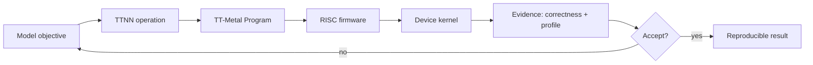
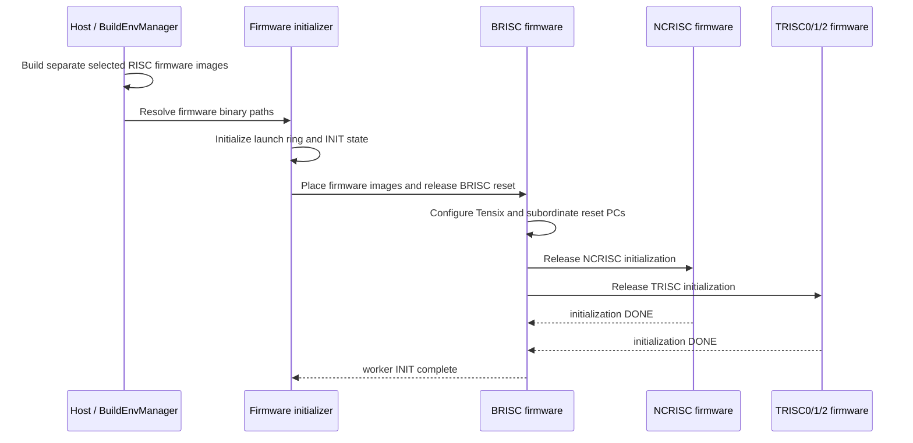
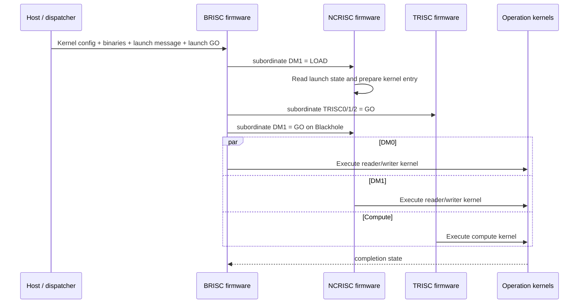
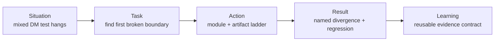
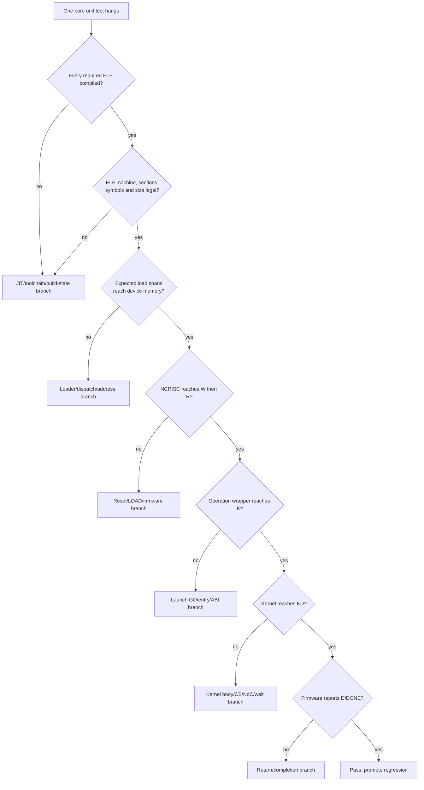
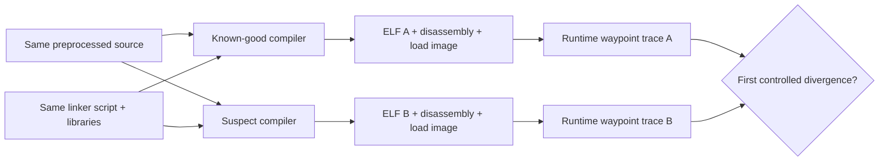
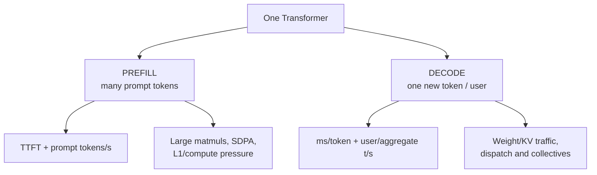
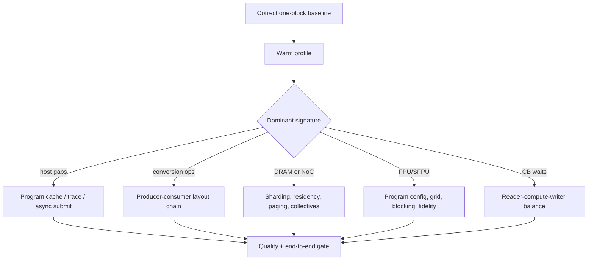

# Discussion subpage 04 — 30-minute research and achievement presentation

Prepared: **19 August 2026**
Source baseline: **TT-Metal `50a82f835593512c4176546b4af68d7e91315a86`**
Interactive page: <https://buicongnguyen.github.io/tt-sim/discussion-presentation.html>

## Purpose

This is a copy-ready presentation plan for a 30-minute technical discussion:

1. optional self-introduction;
2. concise overview of the research method;
3. one Blackhole bring-up/debugging project;
4. one Transformer optimization project;
5. prepared answers for likely architecture, debugging and performance questions.

The slide text is intentionally concise. The speaker notes carry the technical
qualification and code evidence.

## Evidence rule before copying this deck

Three labels are used:

| Label | Meaning | What to do before presenting |
|---|---|---|
| **VERIFIED** | The architecture or API claim was checked in the pinned WSL source | Keep the source link in speaker notes |
| **PERSONALIZE** | The slide describes a project-shaped story but needs the speaker's exact ownership/artifacts | Replace brackets and name the team boundary |
| **MEASURE** | The slide needs a real model/device run | Insert run ID, configuration, repeated result and quality gate |

The present repository proves the source model and the debugging/optimization
method. It does **not** recover the historical compiler binaries or prove a
Blackhole performance speedup. Do not convert those missing artifacts into a
personal achievement claim.

## Run of show — exactly 30 minutes

| Slide | Time | Section | Title |
|---|---:|---|---|
| S01 | 1 min | Open | Self-introduction — optional |
| S02 | 2 min | Research | Research overview |
| S03 | 3 min | Research | System mental model |
| S04 | 3 min | Achievement 1 · S/T | Blackhole bring-up situation and task |
| S05 | 4 min | Achievement 1 · A | Fault-isolation action |
| S06 | 3 min | Achievement 1 · R/L | Result and learning |
| S07 | 3 min | Achievement 2 · S/T | Transformer situation and task |
| S08 | 4 min | Achievement 2 · A | Profile-and-route action |
| S09 | 3 min | Achievement 2 · R/L | Result and learning |
| S10 | 1 min | Close | What I contribute |
| S11 | 3 min | Q&A | Question reserve |
| **Total** | **30 min** | | |

If self-introduction is skipped, reserve four minutes for Q&A. Rehearse the
content to finish the non-Q&A slides in 26–27 minutes.

---

## S01 — Self-introduction — optional

**Time:** 1 minute
**Evidence:** PERSONALIZE

### Slide title

> I work at the boundary between compiler decisions, runtime control and device
> behavior.

### Copy to slide

- `[Name · current role · years/area of experience]`
- Focus: NPU compiler/runtime, low-level kernels and systematic bring-up
- Today: one debugging case, one model-optimization project and the engineering
  method behind both

### Speaker note

Keep this to identity, technical scope and the promise of the talk. Do not spend
time retelling the résumé. If the panel already knows you, skip this slide.

---

## S02 — Research overview

**Time:** 2 minutes
**Evidence:** VERIFIED

### Slide title

> My question is not only “is it fast?”—it is “which contract failed, and at
> which layer?”

### Copy to slide

- Trace one operation from model graph → TTNN → TT-Metal Program → RISC firmware
  → device kernel.
- Turn a hang or regression into the first observable broken boundary.
- Accept an optimization only when correctness, warm performance and
  reproducibility pass together.

### Small research flow



### Speaker note

The highest useful layer owns the first hypothesis. Move downward only when an
observable boundary proves that the lower layer explains the failure or hot
region.

---

## S03 — System mental model

**Time:** 3 minutes
**Evidence:** VERIFIED

### Slide title

> Cold firmware initialization and warm operation launch are different flows.

### Definitions

| Term | Concise definition |
|---|---|
| **BRISC / DM0** | Data-movement RISC 0 and coordinating Tensix firmware loop |
| **NCRISC / DM1** | Independent data-movement RISC 1 firmware loop |
| **TRISC0/1/2** | Three compute RISC threads that run unpack/math/pack portions of a compute kernel |
| **Firmware** | Persistent control program installed while the device initializes |
| **Operation kernel** | Per-Program reader, writer or compute payload executed after a launch message |
| **Launch message** | Per-operation configuration identifying enabled processors, kernel offsets, runtime arguments and related state |

### Diagram A — cold firmware initialization



Code anchors:

- [`BuildEnvManager::build_firmware`](https://github.com/tenstorrent/tt-metal/blob/50a82f835593512c4176546b4af68d7e91315a86/tt_metal/jit_build/build_env_manager.cpp#L340-L383)
- [Host loads the selected Tensix firmware images](https://github.com/tenstorrent/tt-metal/blob/50a82f835593512c4176546b4af68d7e91315a86/tt_metal/impl/device/firmware/risc_firmware_initializer.cpp#L1143-L1199)
- [BRISC programs reset PCs and releases subordinate RISCs](https://github.com/tenstorrent/tt-metal/blob/50a82f835593512c4176546b4af68d7e91315a86/tt_metal/hw/firmware/src/tt-1xx/brisc.cc#L181-L275)
- [Host releases BRISC reset and waits for INIT completion](https://github.com/tenstorrent/tt-metal/blob/50a82f835593512c4176546b4af68d7e91315a86/tt_metal/impl/device/firmware/risc_firmware_initializer.cpp#L1500-L1532)

### Diagram B — operation launch



Code anchors:

- [Dispatch orders config/binary/launch writes before GO](https://github.com/tenstorrent/tt-metal/blob/50a82f835593512c4176546b4af68d7e91315a86/tt_metal/impl/program/dispatch.cpp#L2355-L2422)
- [BRISC publishes DM1 `LOAD`, prepares state and releases execution](https://github.com/tenstorrent/tt-metal/blob/50a82f835593512c4176546b4af68d7e91315a86/tt_metal/hw/firmware/src/tt-1xx/brisc.cc#L439-L488)
- [NCRISC waits for BRISC, prepares its kernel and executes it](https://github.com/tenstorrent/tt-metal/blob/50a82f835593512c4176546b4af68d7e91315a86/tt_metal/hw/firmware/src/tt-1xx/ncrisc.cc#L77-L192)
- [NCRISC operation wrapper and `kernel_main`](https://github.com/tenstorrent/tt-metal/blob/50a82f835593512c4176546b4af68d7e91315a86/tt_metal/hw/firmware/src/tt-1xx/ncrisck.cc#L38-L95)

### Speaker note

Say: **“The host places separate images. BRISC coordinates shared launch state;
NCRISC does not forward firmware to BRISC.”**

There are also two GO-bearing locations in the operation flow:

1. `subordinate_sync->dm1` carries the BRISC-to-NCRISC `LOAD/GO/DONE`
   handshake.
2. `wait_for_go_message()` in the operation wrapper reads the separate
   launch-level `mailboxes->go_messages[...]` word.

---

## S04 — Achievement 1: Blackhole bring-up situation and task

**Time:** 3 minutes
**Evidence:** PERSONALIZE

### Copy to slide

- **Situation:** a one-worker test using both data-movement RISCs hangs after
  host launch.
- **Task:** locate the first broken boundary—build, load, launch handshake,
  entry, kernel body or completion.
- **Constraint:** treat “the third-party compiler is wrong” as a hypothesis
  until a controlled A/B comparison proves it.

### STAR framing



### Personalization checklist

- exact unit-test name and command;
- Blackhole board/SKU and firmware/driver state;
- TT-Metal revision;
- failing third-party compiler name/version/hash;
- first observed Watcher waypoint;
- whether failure is deterministic;
- personal contribution versus team contribution.

### Speaker note

The current repository's case is a source-backed reconstruction. If the
historical artifacts are not available, present the deliverable as a debugging
method—not as a recovered compiler root cause.

---

## S05 — Achievement 1: action

**Time:** 4 minutes
**Evidence:** VERIFIED method; PERSONALIZE result

### Copy to slide

- Run DM0-only, DM1-only and combined one-core tests.
- Record Watcher waypoints and both launch words.
- Verify ELF structure, symbols, disassembly and load spans.
- Verify bytes delivered to the expected device memory.
- Run a matched compiler A/B test with identical input, linker script and
  runtime.

### Decision graph



### Meaning of the short waypoints

| Waypoint | Meaning in the debugging model |
|---|---|
| `W` | NCRISC firmware loop is waiting for BRISC notification |
| `R` | NCRISC completed configuration/CB preparation and is near the operation-kernel call |
| `K` | Operation wrapper entered after the launch-level GO |
| `KD` | `kernel_main()` returned to the wrapper |
| `D` | NCRISC firmware completed the operation path |

`R` without `K` and `K` without `KD` are different intervals and should not be
debugged as the same problem.

### Compiler A/B proof contract



### Speaker note

Compilation alone is not the pass criterion. A credible compiler result needs
the first controlled binary or runtime divergence and the same matrix passing
after the toolchain fix.

---

## S06 — Achievement 1: result and learning

**Time:** 3 minutes
**Evidence:** PERSONALIZE

### Copy to slide

- **Delivered now:** a repeatable module-isolation ladder, binary evidence
  bundle and source-linked launch model.
- **Required historical result:** `[first divergent instruction or artifact]`
  changed by `[compiler fix/version]` and passed `[regression matrix]`.
- **Learning:** build success proves neither binary delivery nor operation
  entry; the first divergent boundary chooses the debugging tool.

### Result sentence template

> I isolated the failure to **[boundary]** by comparing **[artifact A/B]** under
> identical **[controlled conditions]**. After **[specific fix]**, **[test
> matrix]** passed **[repetitions]**, and we added **[regression/monitor]**.

### Evidence to keep in backup slides

- old/new compiler full version and executable hash;
- exact preprocessed translation unit and flags;
- linker script and map;
- ELF program headers, symbols and focused disassembly;
- expected versus read-back load spans;
- Watcher/DPRINT trace for both builds;
- fresh-cache regression results.

---

## S07 — Achievement 2: Transformer situation and task

**Time:** 3 minutes
**Evidence:** PERSONALIZE

### Copy to slide

- **Situation:** the Transformer runs, but prefill and decode expose different
  bottlenecks.
- **Task:** improve one service metric without crossing the quality budget.
- **Contract:** model/checkpoint, Blackhole mesh, prompt/batch/context
  distribution and warm-up are fixed before tuning.

### Mode split



### Fields to replace

- model and checkpoint;
- Blackhole SKU and mesh selector;
- batch and prompt/context distributions;
- primary metric;
- quality threshold;
- baseline run ID and software revision.

---

## S08 — Achievement 2: action

**Time:** 4 minutes
**Evidence:** VERIFIED method

### Copy to slide

- Prove one decoder block before timing the full model.
- Profile warmed prefill and decode separately.
- Stabilize shapes and remove only legal layout conversions.
- Tune attention and gated MLP at the TTNN/program-config layer.
- Apply BFP8/BFP4 by tensor role under a quality gate.
- Capture/replay only the stable hot loop; descend into kernels only after an
  isolated operation proves the need.

### Optimization routing graph



### Precision policy already present in source

The pinned TT-Transformers configuration defines tensor groups `FF1_FF3`,
`FF2`, `WQKV`, `WO`, `KV_CACHE` and `ACTIVATION`, with `BF16`, `BFP8` and
`BFP4` precision settings. Its default is BFP8 for the weight/KV groups, while
the performance policy applies BFP4 to FF1/FF3. See:

- [tensor/precision group definitions](https://github.com/tenstorrent/tt-metal/blob/50a82f835593512c4176546b4af68d7e91315a86/models/tt_transformers/tt/model_config.py#L67-L80);
- [accuracy and performance policies](https://github.com/tenstorrent/tt-metal/blob/50a82f835593512c4176546b4af68d7e91315a86/models/tt_transformers/tt/model_config.py#L128-L237);
- [default mixed-precision and fidelity policy](https://github.com/tenstorrent/tt-metal/blob/50a82f835593512c4176546b4af68d7e91315a86/models/tt_transformers/tt/model_config.py#L288-L318).

---

## S09 — Achievement 2: result and learning

**Time:** 3 minutes
**Evidence:** MEASURE

### Copy to slide

- `[Baseline → final TTFT, prompt tokens/s, ms/token and user/aggregate tokens/s]`
- `[Layer PCC, logits/token agreement and perplexity or task quality]`
- `[Causal profile evidence: conversion/dispatch/traffic or hot-op delta]`
- Learning: smaller storage is an opportunity; the measured system result is
  the achievement.

### Result table template

| Run | Change | Prefill | Decode | Quality | Profile explanation | Decision |
|---|---|---:|---:|---:|---|---|
| B0 | accuracy baseline | `—` | `—` | `—` | baseline | keep |
| B1 | performance preset | `—` | `—` | `—` | `—` | `—` |
| B2 | shape/layout chain | `—` | `—` | `—` | `—` | `—` |
| B3 | per-role precision | `—` | `—` | `—` | `—` | `—` |
| B4 | trace/kernel change | `—` | `—` | `—` | `—` | `—` |

### Speaker note

Do not report “BFP4 gives 4× speedup.” BFP4 reduces a standard 32×32 tile from
2,048 bytes in BF16 to 576 bytes, but end-to-end latency also includes alignment,
conversion, compute, dispatch and other traffic.

---

## S10 — Close

**Time:** 1 minute
**Evidence:** PERSONALIZE

### Copy to slide

> I turn opaque accelerator failures into small, falsifiable experiments—and
> carry the evidence back up to model results.

- Cross-layer ownership: compiler, runtime, firmware and kernel.
- Evidence discipline: revision, artifact hashes, code anchors and regression
  gates.
- Team impact: the next engineer can repeat the diagnosis or optimization.

---

## S11 — Q&A reserve

**Time:** 3 minutes

Use this first-answer structure:

```text
claim → strongest evidence → limitation → next experiment
```

### Q1 — Why do you say NCRISC does not call BRISC?

They are independent firmware loops. BRISC writes the shared subordinate DM1
`LOAD/GO` state. NCRISC polls it, prepares its operation-kernel entry, runs that
entry and writes `DONE`. The control relation is a shared-memory handshake, not a
normal C/C++ call from NCRISC to BRISC.

### Q2 — What does `R` without `K` mean?

`R` is a firmware waypoint near the operation-kernel call, while `K` is the
operation wrapper after its launch-level GO wait. `R` without `K` routes the
investigation to the launch GO, ELF entry/PC, ABI or wrapper prologue. `K` without
`KD` routes it inside `kernel_main()` or a wait used by that kernel.

### Q3 — How would you prove a compiler root cause?

Hold preprocessed source, flags, linker script, libraries, runtime state and
device constant. Change only compiler build. Compare ELF headers, map,
disassembly and delivered bytes, then identify the first runtime divergence and
show the fixed build passing the same regression matrix.

### Q4 — Why not start with DPRINT everywhere?

Watcher gives a low-volume per-RISC classification first. DPRINT adds traffic and
can perturb or block timing-sensitive code. Add a minimal DPRINT only after the
failing interval is known. Tracy answers timing questions, and JTAG/GDB is a
last-mile mechanism when the hardware and debug transport expose it.

### Q5 — Why separate cold boot from operation launch?

Cold boot installs persistent firmware and initializes the core. Operation
launch delivers or reuses a Program's binaries/configuration and publishes a
launch message. The owners, messages, lifetimes and likely failure points are
different.

### Q6 — Why BFP8 instead of INT8 for the current LLM path?

The pinned [`ttnn.linear` binding](https://github.com/tenstorrent/tt-metal/blob/50a82f835593512c4176546b4af68d7e91315a86/ttnn/cpp/ttnn/operations/matmul/matmul_nanobind.cpp#L824-L898)
lists BF16, FP32, BFP8_B and BFP4_B tile inputs. INT8 exists in the tensor and
LLK layers, but that does not make it a supported generic `ttnn.linear` input.

### Q7 — What is the largest quantization risk?

Applying one dtype to every tensor. Attention weights, KV cache, residuals,
normalization, MLP weights and accumulation paths have different error
sensitivity. The rollback unit should be a tensor role or layer.

### Q8 — How do you know a speedup is real?

Use the same model, prompts, mesh, software revision, warm-up and quality gate;
change one variable; repeat warm measurements; and retain a profiler signature
that explains the delta.

## Logic review

| Review question | Failure avoided | Gate |
|---|---|---|
| Is the speaker's personal contribution separated from team work? | inflated ownership | name exact implementation, diagnosis, test or decision owned |
| Is a compiler claim supported by a controlled A/B divergence? | correlation presented as causation | matched build inputs + first binary/runtime divergence |
| Is the result measured on a named workload and device? | unreproducible speedup | model, mesh, shapes, revision, warm-up, repetitions and quality |
| Are cold boot and operation launch separated? | wrong firmware/message ownership | use the two small sequence diagrams |
| Does slide time total 30 minutes? | no Q&A reserve | rehearse to 27 minutes plus 3 minutes Q&A |
| Are limitations said aloud? | overclaim under questioning | keep the evidence label in speaker notes |

## Code review

The presentation flow was checked against these concrete source facts:

1. `BuildEnvManager::build_firmware` is the host build boundary.
2. `RiscFirmwareInitializer::initialize_firmware` iterates selected processor
   classes/RISC IDs and loads each binary; it does not send one common image to
   NCRISC for redistribution.
3. Host initialization releases BRISC reset on traditional tt-1xx workers and
   waits for `RUN_MSG_INIT` completion.
4. BRISC programs NCRISC/TRISC reset PCs and deasserts subordinate reset.
5. BRISC writes DM1 `LOAD`; Blackhole later writes DM1 `GO`.
6. NCRISC independently polls the subordinate word, prepares configuration and
   calls its computed operation-kernel address.
7. The TT-Transformers precision policy is per tensor group and per decoder;
   the performance preset is not an INT8 model-wide switch.
8. The generic `ttnn.linear` Python contract lists BF16, FP32, BFP8_B and BFP4_B
   tile inputs.

## Final rehearsal checklist

- [ ] all bracketed personal fields replaced;
- [ ] no historical compiler root-cause claim without old/new artifacts;
- [ ] exact unit test, compiler, board and TT-Metal revision on backup slide;
- [ ] exact model, mesh, workload and quality budget on optimization slide;
- [ ] results table contains measured values and run IDs;
- [ ] architecture diagrams fit and remain legible;
- [ ] full talk finishes by minute 27;
- [ ] first answers to Q1–Q8 stay under 45 seconds.
