# Discussion chain 02 — optimize a Transformer on Blackhole

Started: **18 August 2026**

Status: **source-backed plan; model-specific measurements open**

Source baseline: **`tenstorrent/tt-metal@50a82f835593512c4176546b4af68d7e91315a86`**

Interactive view:
<https://buicongnguyen.github.io/tt-sim/discussion-transformer-blackhole-optimization.html>

## Question

> I have a Transformer model. How do I optimize it for a Tenstorrent Blackhole
> device, step by step, and how does each model-level decision reach the TTNN
> and TT-Metal kernels?

## Scope and honesty boundary

No checkpoint, model dimensions, batch distribution, context length, quality
threshold, Blackhole SKU or baseline profile was supplied. Therefore this is a
repeatable **optimization case study and decision process**, not a claim that a
specific private model has already achieved a particular speedup.

The representative workload is a decoder-only, Llama-style Transformer using
the shared [`models/tt_transformers`](https://github.com/tenstorrent/tt-metal/tree/50a82f835593512c4176546b4af68d7e91315a86/models/tt_transformers)
implementation on Blackhole. The source already supports multiple model
families, but every result must be re-measured for the actual checkpoint and
SKU. The guide distinguishes three evidence classes:

| Label | Meaning |
|---|---|
| **SOURCE** | Behavior visible in the pinned `tt-metal` code |
| **DECISION** | A tuning choice to test on the target model |
| **MEASURE** | A field that remains empty until hardware results are captured |

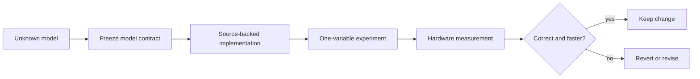

The key rule is simple: **source evidence chooses a plausible experiment;
measurement decides whether the experiment is an optimization.**

## The optimization contract

Fill this before editing a program config or kernel:

| Field | Required value |
|---|---|
| Model/checkpoint and revision | `____________________________` |
| Physical Blackhole SKU/board | `P100 / P150 / P300 / ...` |
| Demo `MESH_DEVICE` selector and opened mesh | `P150 / P300 / P150x4 / P150x8 / BHGLX`, mesh `____ × ____` |
| TT-Metal revision | `50a82f835593512c4176546b4af68d7e91315a86` or replacement |
| Batch/users | `____` |
| Prompt lengths | p50 `____`, p95 `____`, maximum `____` tokens |
| Decode lengths | p50 `____`, p95 `____`, maximum `____` tokens |
| Attention type | MHA / GQA / MQA / sliding window / other |
| Quality gate | PCC `____`, token match `____`, perplexity delta `____` |
| Primary objective | TTFT / user latency / aggregate tokens/s / memory |
| Power and thermal policy | `____________________________` |

Do not optimize one unnamed “Transformer latency.” Autoregressive inference has
two workloads with different shapes and bottlenecks.

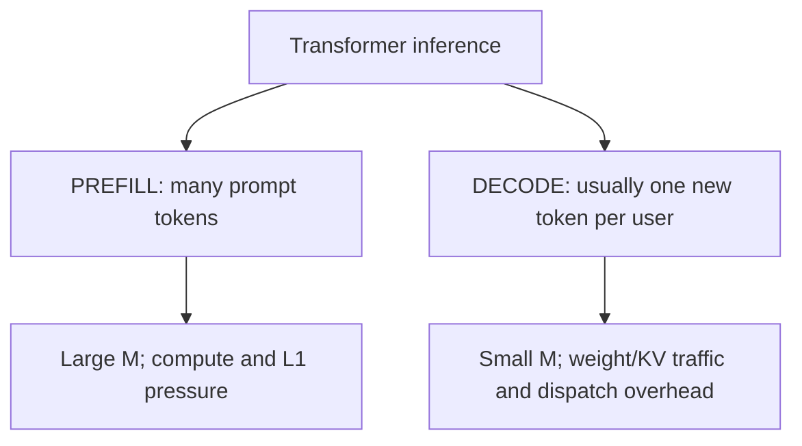

The shared model source makes the split explicit: input preparation branches on
mode, the decoder loops through the same layers, and the final norm/LM head runs
after the layer loop. See
[`model.py:338–473`](https://github.com/tenstorrent/tt-metal/blob/50a82f835593512c4176546b4af68d7e91315a86/models/tt_transformers/tt/model.py#L338-L473)
and
[`model.py:867–965`](https://github.com/tenstorrent/tt-metal/blob/50a82f835593512c4176546b4af68d7e91315a86/models/tt_transformers/tt/model.py#L867-L965).

## Baseline: correctness before performance

Use the existing demo as the reference harness before changing code. Set the
actual model and mesh; these example commands use Llama 3.1 8B only as a
concrete starting point.

```bash
cd ~/src/tt-metal
source python_env/bin/activate

export HF_MODEL=meta-llama/Llama-3.1-8B
export MESH_DEVICE=P150
export TT_CACHE_PATH=$PWD/model_cache

# Establish the quality path first.
pytest models/tt_transformers/demo/simple_text_demo.py \
  -k "accuracy and batch-1"

# Then run the existing performance configuration without local changes.
pytest models/tt_transformers/demo/simple_text_demo.py \
  -k "performance and batch-1"
```

The base Llama 3.1 8B checkpoint above is the P150-verified pairing listed in
the pinned README. The actual demo fixture maps the Blackhole selectors `P150`,
`P300`, `P150x4`, `P150x8` and `BHGLX` to explicit mesh shapes; do not substitute
a physical marketing SKU name unless that selector exists in the fixture. The
exact runnable modes, cache behavior, paging parameters and optimization levels
are documented in the pinned
[`models/tt_transformers/README.md`](https://github.com/tenstorrent/tt-metal/blob/50a82f835593512c4176546b4af68d7e91315a86/models/tt_transformers/README.md),
and the selector map is in
[`simple_text_demo.py:845–861`](https://github.com/tenstorrent/tt-metal/blob/50a82f835593512c4176546b4af68d7e91315a86/models/tt_transformers/demo/simple_text_demo.py#L845-L861).
Record first-run compilation separately from steady-state execution.

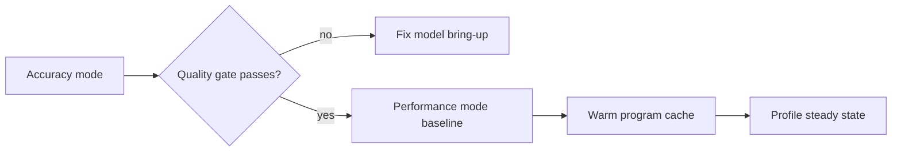

## Profile the right region

Profile prefill and decode separately, after warm-up. End-to-end time alone
cannot tell whether the next edit belongs in Python orchestration, tensor
layout, a TTNN operation, a data-movement kernel or a compute kernel.

```bash
cd ~/src/tt-metal
source python_env/bin/activate

python -m tracy -p -r -v -m pytest \
  models/tt_transformers/demo/simple_text_demo.py \
  -k "performance and batch-1"

# Optional Blackhole hardware-counter pass. It may require a source build and
# current profiler dependencies.
python -m tracy --profiler-capture-perf-counters=all \
  -m "pytest models/tt_transformers/demo/simple_text_demo.py -k 'performance and batch-1'"
```

The official profiler documentation explains the operations CSV and
Blackhole-specific counter groups:
[Profiling TTNN operations](https://docs.tenstorrent.com/tt-metal/latest/ttnn/ttnn/profiling_ttnn_operations.html).
Use [TTNN Visualizer](https://docs.tenstorrent.com/tt-metal/latest/ttnn/ttnn/tutorials/tutorials/ttnn_visualizer.html)
to inspect operation flow, tensor shape/layout, L1/DRAM placement and buffers.

Classify the dominant cost before choosing a change:

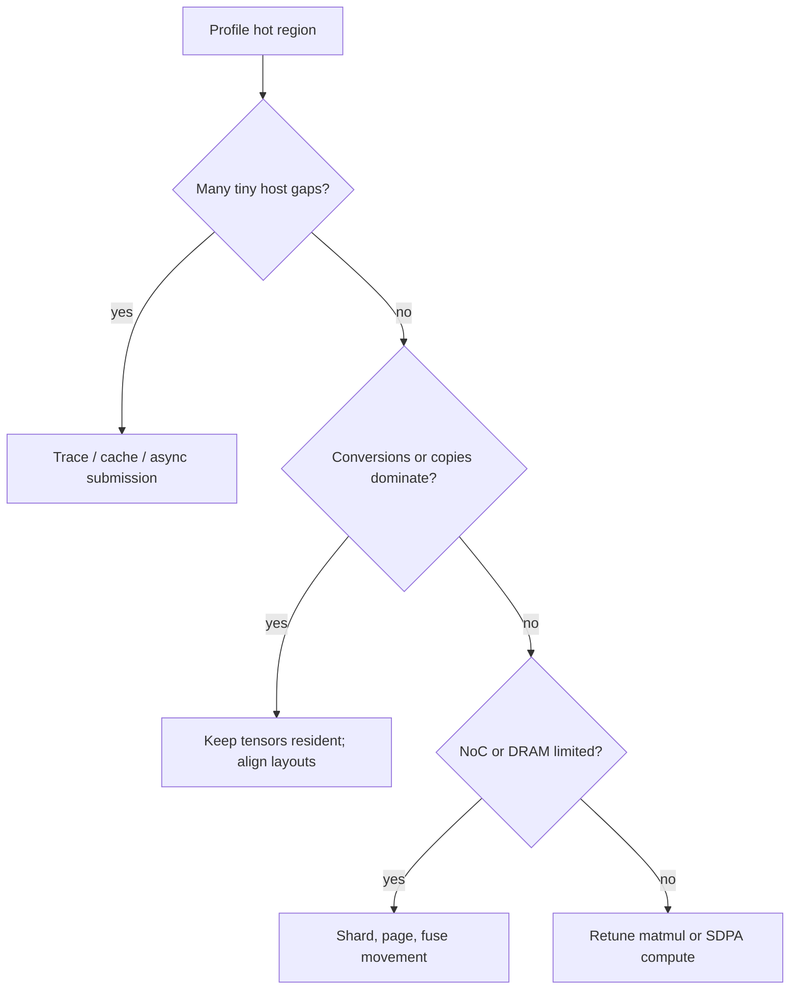

## Step 1 — preserve the model graph and isolate one decoder block

The shared model constructs embeddings, rotary state, a list of
`TransformerBlock`s, final normalization and the LM head in
[`model.py:23–152`](https://github.com/tenstorrent/tt-metal/blob/50a82f835593512c4176546b4af68d7e91315a86/models/tt_transformers/tt/model.py#L23-L152).
Each block performs attention normalization, attention, residual addition,
feed-forward normalization, MLP and the second residual addition in
[`decoder.py:219–338`](https://github.com/tenstorrent/tt-metal/blob/50a82f835593512c4176546b4af68d7e91315a86/models/tt_transformers/tt/decoder.py#L219-L338).

Start with one block and compare every boundary to the reference implementation.
This makes a wrong layout or precision choice local instead of allowing an
error to accumulate across all layers.

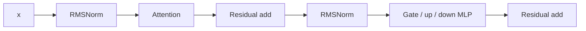

**Decision:** if one block fails the quality gate, stop. More sharding or lower
precision will hide the boundary; it will not repair it.

## Step 2 — make shape and padding policy explicit

Tiles and program-cache keys reward stable shapes. The current source contains
several shape facts that must become test cases:

- Decode inputs are padded to a tile-sized batch representation during input
  preparation.
- Prefill attention requires a sequence length divisible by 128 in the shared
  path and reshapes long sequences.
- The MLP reshapes prefill sequences at a cutoff that defaults to **512 on
  Blackhole** and **1024 otherwise**.
- The Blackhole QKV prefill config can use an `8 × 10` compute/storage grid,
  compared with `8 × 8` in the other branch.

Sources:
[`attention.py:876–928`](https://github.com/tenstorrent/tt-metal/blob/50a82f835593512c4176546b4af68d7e91315a86/models/tt_transformers/tt/attention.py#L876-L928),
[`mlp.py:118–143`](https://github.com/tenstorrent/tt-metal/blob/50a82f835593512c4176546b4af68d7e91315a86/models/tt_transformers/tt/mlp.py#L118-L143),
[`model_config.py:528–680`](https://github.com/tenstorrent/tt-metal/blob/50a82f835593512c4176546b4af68d7e91315a86/models/tt_transformers/tt/model_config.py#L528-L680),
and
[`model_config.py:1687–1720`](https://github.com/tenstorrent/tt-metal/blob/50a82f835593512c4176546b4af68d7e91315a86/models/tt_transformers/tt/model_config.py#L1687-L1720).

Create a shape matrix before tuning:

| Mode | Batch | Sequence/context | Cache state | Expected compiled shape |
|---|---:|---:|---|---|
| prefill-short | `____` | 128 | empty | `________________` |
| prefill-cutoff | `____` | 512 | empty | `________________` |
| prefill-long | `____` | `____` | empty | `________________` |
| decode-start | `____` | context `____` | populated | `________________` |
| decode-long | `____` | context `____` | populated | `________________` |

**Decision:** pad at one intentional boundary and reuse that shape. Do not add
an operation-by-operation pad/unpad cycle.

## Step 3 — keep activations resident and choose layouts as a chain

Inspect the profiler for `from_torch`, `to_torch`, `to_memory_config`, tilize,
untilize, interleaved-to-sharded and sharded-to-interleaved operations. A fast
matmul surrounded by layout conversion can lose at the layer level.

The decoder explicitly checks and converts residual memory configuration before
the layer body, then places intermediate attention/MLP outputs according to
model-config decisions. See
[`decoder.py:234–336`](https://github.com/tenstorrent/tt-metal/blob/50a82f835593512c4176546b4af68d7e91315a86/models/tt_transformers/tt/decoder.py#L234-L336).
Blackhole-specific decode head output sharding is selected in
[`model_config.py:1796–1825`](https://github.com/tenstorrent/tt-metal/blob/50a82f835593512c4176546b4af68d7e91315a86/models/tt_transformers/tt/model_config.py#L1796-L1825).

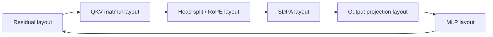

**Decision:** change the whole producer-to-consumer chain on paper first. Keep a
conversion only when the next operation requires it or when its cost is repaid
by a materially faster kernel.

## Step 4 — optimize attention as separate prefill and decode programs

### Decode

The decode path already encodes important optimization choices:

1. one fused QKV `ttnn.linear` call with a mode-specific memory, program and
   compute configuration;
2. head split and rotary embedding;
3. fused or separate paged K/V cache update;
4. paged or ordinary decode SDPA;
5. head concatenation;
6. output projection, with optional asynchronous collective/matmul fusion on
   supported multi-chip paths.

Read
[`attention.py:589–735`](https://github.com/tenstorrent/tt-metal/blob/50a82f835593512c4176546b4af68d7e91315a86/models/tt_transformers/tt/attention.py#L589-L735)
and
[`attention.py:738–874`](https://github.com/tenstorrent/tt-metal/blob/50a82f835593512c4176546b4af68d7e91315a86/models/tt_transformers/tt/attention.py#L738-L874).

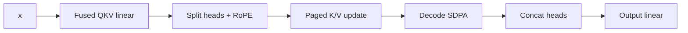

The source comment chooses HiFi2 for some DRAM-sharded decode matmuls because
they would otherwise be FLOP-bound, while acknowledging a one-bit activation
precision cost. Treat that as an existing **source-backed trade-off**, not a
universal rule. Measure the actual quality gate before retaining it.

For long-lived or variable-length requests, test paged KV cache. The TTNN
wrapper validates decode chunk sizes and dispatches paged/non-paged variants in
[`sdpa_decode.cpp:41–178`](https://github.com/tenstorrent/tt-metal/blob/50a82f835593512c4176546b4af68d7e91315a86/ttnn/cpp/ttnn/operations/transformer/sdpa_decode/sdpa_decode.cpp#L41-L178).

### Prefill

The prefill path batches/reshapes the prompt, performs fused QKV projection,
fills the K/V cache, chooses chunked or normal causal SDPA, concatenates heads
and projects the output. Read
[`attention.py:876–1068`](https://github.com/tenstorrent/tt-metal/blob/50a82f835593512c4176546b4af68d7e91315a86/models/tt_transformers/tt/attention.py#L876-L1068)
and
[`attention.py:1070–1188`](https://github.com/tenstorrent/tt-metal/blob/50a82f835593512c4176546b4af68d7e91315a86/models/tt_transformers/tt/attention.py#L1070-L1188).

**Decision:** tune prefill Q/K chunk size and grid for the actual prompt-length
distribution. Tune decode chunking for the context-length distribution. A
single compromise configuration is easy to maintain but rarely proves both
objectives.

## Step 5 — optimize the gated MLP without materializing avoidable work

The shared MLP computes gate and up projections, applies the configured
activation inside `ttnn.mul`, then performs the down projection. It explicitly
deallocates dead intermediates and selects a different prefill/decode matmul
path. See
[`mlp.py:118–330`](https://github.com/tenstorrent/tt-metal/blob/50a82f835593512c4176546b4af68d7e91315a86/models/tt_transformers/tt/mlp.py#L118-L330).

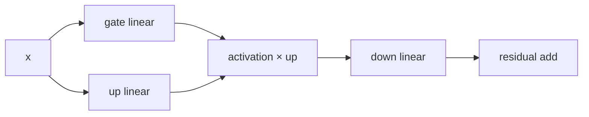

Check, in order:

1. `w1` and `w3` use the intended common input layout;
2. the activation is fused into the multiply rather than emitted as a separate
   materialized tensor;
3. the multiply output already matches the down-projection input layout;
4. the program config uses the useful Blackhole grid without overflowing L1;
5. dead inputs are deallocated at their last consumer;
6. prefill and decode use separate configs when their M dimension differs.

**Decision:** if the profiler shows the two projection matmuls dominating,
tune their grid/blocking. If conversions dominate, fix the chain. If the binary
activation/multiply dominates, inspect fusion and data format before writing a
new matmul kernel.

## Step 6 — reduce precision by tensor role, not globally

The current `ttnn.linear` binding documents BFLOAT16, FLOAT32, BFLOAT8_B and
BFLOAT4_B tile inputs, and the matmul validator enforces tile/layout and
tiny-tile constraints. See
[`matmul_nanobind.cpp:824–898`](https://github.com/tenstorrent/tt-metal/blob/50a82f835593512c4176546b4af68d7e91315a86/ttnn/cpp/ttnn/operations/matmul/matmul_nanobind.cpp#L824-L898)
and
[`matmul_device_operation.cpp:31–159`](https://github.com/tenstorrent/tt-metal/blob/50a82f835593512c4176546b4af68d7e91315a86/ttnn/cpp/ttnn/operations/matmul/device/matmul_device_operation.cpp#L31-L159).

Use a per-role sweep:

| Tensor/operation role | Start | Candidate | Gate |
|---|---|---|---|
| norm and residual | BF16 / higher-accuracy config | keep wide first | block PCC + end-to-end quality |
| QKV / output weights | current source config | BFP8_B, then BFP4_B if supported | attention output + model quality |
| MLP weights | current source config | BFP8_B, then BFP4_B if supported | block PCC + perplexity/token gate |
| activations | BF16 | BFP8_B only after weights pass | accumulation-sensitive quality |
| SDPA accumulations | source compute config | fidelity/FP32 accumulator sweep | long-context stability |
| KV cache | source format | narrower only with long-context tests | token agreement over context |

`DecodersPrecision` and the per-layer optimization config are the right control
surface; do not hard-code one dtype deep inside a kernel until the per-layer
sweep proves the need. Keep the first failing tensor role wide, then continue
with the others.

## Step 7 — trace stable decode and remove host work from the token loop

Decode repeats a nearly stable graph. The generator compiles once, prepares
device-resident inputs, begins capture, invokes the model, ends capture, then
updates inputs and executes the trace non-blocking in later iterations. See
[`generator.py:1535–1621`](https://github.com/tenstorrent/tt-metal/blob/50a82f835593512c4176546b4af68d7e91315a86/models/tt_transformers/tt/generator.py#L1535-L1621)
and
[`generator.py:1623–1692`](https://github.com/tenstorrent/tt-metal/blob/50a82f835593512c4176546b4af68d7e91315a86/models/tt_transformers/tt/generator.py#L1623-L1692).

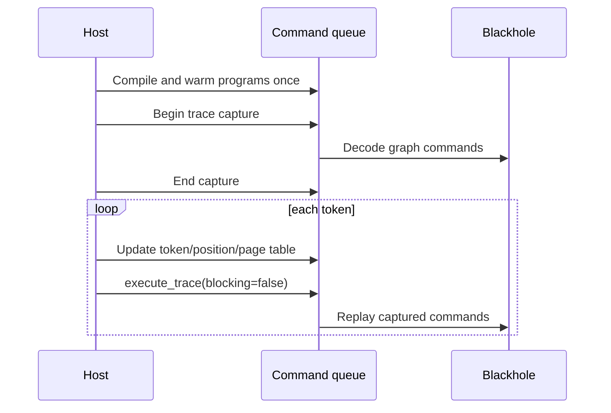

Trace only after shapes, memory locations and program variants are stable. A
shape change inside capture can select a different program or invalidate an
address assumption. Measure:

- host gap between device operations;
- dispatch count per token;
- decode milliseconds per token after warm-up;
- whether sampling or tensor conversion returns to the host.

If host sampling is on the critical path, test an on-device supported path for
the actual batch/sampling mode. Preserve exact sampling semantics as a
correctness condition.

## Compiler branch — where TT-Forge and TT-MLIR enter

The official project name is **TT-Forge**, not “tt-force.” In the current
Tenstorrent stack, the TT-Forge repository is the umbrella for the end-to-end
compiler projects and TT-MLIR is the core middle/backend compiler. The
[official TT-Forge overview](https://docs.tenstorrent.com/forge/index.html)
lists TT-XLA and TT-Forge-ONNX as frontends and TT-MLIR as the middle/backend.
The [current TT-Forge repository](https://github.com/tenstorrent/tt-forge)
describes the following responsibilities:

| Project | Current responsibility |
|---|---|
| TT-XLA | primary PyTorch/JAX frontend; PJRT produces StableHLO for TT-MLIR |
| TT-Forge-ONNX | ONNX, TensorFlow and PaddlePaddle frontend through TVM |
| TT-MLIR | TTIR, TTNN and TTKernel dialects; graph fusion, sharding, layout and lowering |
| TT-Lang | early-preview Python DSL for high-performance custom kernels |
| TTNN / TT-Metalium | operation/runtime and low-level program/kernel implementation |

This does not invalidate the handwritten path audited in the rest of this page.
It creates **two distinct routes** that converge on TTNN/TT-Metalium:

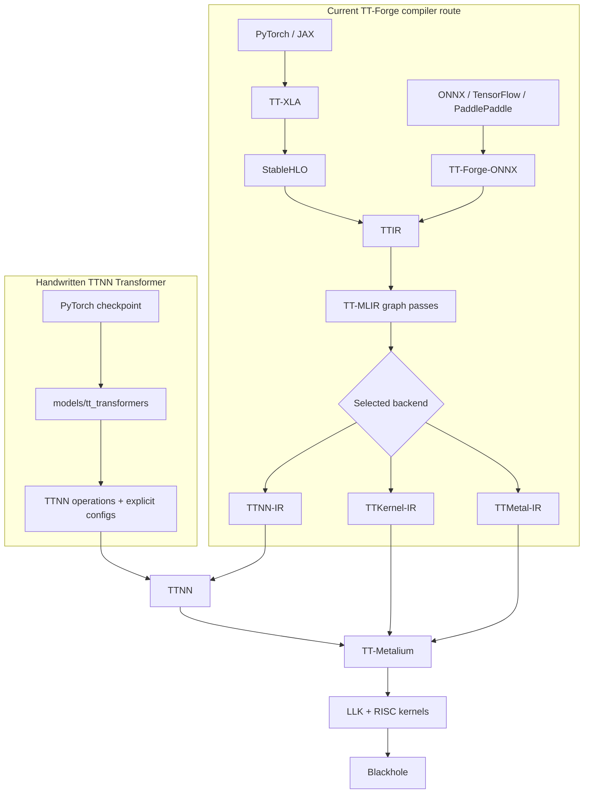

### Release and revision boundary

The latest TT-Forge development release displayed during this review on
**19 August 2026** was
[`1.5.0.dev20260819000359`](https://github.com/tenstorrent/tt-forge/releases).
Its release record pins:

| Dependency | Release-pinned commit |
|---|---|
| TT-XLA | `2ddaf4bc36f7def52dc60d392c820ab464e99f30` |
| TT-MLIR | `71046369d603b97fd6a8dd8b947ca8588ac2a74f` |
| TT-Metal | `5beed318d0f0d1c6212e605947fb0be80c9e0a1d` |

The handwritten TTNN analysis in this page is pinned to a different local
revision: `tt-metal@50a82f835593512c4176546b4af68d7e91315a86`.
Therefore:

> Do not combine a finding from the local pinned TTNN source with a finding from
> the latest TT-Forge dependency set as though they came from one build. Re-run
> the source and performance audit at the exact dependency commits used by the
> selected TT-Forge release.

### How the four Transformer performance levers divide across the stack

| Lever | TT-Forge / TT-MLIR responsibility | TTNN / TT-Metal responsibility | Acceptance evidence |
|---|---|---|---|
| KV cache and attention | for recognized frontend forms, preserve cache/update and SDPA semantics through legal conversion/fusion | execute paged cache update, chunked SDPA and reader/compute/writer kernels | successful lowering for the exact graph plus context-bucket traffic and long-decode token agreement |
| layout and sharding | propagate legal layouts, select operation configurations and manage spills using the target system description | honor concrete memory configs, grids, circular buffers and NoC ownership | fewer legal conversions/spills in both IR and device traces |
| quantization | preserve Q/DQ and dtype semantics for supported patterns; reject or decompose unsupported forms | provide legal storage, math, accumulation, pack/unpack and conversion kernels | exact bit-width/operator lowering plus layer/model quality and warm traffic/latency |
| fusion and dispatch | recognize graph patterns and remove materialized intermediates or layout repair | cache programs, capture stable traces, dispatch and run the fused operation | fewer dispatches, allocations or transferred bytes—not only fewer IR operations |

The TT-MLIR
[dialect overview](https://docs.tenstorrent.com/tt-mlir/dialects-overview.html)
defines TTIR as the high-level tensor graph, TTNN as the dialect modeling the
TTNN API, TTKernel for kernel-library operations and TTMetal for host-to-device
dispatch. The current
[TTNN optimizer documentation](https://docs.tenstorrent.com/tt-mlir/specs/ttnn-optimizer.html)
describes layout propagation, operation-configuration selection and L1 spill
management. Those are compiler decisions only when the model actually passes
through that compiler pipeline.

The release-pinned TT-MLIR code makes three parts of that statement concrete:

- [`StableHLOToTTIRPatterns.cpp:1307–1385`](https://github.com/tenstorrent/tt-mlir/blob/71046369d603b97fd6a8dd8b947ca8588ac2a74f/lib/Conversion/StableHLOToTTIR/StableHLOToTTIRPatterns.cpp#L1307-L1385)
  converts recognized StableHLO uniform quantize/dequantize operations to TTIR
  quantize, requantize and dequantize operations.
- [`StableHLOToTTIRPatterns.cpp:8449–8641`](https://github.com/tenstorrent/tt-mlir/blob/71046369d603b97fd6a8dd8b947ca8588ac2a74f/lib/Conversion/StableHLOToTTIR/StableHLOToTTIRPatterns.cpp#L8449-L8641)
  recognizes specific `tt.fill_cache`, `tt.update_cache` and
  `tt.paged_update_cache` custom calls; the SDPA composite conversion has its
  own operand/result and mask checks in
  [`StableHLOLegalizeCompositePass.cpp:2064–2138`](https://github.com/tenstorrent/tt-mlir/blob/71046369d603b97fd6a8dd8b947ca8588ac2a74f/lib/Conversion/StableHLOToTTIR/StableHLOLegalizeCompositePass.cpp#L2064-L2138).
- [`TTNNPipelines.cpp:100–158`](https://github.com/tenstorrent/tt-mlir/blob/71046369d603b97fd6a8dd8b947ca8588ac2a74f/lib/Dialect/TTNN/Pipelines/TTNNPipelines.cpp#L100-L158)
  assembles the current greedy memory-layout propagation, L1-spill management,
  canonicalization and operation-validation/fallback sequence.

These files prove that conversion machinery exists. They do **not** prove that
an arbitrary Transformer graph matches a recognized pattern, that every shape
and dtype is legal, or that the resulting operation has a performant Blackhole
kernel. Inspect the emitted IR and run the exact model.

> **Blackhole budget warning:** the current TTNN optimizer document explicitly
> says its example capacity, latency and per-core budget numbers are Wormhole
> values. The pass structure is useful for Blackhole analysis, but its numeric
> budgets must come from the selected Blackhole system descriptor and backend,
> not from those example tables.

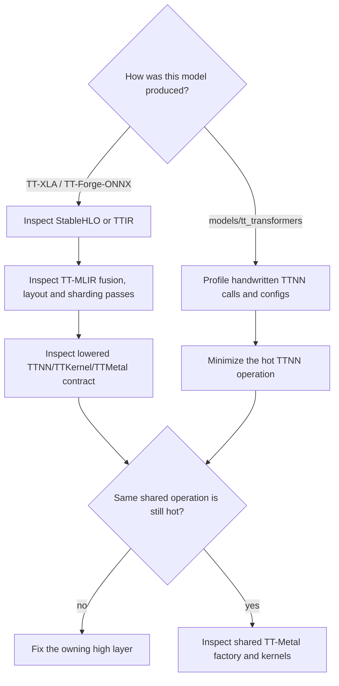

### Practical decision rule

1. For an existing `models/tt_transformers` implementation, begin with its
   TTNN model/configuration, KV-cache and trace paths.
2. For a PyTorch/JAX model entering through TT-XLA, inspect StableHLO → TTIR →
   the selected backend IR and the TT-MLIR passes before editing a device
   kernel.
3. For an ONNX-family model, inspect TT-Forge-ONNX → TTIR before the shared
   TT-MLIR route.
4. Descend into TT-Metal only after either route produces a minimized operation
   whose lower-level implementation is the measured cause.
5. Compare the two routes only with the same model, inputs, data formats,
   hardware, release-pinned dependencies and quality gate.

## Step 8 — follow a hot `ttnn.linear` into TT-Metal before changing kernels

The code path for a hot projection is concrete:

1. Python calls `ttnn.linear` from the Transformer module.
2. Nanobind maps `linear` to the C++ function.
3. C++ builds `MatmulParams`, selects/normalizes the program config and invokes
   `ttnn::prim::matmul`.
4. `MatmulDeviceOperation` validates tensors and selects a program factory.
5. The factory creates data-movement and compute kernels, circular buffers and
   per-core runtime arguments.
6. TT-Metal compiles/caches and dispatches those kernels to the worker RISCs.

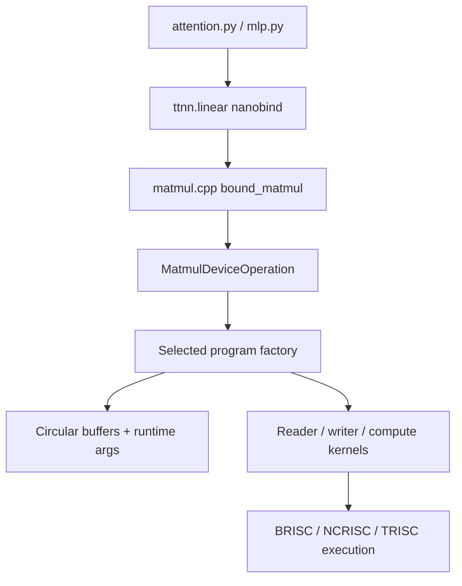

Direct code links:

- [`matmul_nanobind.cpp:824–898`](https://github.com/tenstorrent/tt-metal/blob/50a82f835593512c4176546b4af68d7e91315a86/ttnn/cpp/ttnn/operations/matmul/matmul_nanobind.cpp#L824-L898) — Python binding.
- [`matmul.cpp:217–362`](https://github.com/tenstorrent/tt-metal/blob/50a82f835593512c4176546b4af68d7e91315a86/ttnn/cpp/ttnn/operations/matmul/matmul.cpp#L217-L362) and
  [`matmul.cpp:414–451`](https://github.com/tenstorrent/tt-metal/blob/50a82f835593512c4176546b4af68d7e91315a86/ttnn/cpp/ttnn/operations/matmul/matmul.cpp#L414-L451) — program choice, primitive call and `linear` parameters.
- [`matmul_device_operation.hpp:18–55`](https://github.com/tenstorrent/tt-metal/blob/50a82f835593512c4176546b4af68d7e91315a86/ttnn/cpp/ttnn/operations/matmul/device/matmul_device_operation.hpp#L18-L55) — device-operation interface and factory variants.
- [`matmul_device_operation.cpp:2127–2160`](https://github.com/tenstorrent/tt-metal/blob/50a82f835593512c4176546b4af68d7e91315a86/ttnn/cpp/ttnn/operations/matmul/device/matmul_device_operation.cpp#L2127-L2160) — factory selection.
- [`matmul_multicore_reuse_mcast_1d_program_factory.cpp:607–965`](https://github.com/tenstorrent/tt-metal/blob/50a82f835593512c4176546b4af68d7e91315a86/ttnn/cpp/ttnn/operations/matmul/device/factory/matmul_multicore_reuse_mcast_1d_program_factory.cpp#L607-L965) — representative kernel and circular-buffer creation.
- [`matmul_multicore_reuse_mcast_1d_program_factory.cpp:1039–1164`](https://github.com/tenstorrent/tt-metal/blob/50a82f835593512c4176546b4af68d7e91315a86/ttnn/cpp/ttnn/operations/matmul/device/factory/matmul_multicore_reuse_mcast_1d_program_factory.cpp#L1039-L1164) — per-core runtime arguments.

**Decision:** stay at the highest layer that explains the bottleneck. Change a
model config before a TTNN operation, a TTNN program config before a factory,
and a factory before an LLK. Descend only when the profiler and a minimized op
test show the lower layer is responsible.

## Step 9 — follow decode SDPA into its three kernels

The decode SDPA device operation creates a descriptor that contains circular
buffers, three semaphores, compile-time arguments, runtime buffer bindings and
three kernel sources:

- `dataflow/reader_decode_all.cpp`;
- `dataflow/writer_decode_all.cpp`;
- `compute/sdpa_flash_decode.cpp`.

See
[`sdpa_decode_program_factory.cpp:510–638`](https://github.com/tenstorrent/tt-metal/blob/50a82f835593512c4176546b4af68d7e91315a86/ttnn/cpp/ttnn/operations/transformer/sdpa_decode/device/sdpa_decode_program_factory.cpp#L510-L638),
[`sdpa_decode_program_factory.cpp:646–821`](https://github.com/tenstorrent/tt-metal/blob/50a82f835593512c4176546b4af68d7e91315a86/ttnn/cpp/ttnn/operations/transformer/sdpa_decode/device/sdpa_decode_program_factory.cpp#L646-L821)
and
[`sdpa_decode_program_factory.cpp:833–1035`](https://github.com/tenstorrent/tt-metal/blob/50a82f835593512c4176546b4af68d7e91315a86/ttnn/cpp/ttnn/operations/transformer/sdpa_decode/device/sdpa_decode_program_factory.cpp#L833-L1035).

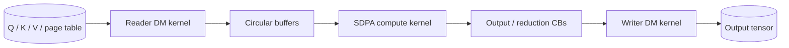

The descriptor also shows why “add a semaphore” is not a performance strategy:
the semaphores implement specific reduction, output and K-multicast ownership.
Change synchronization only after proving a wait is unnecessary and preserving
producer/consumer counts.

## Logic review of the plan

The plan was reviewed against these failure modes:

| Tempting shortcut | Why it is rejected | Correct gate |
|---|---|---|
| Optimize one combined inference number | hides prefill/decode bottlenecks | separate TTFT, prefill throughput and decode latency |
| Lower every tensor to the smallest dtype | ignores norm, residual, accumulation and KV sensitivity | per-role precision sweep with model quality |
| Tune matmul in isolation | may add conversions that erase its gain | layer-level time and traffic |
| Write a custom kernel first | skips existing program, sharding and fusion controls | minimized op profile proves kernel cause |
| Treat more cores as always faster | can increase multicast, reduction and L1 pressure | sweep legal grids and block sizes |
| Trust first-run time | includes compilation and cache population | cold and warm results recorded separately |
| Use simulator time as Blackhole speed | simulator wall time is not silicon performance | hardware profiler for performance claims |
| Claim a speedup without supplied results | creates fictional evidence | blank measurement ledger until run |
| Treat TT-Forge and TT-MLIR as synonyms | TT-Forge is the end-to-end stack; TT-MLIR is the compiler core | name the frontend, IR boundary and lowering path |
| Mix local TT-Metal and latest TT-Forge source findings | the release pins a different TT-Metal dependency | repeat the audit at one recorded dependency set |
| Treat an IR conversion pattern as model support | pattern matching, op validation, shape/dtype legality and the target kernel are separate gates | inspect emitted IR and run the exact graph on the release-pinned target |
| Copy TTNN optimizer memory numbers into a Blackhole plan | the official page labels those numerical examples as Wormhole values | use the Blackhole system descriptor and backend validation for budgets |

The dependency order is also deliberate:


Later steps assume earlier invariants. For example, trace capture assumes stable
shapes and addresses; precision experiments assume a correct layout; kernel
work assumes the operation boundary is already isolated.

## Code review of the plan

The source review produced these concrete conclusions:

1. **Prefill and decode are genuinely different code paths.** The model,
   attention, MLP and generator all branch on mode; the plan must do the same.
2. **The current implementation already fuses important work.** Fused QKV,
   activation-in-multiply, paged cache update and trace replay must be measured
   before proposing duplicates.
3. **Memory configuration is part of the operation contract.** The decoder and
   model-config code intentionally move between sharded/interleaved and L1/DRAM
   placements; removing a conversion without checking the consumer is unsafe.
4. **Program configs reach real kernel structure.** Matmul grid/block choices
   select a factory that changes cores, CB sizes, multicast and runtime args.
5. **Blackhole details are visible in source, not inferred from marketing.** The
   pinned config selects a 512-token MLP prefill cutoff, Blackhole-specific
   sharding and up to an `8 × 10` QKV prefill grid in the reviewed path.
6. **SDPA synchronization is structural.** Reader/writer/compute kernels and
   reduction/multicast semaphores are built together. Optimize the work plan,
   not one isolated wait primitive.
7. **Several comments are warnings, not specifications.** `FIXME`, model/SKU
   workarounds and accuracy notes remain bounded to their branch and revision.
8. **No private-model result can be inferred from public code.** The final
   performance table remains unfilled until the exact model runs on the exact
   Blackhole target.
9. **TT-Forge and handwritten TTNN are separate entry routes.** Compiler-level
   conclusions apply only when the model passes through TT-XLA/TT-Forge-ONNX
   and TT-MLIR; the existing TT-Transformers model uses explicit TTNN code.
10. **Release pins are part of the experiment contract.** The latest reviewed
    TT-Forge development release uses a TT-Metal revision different from this
    page's local source baseline.

## Experiment ladder and decision record

Run one change at a time. Reset to the last accepted row when a gate fails.

| Run | Change | Prefill ms / tokens/s | Decode ms/token / tokens/s | DRAM/L1 evidence | Quality result | Keep? |
|---|---|---|---|---|---|---|
| B0 | pinned baseline, accuracy config | `—` | `—` | `—` | `—` | baseline |
| B1 | performance config | `—` | `—` | `—` | `—` | `—` |
| B2 | stable padding / shape buckets | `—` | `—` | `—` | `—` | `—` |
| B3 | layout + sharding chain | `—` | `—` | `—` | `—` | `—` |
| B4 | QKV / SDPA / KV-cache config | `—` | `—` | `—` | `—` | `—` |
| B5 | MLP program config | `—` | `—` | `—` | `—` | `—` |
| B6 | per-role precision | `—` | `—` | `—` | `—` | `—` |
| B7 | program cache + decode trace | `—` | `—` | `—` | `—` | `—` |
| B8 | custom kernel, only if proven | `—` | `—` | `—` | `—` | `—` |

For each accepted row, save:

```text
experiment-id:
git-commit:
model/checkpoint:
sku/mesh:
environment:
command:
shape-distribution:
one-changed-variable:
profiler-report:
before:
after:
quality-gate:
decision:
reason:
```

## Definition of done

The optimization is complete only when all of these are true:

1. the model contract and exact source revision are recorded;
2. prefill and decode have separate warm baselines;
3. the profiler report identifies the changed bottleneck;
4. every accepted change has a one-variable comparison;
5. block-level and end-to-end quality gates pass;
6. first-token time, decode latency and aggregate throughput are not conflated;
7. no simulator timing is presented as silicon performance;
8. a clean checkout can reproduce the final run;
9. the final table includes rejected changes as well as accepted ones;
10. lower-level kernel edits link back to the TTNN operation and model call site.

## Source map

### Model and decision layers

- [Transformer construction](https://github.com/tenstorrent/tt-metal/blob/50a82f835593512c4176546b4af68d7e91315a86/models/tt_transformers/tt/model.py#L23-L152)
- [Model input preparation](https://github.com/tenstorrent/tt-metal/blob/50a82f835593512c4176546b4af68d7e91315a86/models/tt_transformers/tt/model.py#L338-L473)
- [Model forward/layer loop](https://github.com/tenstorrent/tt-metal/blob/50a82f835593512c4176546b4af68d7e91315a86/models/tt_transformers/tt/model.py#L867-L965)
- [Transformer block](https://github.com/tenstorrent/tt-metal/blob/50a82f835593512c4176546b4af68d7e91315a86/models/tt_transformers/tt/decoder.py#L219-L338)
- [Decode attention](https://github.com/tenstorrent/tt-metal/blob/50a82f835593512c4176546b4af68d7e91315a86/models/tt_transformers/tt/attention.py#L589-L874)
- [Prefill attention](https://github.com/tenstorrent/tt-metal/blob/50a82f835593512c4176546b4af68d7e91315a86/models/tt_transformers/tt/attention.py#L876-L1188)
- [Gated MLP](https://github.com/tenstorrent/tt-metal/blob/50a82f835593512c4176546b4af68d7e91315a86/models/tt_transformers/tt/mlp.py#L118-L330)
- [Blackhole/model configs](https://github.com/tenstorrent/tt-metal/blob/50a82f835593512c4176546b4af68d7e91315a86/models/tt_transformers/tt/model_config.py#L528-L680)
- [Trace capture and replay](https://github.com/tenstorrent/tt-metal/blob/50a82f835593512c4176546b4af68d7e91315a86/models/tt_transformers/tt/generator.py#L1535-L1692)

### TTNN to TT-Metal layers

- [`ttnn.linear` Python binding](https://github.com/tenstorrent/tt-metal/blob/50a82f835593512c4176546b4af68d7e91315a86/ttnn/cpp/ttnn/operations/matmul/matmul_nanobind.cpp#L824-L898)
- [C++ matmul/linear dispatch](https://github.com/tenstorrent/tt-metal/blob/50a82f835593512c4176546b4af68d7e91315a86/ttnn/cpp/ttnn/operations/matmul/matmul.cpp#L217-L451)
- [Matmul device operation](https://github.com/tenstorrent/tt-metal/blob/50a82f835593512c4176546b4af68d7e91315a86/ttnn/cpp/ttnn/operations/matmul/device/matmul_device_operation.hpp#L18-L55)
- [Representative matmul program factory](https://github.com/tenstorrent/tt-metal/blob/50a82f835593512c4176546b4af68d7e91315a86/ttnn/cpp/ttnn/operations/matmul/device/factory/matmul_multicore_reuse_mcast_1d_program_factory.cpp#L607-L1164)
- [SDPA decode wrapper](https://github.com/tenstorrent/tt-metal/blob/50a82f835593512c4176546b4af68d7e91315a86/ttnn/cpp/ttnn/operations/transformer/sdpa_decode/sdpa_decode.cpp#L41-L178)
- [SDPA decode program descriptor](https://github.com/tenstorrent/tt-metal/blob/50a82f835593512c4176546b4af68d7e91315a86/ttnn/cpp/ttnn/operations/transformer/sdpa_decode/device/sdpa_decode_program_factory.cpp#L510-L1035)
- [SDPA reader kernel](https://github.com/tenstorrent/tt-metal/blob/50a82f835593512c4176546b4af68d7e91315a86/ttnn/cpp/ttnn/operations/transformer/sdpa_decode/device/kernels/dataflow/reader_decode_all.cpp)
- [SDPA writer kernel](https://github.com/tenstorrent/tt-metal/blob/50a82f835593512c4176546b4af68d7e91315a86/ttnn/cpp/ttnn/operations/transformer/sdpa_decode/device/kernels/dataflow/writer_decode_all.cpp)
- [SDPA compute kernel](https://github.com/tenstorrent/tt-metal/blob/50a82f835593512c4176546b4af68d7e91315a86/ttnn/cpp/ttnn/operations/transformer/sdpa_decode/device/kernels/compute/sdpa_flash_decode.cpp)

### Official tools and method

- [New model bring-up in TTNN](https://github.com/tenstorrent/tt-metal/blob/50a82f835593512c4176546b4af68d7e91315a86/tech_reports/ttnn/TTNN-model-bringup.md)
- [Profiling TTNN operations](https://docs.tenstorrent.com/tt-metal/latest/ttnn/ttnn/profiling_ttnn_operations.html)
- [TTNN Visualizer](https://docs.tenstorrent.com/tt-metal/latest/ttnn/ttnn/tutorials/tutorials/ttnn_visualizer.html)
- [TT-Metalium tools](https://docs.tenstorrent.com/tt-metal/latest/tt-metalium/tools/index.html)
- [Host-to-RISC flow in this guide](./RISC_FIRMWARE_TO_KERNEL_FLOW.md)

### Current TT-Forge and TT-MLIR compiler route

- [TT-Forge repository and current architecture](https://github.com/tenstorrent/tt-forge)
- [Official TT-Forge overview](https://docs.tenstorrent.com/forge/index.html)
- [TT-Forge releases and dependency pins](https://github.com/tenstorrent/tt-forge/releases)
- [TT-MLIR repository](https://github.com/tenstorrent/tt-mlir)
- [TT-MLIR architecture](https://docs.tenstorrent.com/tt-mlir/overview.html)
- [TT-MLIR dialect overview](https://docs.tenstorrent.com/tt-mlir/dialects-overview.html)
- [Current TTNN optimizer](https://docs.tenstorrent.com/tt-mlir/specs/ttnn-optimizer.html)
- [Release-pinned StableHLO Q/DQ conversion](https://github.com/tenstorrent/tt-mlir/blob/71046369d603b97fd6a8dd8b947ca8588ac2a74f/lib/Conversion/StableHLOToTTIR/StableHLOToTTIRPatterns.cpp#L1307-L1385)
- [Release-pinned cache-update conversion](https://github.com/tenstorrent/tt-mlir/blob/71046369d603b97fd6a8dd8b947ca8588ac2a74f/lib/Conversion/StableHLOToTTIR/StableHLOToTTIRPatterns.cpp#L8449-L8641)
- [Release-pinned SDPA composite conversion](https://github.com/tenstorrent/tt-mlir/blob/71046369d603b97fd6a8dd8b947ca8588ac2a74f/lib/Conversion/StableHLOToTTIR/StableHLOLegalizeCompositePass.cpp#L2064-L2138)
- [Release-pinned TTNN optimizer pipeline](https://github.com/tenstorrent/tt-mlir/blob/71046369d603b97fd6a8dd8b947ca8588ac2a74f/lib/Dialect/TTNN/Pipelines/TTNNPipelines.cpp#L100-L158)

## Final conclusion

Optimizing a Transformer on Blackhole is not a single kernel exercise. First
separate prefill from decode, establish correctness, profile warm execution and
stabilize shapes. Then optimize the producer-to-consumer memory-layout chain,
attention/KV-cache path, gated MLP, per-role precision and repeated decode
dispatch. Follow a hot operation from the model through TTNN into its TT-Metal
reader/writer/compute kernels only when the measured bottleneck requires it.

For a compiler-ingested model, add an earlier loop: inspect the TT-XLA or
TT-Forge-ONNX frontend, TTIR, and TT-MLIR fusion/layout/sharding decisions before
descending into the shared TTNN/TT-Metal implementation. The compiler path and
the handwritten TTNN path are complementary experiments, not interchangeable
source baselines.

This page supplies the source-backed map and decision gates. The model-specific
speedup remains intentionally unclaimed until the measurement ledger is filled.
