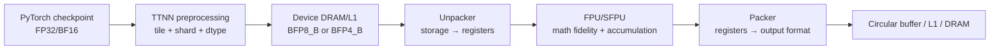
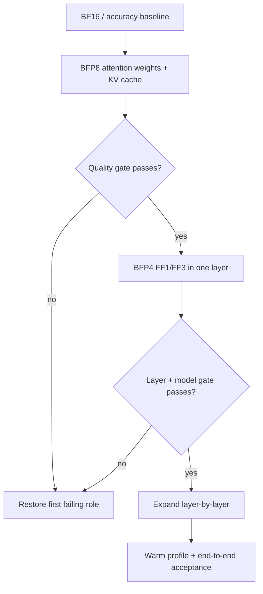
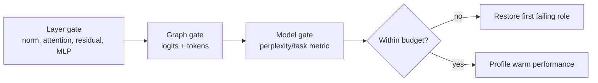
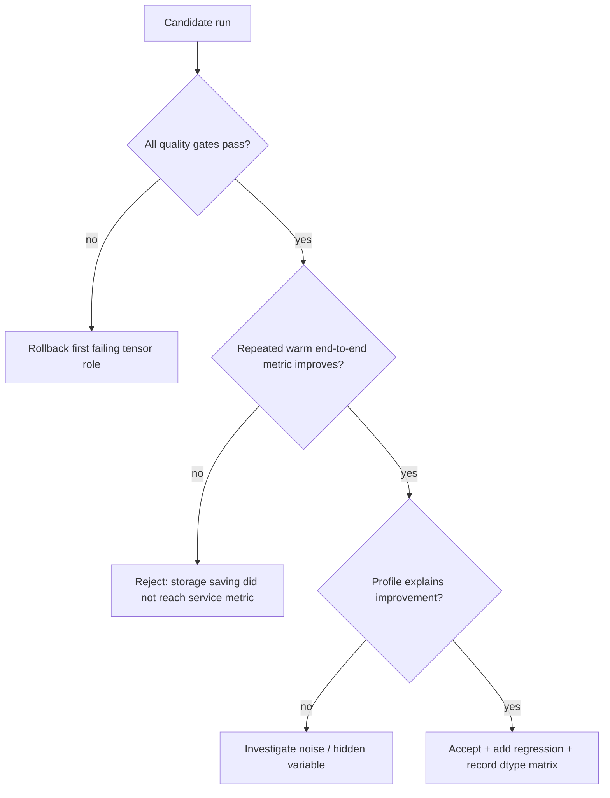
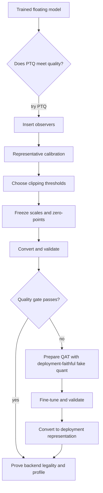
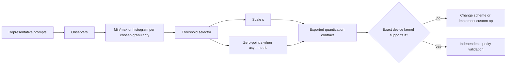
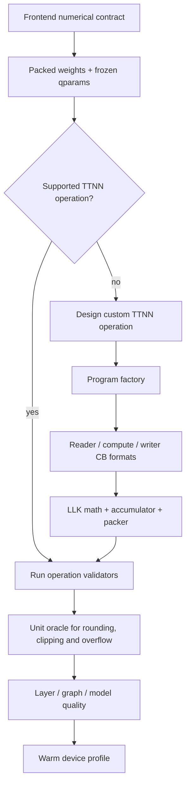
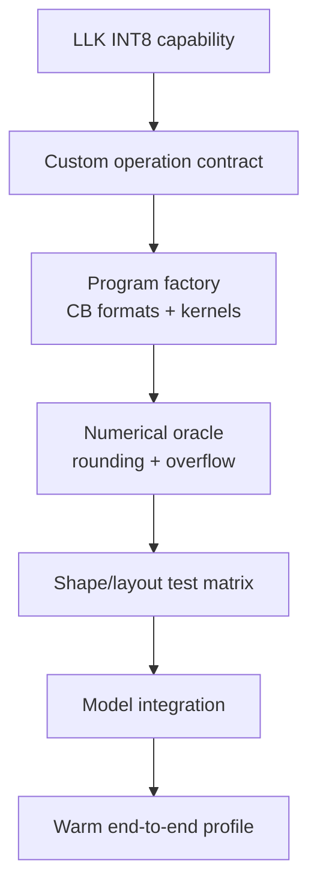

# Discussion subpage 05 — quantization and mixed precision on TT-Metal

Prepared: **19 August 2026**
Source baseline: **TT-Metal `50a82f835593512c4176546b4af68d7e91315a86`**
Primary target: **TTNN/TT-Metal LLM inference, with Blackhole in mind**
Interactive page: <https://buicongnguyen.github.io/tt-sim/discussion-quantization.html>

## Executive answer

For the pinned generic TTNN LLM path, begin with a BF16/accuracy baseline, move
weights and selected long-lived tensors to **BFLOAT8_B**, and then test
**BFLOAT4_B** on insensitive tensor roles such as FF1/FF3 MLP weights. Keep
normalization, residual paths and sensitive accumulation/output paths wider until
measurement proves they can be narrowed.

Do **not** start by changing every tensor to INT8:

- `DataType::INT8` exists in TT-Metal.
- Blackhole LLK contains integer-format and INT8-math machinery.
- The current generic [`ttnn.linear` contract](https://github.com/tenstorrent/tt-metal/blob/50a82f835593512c4176546b4af68d7e91315a86/ttnn/cpp/ttnn/operations/matmul/matmul_nanobind.cpp#L824-L898)
  lists BFLOAT16, FLOAT32, BFLOAT8_B and BFLOAT4_B tile inputs—not INT8.
- [`ttnn.to_dtype(INT8)` is documented as a host conversion](https://github.com/tenstorrent/tt-metal/blob/50a82f835593512c4176546b4af68d7e91315a86/ttnn/cpp/ttnn-nanobind/operations/core.cpp#L239-L269),
  and the elementwise quantization API currently produces INT32 or UINT8.

The correct conclusion is not “Tenstorrent has no INT8 hardware.” It is:

> Hardware/LLK datatype capability, tensor construction, an elementwise
> quantization utility and a supported end-to-end LLM matmul path are four
> different contracts.

## Claim-to-reference map

The interactive page places these references beside the specific item they
support. Pinned GitHub links establish the audited implementation at
`50a82f8…`; official documentation links establish the current public API or
programming description.

| Page item | What backs it up |
|---|---|
| Generic `ttnn.linear` accepts BF16/BFP8/BFP4/FP32 tile inputs, not INT8 | [official `ttnn.linear` dtype table](https://docs.tenstorrent.com/tt-metal/latest/ttnn/ttnn/api/ttnn.linear.html), [pinned binding](https://github.com/tenstorrent/tt-metal/blob/50a82f835593512c4176546b4af68d7e91315a86/ttnn/cpp/ttnn/operations/matmul/matmul_nanobind.cpp#L824-L898) |
| BFP8 shares exponent information and has dynamic-range limitations | [official Tensor/BFLOAT8_B note](https://docs.tenstorrent.com/tt-metal/latest/ttnn/ttnn/tensor.html), [pinned tensor documentation](https://github.com/tenstorrent/tt-metal/blob/50a82f835593512c4176546b4af68d7e91315a86/docs/source/ttnn/ttnn/tensor.rst#L149-L167) |
| BFP tile byte counts include exponent overhead | [`constants.hpp:13–21`](https://github.com/tenstorrent/tt-metal/blob/50a82f835593512c4176546b4af68d7e91315a86/tt_metal/api/tt-metalium/constants.hpp#L13-L21) |
| Unpacker/packer hardware bridges compact SRAM format and compute registers | [official Tensix compute-dataflow documentation](https://docs.tenstorrent.com/tt-metal/latest/tt-metalium/tt_metal/advanced_topics/compute_engines_and_dataflow_within_tensix.html), [pinned documentation](https://github.com/tenstorrent/tt-metal/blob/50a82f835593512c4176546b4af68d7e91315a86/docs/source/tt-metalium/tt_metal/advanced_topics/compute_engines_and_dataflow_within_tensix.rst#L45-L63) |
| TT-Transformers applies precision by tensor group and offers accuracy/performance policies | [`model_config.py:67–80`](https://github.com/tenstorrent/tt-metal/blob/50a82f835593512c4176546b4af68d7e91315a86/models/tt_transformers/tt/model_config.py#L67-L80), [`model_config.py:128–237`](https://github.com/tenstorrent/tt-metal/blob/50a82f835593512c4176546b4af68d7e91315a86/models/tt_transformers/tt/model_config.py#L128-L237) |
| Per-decoder precision is the control surface for a one-layer sweep | [`model_config.py:4520–4598`](https://github.com/tenstorrent/tt-metal/blob/50a82f835593512c4176546b4af68d7e91315a86/models/tt_transformers/tt/model_config.py#L4520-L4598) |
| `quantize`, `requantize` and `dequantize` are utility contracts, not proof of INT8 matmul | [`quantization.cpp:179–204`](https://github.com/tenstorrent/tt-metal/blob/50a82f835593512c4176546b4af68d7e91315a86/ttnn/cpp/ttnn/operations/eltwise/quantization/quantization.cpp#L179-L204), [`quantization.cpp:317–341`](https://github.com/tenstorrent/tt-metal/blob/50a82f835593512c4176546b4af68d7e91315a86/ttnn/cpp/ttnn/operations/eltwise/quantization/quantization.cpp#L317-L341), [`quantization.cpp:468–485`](https://github.com/tenstorrent/tt-metal/blob/50a82f835593512c4176546b4af68d7e91315a86/ttnn/cpp/ttnn/operations/eltwise/quantization/quantization.cpp#L468-L485) |
| `to_dtype` is a host conversion and does not establish a generic device INT8 linear path | [official `ttnn.to_dtype`](https://docs.tenstorrent.com/tt-metal/latest/ttnn/ttnn/api/ttnn.to_dtype.html), [pinned binding/limitation](https://github.com/tenstorrent/tt-metal/blob/50a82f835593512c4176546b4af68d7e91315a86/ttnn/cpp/ttnn-nanobind/operations/core.cpp#L239-L269) |
| Blackhole LLK contains real INT8 configuration machinery | [`ckernel_defs.h:279–284`](https://github.com/tenstorrent/tt-metal/blob/50a82f835593512c4176546b4af68d7e91315a86/tt_metal/tt-llk/tt_llk_blackhole/common/inc/ckernel_defs.h#L279-L284), [`llk_math_common.h:33–56`](https://github.com/tenstorrent/tt-metal/blob/50a82f835593512c4176546b4af68d7e91315a86/tt_metal/tt-llk/tt_llk_blackhole/llk_lib/llk_math_common.h#L33-L56) |
| MXFP4 remains a low-level, architecture-specific experiment in this source | [`tile.cpp:70–100`](https://github.com/tenstorrent/tt-metal/blob/50a82f835593512c4176546b4af68d7e91315a86/tt_metal/impl/data_format/tile.cpp#L70-L100), [Quasar/DFB MXFP4 test](https://github.com/tenstorrent/tt-metal/blob/50a82f835593512c4176546b4af68d7e91315a86/tests/tt_metal/tt_metal/llk/test_mxfp4_typecast.cpp#L31-L192), [`DataFormat` legality warning](https://github.com/tenstorrent/tt-metal/blob/50a82f835593512c4176546b4af68d7e91315a86/tt_metal/api/tt-metalium/tt_backend_api_types.hpp#L18-L56) |
| A performance claim requires device/host profiling rather than byte-count inference | [official Metalium tools index](https://docs.tenstorrent.com/tt-metal/latest/tt-metalium/tools/index.html) |
| PTQ measures a trained model; QAT fine-tunes while simulating quantization | [official PyTorch quantization practice](https://pytorch.org/blog/quantization-in-practice/), [official PyTorch QAT mechanism](https://pytorch.org/blog/quantization-aware-training/) |
| Static activation calibration uses representative samples to derive clipping thresholds and quantization parameters | [PyTorch observers/calibration](https://pytorch.org/blog/quantization-in-practice/), [NVIDIA TensorRT calibration contract](https://docs.nvidia.com/deeplearning/tensorrt/10.x.x/inference-library/work-quantized-types.html#post-training-quantization-using-calibration) |
| Min-max, percentile and entropy/KL are threshold-selection policies—not device-kernel implementations | [NVIDIA TensorRT entropy and percentile calibrators](https://docs.nvidia.com/deeplearning/tensorrt/10.x.x/inference-library/work-quantized-types.html#post-training-quantization-using-calibration), [pinned TTNN linear binding](https://github.com/tenstorrent/tt-metal/blob/50a82f835593512c4176546b4af68d7e91315a86/ttnn/cpp/ttnn/operations/matmul/matmul_nanobind.cpp#L824-L898) |

## Three meanings of quantization

| Meaning | Mechanism | Current practical use |
|---|---|---|
| Block floating point | several values share exponent information; each value carries a small payload | mainstream TTNN LLM mixed precision with BFP8_B/BFP4_B |
| Affine integer quantization | `q = round(x / scale) + zero_point`, then dequantize with scale/zero point | `ttnn.quantize`, `requantize`, `dequantize`; utility or custom integer graph work |
| Low-level format capability | packer/unpacker/FPU/SFPU and `DataFormat` understand an integer, FP8 or MX representation | LLK tests and custom kernels; per-architecture/per-operation legality still required |

Do not call BFP4 “INT4.” Both may store a small value field, but their numerical
contracts and scaling metadata are different.

## Format ledger

### Public TT-Metal tensor datatypes

The pinned [`DataType` enum](https://github.com/tenstorrent/tt-metal/blob/50a82f835593512c4176546b4af68d7e91315a86/tt_metal/api/tt-metalium/tensor/tensor_types.hpp#L26-L40)
contains:

```text
BFLOAT16, FLOAT32, UINT32, BFLOAT8_B, BFLOAT4_B,
UINT8, UINT16, INT32, FP8_E4M3, INT8
```

This list describes representable tensor datatypes. Each operation still defines
its own legal inputs, layout, memory placement, architecture and output rules.

### Storage of a standard 32×32 tile

A standard tile contains 1,024 values. TT-Metal's constants define a BF16 tile
as 2,048 data bytes, a BFLOAT8_B tile as 1,024 value bytes plus a 64-byte
exponent section, and a BFLOAT4_B tile as 512 value bytes plus that exponent
section. See [`constants.hpp:13–21`](https://github.com/tenstorrent/tt-metal/blob/50a82f835593512c4176546b4af68d7e91315a86/tt_metal/api/tt-metalium/constants.hpp#L13-L21).

| Format | Standard tile bytes | Difference versus BF16 | Current interpretation |
|---|---:|---:|---|
| FLOAT32 | 4,096 | 100% more | wide debug/reference or operations that need it |
| BFLOAT16 | 2,048 | baseline | correctness and sensitive paths |
| BFLOAT8_B | 1,088 | 46.875% less | first practical LLM compression step |
| BFLOAT4_B | 576 | 71.875% less | selective low-precision weights |
| UINT8 / INT8 / FP8_E4M3 | 1,024 | 50% less | operation-specific; not generic LLM linear inputs here |
| MXFP4 | 544 bytes in the cited Quasar/DFB test path | 73.4375% less | low-level/experimental; not a generic TTNN datatype |

The MX calculation comes from [`Tile::get_tile_size`](https://github.com/tenstorrent/tt-metal/blob/50a82f835593512c4176546b4af68d7e91315a86/tt_metal/impl/data_format/tile.cpp#L70-L100):
one E8M0 scale byte per 32-element block plus packed elements. The low-level
[`DataFormat` enum](https://github.com/tenstorrent/tt-metal/blob/50a82f835593512c4176546b4af68d7e91315a86/tt_metal/api/tt-metalium/tt_backend_api_types.hpp#L18-L56)
is explicitly a union of formats across generations and warns that not every
format is legal on every architecture.

### BFP8 numerical behavior

The TTNN tensor documentation states that **16 consecutive BFP8_B values share
one exponent**, selected from the largest magnitude in the group. Extreme values
can consume the shared range and cause smaller values to lose precision or round
to zero. See [`tensor.rst:149–167`](https://github.com/tenstorrent/tt-metal/blob/50a82f835593512c4176546b4af68d7e91315a86/docs/source/ttnn/ttnn/tensor.rst#L149-L167).

Consequences:

- BFP8/BFP4 are attractive when neighboring values have compatible dynamic
  range.
- A reciprocal or another range-expanding operation can be more sensitive than
  a matrix weight tile.
- Error analysis must use the tensor's real tiling/order; a scalar theoretical
  error bound is insufficient.

### Special warning for FP8_E4M3

The public enum marks `FP8_E4M3` as **Blackhole-only, row-major-only**, currently
used by specialized DeepSeek V3 prefill combine/dispatch operations. That source
comment is an example of why “the dtype exists” must not be rewritten as “every
operation supports it.”

## Why BFP works naturally in the Tensix data path

TT-Metal documents that the storage format in SRAM may differ from the compute
register format. Hardware unpackers and packers perform the conversion, letting
SRAM remain compact while compute uses the appropriate internal representation.
See [compute engines and dataflow within Tensix](https://github.com/tenstorrent/tt-metal/blob/50a82f835593512c4176546b4af68d7e91315a86/docs/source/tt-metalium/tt_metal/advanced_topics/compute_engines_and_dataflow_within_tensix.rst#L45-L63).



This flow explains a core design choice: compressed block-float storage can
reduce memory movement without expressing the graph as affine INT8 arithmetic.

## What the TT-Transformers model already does

### Tensor groups and precision settings

The current model configuration defines these tensor groups:

```text
FF1_FF3, FF2, WQKV, WO, KV_CACHE, ACTIVATION
```

and these model-level precision settings:

```text
BFP4, BFP8, BF16
```

Source: [`model_config.py:67–80`](https://github.com/tenstorrent/tt-metal/blob/50a82f835593512c4176546b4af68d7e91315a86/models/tt_transformers/tt/model_config.py#L67-L80).

The default policy is BFP8 for FF1/FF3, FF2, WQKV, WO and KV cache, while the
activation follows its original dtype. Operator fidelity is independently
selected; prefill SDPA uses a different default fidelity from decode. Source:
[`model_config.py:288–318`](https://github.com/tenstorrent/tt-metal/blob/50a82f835593512c4176546b4af68d7e91315a86/models/tt_transformers/tt/model_config.py#L288-L318).

### Accuracy versus performance policy

For Llama-family models, the accuracy policy already uses BFP8 for attention
weights and KV cache with wider MLP accumulation. The generic performance policy
changes FF1/FF3 tensor precision to BFP4 and its linear fidelity to LoFi. There
are model-specific exceptions; for example Qwen2.5-7B uses a wider policy because
the standard high-performance settings degrade it.

Source: [`ModelOptimizations.accuracy/performance`](https://github.com/tenstorrent/tt-metal/blob/50a82f835593512c4176546b4af68d7e91315a86/models/tt_transformers/tt/model_config.py#L128-L237).

This is the pattern to copy:



### Per-decoder control surface

`DecodersPrecision` stores a configuration for each decoder and maps BFP4/BFP8/
BF16 to the actual TTNN datatypes. When the prefetcher is enabled, it forces a
consistent weight dtype across layers to avoid races caused by different block
sizes. Source:
[`model_config.py:4520–4598`](https://github.com/tenstorrent/tt-metal/blob/50a82f835593512c4176546b4af68d7e91315a86/models/tt_transformers/tt/model_config.py#L4520-L4598).

That prefetcher rule is a useful warning: dtype is not only a numerical choice;
it changes storage geometry and therefore runtime contracts.

## Repeatable application procedure

### Step 0 — freeze the contract

Record:

| Field | Example—not a substitute for the real value |
|---|---|
| model/checkpoint | Llama 3.1 8B |
| TT-Metal revision | `50a82f8…` |
| device | exact Blackhole SKU and mesh |
| prefill workload | prompt length percentiles and batch |
| decode workload | active users and context percentiles |
| primary performance metric | TTFT, prompt t/s, ms/token or aggregate t/s |
| quality gate | layer PCC + logits/tokens + perplexity/task metric |
| repetitions/warm-up | explicit numbers |

### Step 1 — run both source presets

```bash
cd ~/src/tt-metal

pytest models/tt_transformers/demo/simple_text_demo.py \
  -k "accuracy and batch-1"

pytest models/tt_transformers/demo/simple_text_demo.py \
  -k "performance and batch-1"
```

The demo's test parametrization maps these configurations to
`DecodersPrecision.accuracy` and `DecodersPrecision.performance`; see
[`simple_text_demo.py:824–838`](https://github.com/tenstorrent/tt-metal/blob/50a82f835593512c4176546b4af68d7e91315a86/models/tt_transformers/demo/simple_text_demo.py#L824-L838).

Use the actual test selector and device environment required by the local model.
The commands are starting points, not universal promises that every model asset
is present.

### Step 2 — isolate one layer and one tensor role

The real model control surface supports a per-decoder configuration:

```python
from models.tt_transformers.tt.model_config import (
    DecodersPrecision,
    ModelOptimizations,
    TensorGroup,
    PrecisionSetting,
    OpGroup,
    MathFidelitySetting,
)

precision = DecodersPrecision.accuracy(n_layers, model_name)

mlp_bfp4 = ModelOptimizations(
    {
        "TensorPrecision": {
            TensorGroup.FF1_FF3: PrecisionSetting.BFP4,
        },
        "OpFidelity": {
            OpGroup.LI_FF1_FF3: MathFidelitySetting.LOFI,
        },
    }
)

# First experiment: only decoder 0.
precision.set_decoder_conf(0, mlp_bfp4)
```

Inject this precision object through the same harness/model-argument route used
by the demo. Do not modify a low-level kernel constant yet.

### Step 3 — validate at three scopes



Recommended saved artifacts:

- input IDs, positions, attention mask/page table and cache state;
- output tensors at decoder boundaries;
- reference/TTNN logits;
- generated token sequence;
- quality metric and threshold;
- datatype and math-fidelity matrix per layer;
- profiler result and run metadata.

### Step 4 — profile prefill and decode separately

| Gate | Prefill | Decode |
|---|---|---|
| primary performance | warm TTFT and prompt tokens/s | warm ms/token and user/aggregate tokens/s |
| numerical stress | prompt buckets and causal SDPA | long-context KV-cache evolution |
| traffic | weights, intermediate activations, collectives | weights, KV cache, page table and dispatch |
| failure mode | L1 pressure, tiling, compute fidelity | memory/dispatch dominated, accumulated token drift |

Smaller weights help only if the final profile shows less traffic or a faster hot
operation without compensating conversion/layout cost.

### Step 5 — accept or roll back



## PTQ, QAT and calibration question chain

This section describes **affine integer quantization**. It must not be silently
applied to Tenstorrent BFP8/BFP4. Those block-floating formats use shared
exponents and the TT-Transformers precision policy described above; they do not
use an affine integer zero point in the same way.

### Question 1 — what are PTQ and QAT?

**Post-training quantization (PTQ)** begins with an already trained floating-
point model. It measures weights and, for static activation quantization,
representative activations; chooses ranges and quantization parameters; then
converts the model without updating the original weights through full training.
It is normally the first experiment because it is fast and comparatively cheap.

**Quantization-aware training (QAT)** prepares the floating model with fake-
quantization modules or functions. During the forward pass, values are clipped,
rounded to the target integer grid and dequantized so training sees the expected
deployment error. The trainable weights remain floating point. The rounding
operation has no useful ordinary derivative, so QAT commonly uses a
straight-through estimator during back-propagation. After fine-tuning, the model
is converted to the same kind of deployment representation targeted by PTQ.

The official [PyTorch quantization practice guide](https://pytorch.org/blog/quantization-in-practice/)
describes static PTQ and calibration. The official
[PyTorch QAT guide](https://pytorch.org/blog/quantization-aware-training/)
shows the `prepare` → fake-quantized forward/training → `convert` mechanism and
why QAT can recover quality that PTQ loses.

| Property | PTQ | QAT |
|---|---|---|
| weights updated? | no | yes, during a fine-tuning phase |
| representative data? | required for static activation calibration | training/fine-tuning data required; observers may also collect ranges |
| quantization in forward pass | observers first, real conversion afterward | simulated with fake quantization during fine-tuning |
| cost | low | higher |
| best first use | 8-bit or tolerant layers/models | low-bit or accuracy-sensitive model that fails PTQ |



### Question 2 — why is calibration needed?

A trained weight tensor is fixed, so a simple weight-only scheme can measure its
range directly. Activations are different: their distributions depend on input
tokens, prompt lengths, attention masks, cache state, layer position and model
behavior. Static activation quantization therefore needs representative samples
to predict the range that the deployed model will see.

Calibration runs the unconverted model over those samples while **observers**
collect per-tensor, per-channel or per-group extrema or histograms. It then:

1. estimates a representative numerical distribution;
2. chooses lower and upper clipping thresholds;
3. derives the scale and, for asymmetric affine quantization, the zero point;
4. freezes those quantization parameters for conversion/export.

Calibration does **not** train the weights, prove model quality, select the
fastest kernel, or create hardware support for a missing operator. Dynamic
activation quantization is an alternative: it calculates activation parameters
at runtime, avoiding the offline activation-calibration pass but adding runtime
work. The distinction is described in the
[PyTorch guide](https://pytorch.org/blog/quantization-in-practice/).

Representative means matching the deployment distribution—not using as much
data as possible. For an LLM, stratify samples by prompt length, language/domain,
prefill/decode mode, batch or active-user count, and long-context/cache behavior.
Keep a separate evaluation set so threshold selection is not also the final
quality proof.



### Question 3 — what mapping does calibration produce?

For a common affine mapping:

```text
q     = clamp(round(x / s) + z, qmin, qmax)
x_hat = s × (q - z)
```

Here `x` is a real value, `q` is the stored integer, `x_hat` is the reconstructed
value, `s > 0` is the scale and `z` is the integer code that represents real
zero. Exact tie-breaking, saturation and narrow-range rules are part of the
deployment contract and must match between calibration/QAT and the device
kernel.

**Asymmetric affine quantization** uses both observed bounds:

```text
s = (xmax - xmin) / (qmax - qmin)
z = clamp(round(qmin - xmin / s), qmin, qmax)
```

It makes better use of the integer codes for a shifted or skewed activation
distribution, but the kernel must account for a non-zero `z`.

**Symmetric affine quantization** centers the mapping on zero:

```text
a = max(abs(xmin), abs(xmax))
s = a / qmax_abs
z = 0
```

It simplifies zero-point behavior and is common for signed weights. It can waste
codes when the distribution is strongly skewed. With signed INT8, many practical
implementations use an effective symmetric magnitude of 127, even though the
container range is `[-128, 127]`; always copy the backend's exact convention.
PyTorch's official guide gives the corresponding affine and symmetric mapping
definitions.

### Question 4 — what do min-max, percentile and KL calibration do?

These policies choose clipping thresholds. The affine formulas above derive
scale and zero point **after** the thresholds are selected.

| Method | Mechanism | Advantage | Main risk |
|---|---|---|---|
| min-max | preserve the smallest and largest observed values | fast, simple baseline | a rare outlier stretches the scale and makes common values coarse |
| percentile | clip values outside a chosen percentile, for example a rare tail | deliberately trades a few clipped values for finer central resolution | percentile is a hyperparameter and can overfit the calibration set |
| entropy / KL divergence | scan threshold candidates, quantize/reconstruct histogram bins, choose the candidate minimizing information divergence | data-driven clipping for histogram-based static PTQ | depends on histogram bins, sample representativeness and backend implementation |

NVIDIA's official
[TensorRT calibration documentation](https://docs.nvidia.com/deeplearning/tensorrt/10.x.x/inference-library/work-quantized-types.html#post-training-quantization-using-calibration)
documents entropy/KL and percentile-based calibrators. This is a reference for
the calibration algorithms, **not evidence that TTNN consumes a TensorRT cache
or implements the same histogram details**. TensorRT 10.x also marks implicit
quantization—and therefore this legacy calibration workflow—as deprecated in
favor of explicit Q/DQ graphs. Use the calibrator descriptions as algorithmic
background, not as a recommended Tenstorrent deployment API.

A simplified KL threshold search is:

```text
collect a high-resolution reference histogram P
for each candidate clipping threshold t:
    clip P to [-t, t] (or [low_t, high_t])
    merge bins into the number of available quantized codes
    expand the merged histogram back to reference-bin resolution as Q_t
    score D_KL(P_t || Q_t)
choose the t with the smallest score
derive s and z from t
```

Do not compare a KL score across incompatible binning implementations. The final
selection still requires layer/logit/model-quality validation.

### Question 5 — which granularity should I use?

| Granularity | Parameters | Typical benefit | Cost/requirement |
|---|---|---|---|
| per-tensor | one range and qparams for the entire tensor | simplest metadata and kernel | sensitive to channel outliers |
| per-channel | independent qparams, commonly by weight output channel | much lower weight error when channel ranges differ | kernel must load/apply channel scales |
| per-group | one set of qparams for a fixed group of weights | compromise common in very-low-bit LLM weights | group layout and scale ownership must match packing/kernel |
| dynamic per-token activation | range calculated for each token/vector at runtime | adapts to activation outliers without a frozen static range | reduction, scale calculation and synchronization add runtime work |

A common hypothesis—not a universal rule—is symmetric per-channel or per-group
weights plus per-tensor asymmetric static activations, or dynamic per-token
activations when the backend has a fused path. Treat it as a candidate to test,
not a Tenstorrent API promise.

### Question 6 — how do I implement affine quantization for a Tenstorrent LLM?

The implementation must cross two independent boundaries:

1. **numerical policy:** PTQ/QAT, granularity, thresholds, scale, zero point,
   rounding and accumulator behavior;
2. **device legality:** the exact TTNN operation, program factory, circular-
   buffer formats, LLK instructions, accumulator and packer support that policy.

At the pinned source revision, the audited `models/tt_transformers`, `ttnn` and
`tt_metal` paths do not expose a model-level PTQ/QAT calibration pipeline. The
generic [`ttnn.linear` binding](https://github.com/tenstorrent/tt-metal/blob/50a82f835593512c4176546b4af68d7e91315a86/ttnn/cpp/ttnn/operations/matmul/matmul_nanobind.cpp#L824-L898)
lists BF16, BFP8_B, BFP4_B and FP32 tile inputs, not affine INT8. Therefore:

- the **current practical LLM path** is the source's BF16 → BFP8 → selective
  BFP4 role/layer sweep;
- an **affine INT8 research path** needs frontend calibration/QAT plus a device
  operation whose exact quantization contract is proven or newly implemented.

For a compiler-ingested model there is an additional IR boundary between those
two proof classes. The TT-MLIR commit pinned by the reviewed TT-Forge
development release contains concrete
StableHLO uniform Q/DQ conversion in
[`StableHLOToTTIRPatterns.cpp:1307–1385`](https://github.com/tenstorrent/tt-mlir/blob/71046369d603b97fd6a8dd8b947ca8588ac2a74f/lib/Conversion/StableHLOToTTIR/StableHLOToTTIRPatterns.cpp#L1307-L1385)
and exposes Q/DQ, target-bit-width, experimental BFP weight and experimental BFP
KV-cache controls in
[`TTNNPipelines.h:306–430`](https://github.com/tenstorrent/tt-mlir/blob/71046369d603b97fd6a8dd8b947ca8588ac2a74f/include/ttmlir/Dialect/TTNN/Pipelines/TTNNPipelines.h#L306-L430).
This is real compiler quantization plumbing, but it is not proof that an
arbitrary affine INT8 `linear` graph reaches a legal or performant Blackhole
kernel. Check the frontend pattern, emitted TTIR/TTNN IR, operation validation
and final TT-Metal implementation separately.

Use this order:

1. Freeze the checkpoint, prompts/context distribution, Blackhole target,
   quality budget and the exact operation to optimize.
2. Save the floating/BF16 layer outputs, logits, tokens, perplexity/task score,
   TTFT and decode throughput.
3. Choose PTQ or QAT; weight-only, static or dynamic activations; bit width;
   granularity; and symmetric/asymmetric mapping.
4. Instrument a frontend such as PyTorch/torchao with observers or fake-
   quantization that matches the intended kernel.
5. For static PTQ, run representative calibration and compare min-max,
   percentile and KL thresholds. For QAT, fine-tune under the final clipping,
   rounding and granularity semantics.
6. Freeze qparams and export packed weights plus explicit Q/DQ boundaries.
7. Map them only to a supported TTNN operation—or a custom operation—that
   proves the same input/output formats, qparam ownership, accumulation,
   saturation and rounding behavior.
8. Validate layer tensors, logits/tokens, perplexity/task quality and long-
   context decode on data excluded from calibration/fine-tuning.
9. Warm-profile quantization overhead, DRAM/L1/NoC traffic, TTFT and ms/token.
10. Accept only when both quality and repeated end-to-end performance pass.



The existing [`ttnn.quantize`](https://github.com/tenstorrent/tt-metal/blob/50a82f835593512c4176546b4af68d7e91315a86/ttnn/cpp/ttnn/operations/eltwise/quantization/quantization.cpp#L179-L204),
[`requantize`](https://github.com/tenstorrent/tt-metal/blob/50a82f835593512c4176546b4af68d7e91315a86/ttnn/cpp/ttnn/operations/eltwise/quantization/quantization.cpp#L317-L341)
and [`dequantize`](https://github.com/tenstorrent/tt-metal/blob/50a82f835593512c4176546b4af68d7e91315a86/ttnn/cpp/ttnn/operations/eltwise/quantization/quantization.cpp#L468-L485)
can be used where their checked contracts fit. They do not by themselves supply
an INT8 linear kernel.

> **Key rule:** calibration chooses a numeric mapping; it does not create an
> unsupported kernel.

## Affine integer quantization utilities

The elementwise operations are useful, but their contracts must be stated
precisely.

### Quantize

[`quantization.cpp:179–204`](https://github.com/tenstorrent/tt-metal/blob/50a82f835593512c4176546b4af68d7e91315a86/ttnn/cpp/ttnn/operations/eltwise/quantization/quantization.cpp#L179-L204)
requires floating input and currently permits output `INT32` or `UINT8`.
Per-channel `UINT8` output is rejected.

### Requantize

[`quantization.cpp:317–341`](https://github.com/tenstorrent/tt-metal/blob/50a82f835593512c4176546b4af68d7e91315a86/ttnn/cpp/ttnn/operations/eltwise/quantization/quantization.cpp#L317-L341)
accepts `INT32` or `UINT8` input/output and also rejects per-channel `UINT8`
output.

### Dequantize

[`quantization.cpp:468–485`](https://github.com/tenstorrent/tt-metal/blob/50a82f835593512c4176546b4af68d7e91315a86/ttnn/cpp/ttnn/operations/eltwise/quantization/quantization.cpp#L468-L485)
accepts `INT32` or `UINT8` and produces BF16 or FP32.

### Small utility example

```python
# Elementwise utility—not a quantized matmul replacement.
q = ttnn.quantize(
    x_bf16,
    scale,
    zero_point,
    dtype=ttnn.uint8,  # per-tensor UINT8 path
)

x_hat = ttnn.dequantize(
    q,
    scale,
    zero_point,
    dtype=ttnn.bfloat16,
)
```

The nightly unit tests compare TTNN results against PyTorch quantized tensors;
see [`test_quantization.py:18–44`](https://github.com/tenstorrent/tt-metal/blob/50a82f835593512c4176546b4af68d7e91315a86/tests/ttnn/nightly/unit_tests/operations/eltwise/test_quantization.py#L18-L44).

## Where INT8 exists below the generic LLM API

Blackhole LLK includes:

- a predicate that enables integer math for `Int8` or `Int32` formats in
  [`ckernel_defs.h:279–284`](https://github.com/tenstorrent/tt-metal/blob/50a82f835593512c4176546b4af68d7e91315a86/tt_metal/tt-llk/tt_llk_blackhole/common/inc/ckernel_defs.h#L279-L284);
- math initialization that derives and writes the INT8-math enable bit in
  [`llk_math_common.h:33–56`](https://github.com/tenstorrent/tt-metal/blob/50a82f835593512c4176546b4af68d7e91315a86/tt_metal/tt-llk/tt_llk_blackhole/llk_lib/llk_math_common.h#L33-L56);
- Blackhole SFPU quant/requant conversion code in
  [`ckernel_sfpu_quant.h`](https://github.com/tenstorrent/tt-metal/blob/50a82f835593512c4176546b4af68d7e91315a86/tt_metal/hw/ckernels/blackhole/metal/llk_api/llk_sfpu/ckernel_sfpu_quant.h#L80-L220).

This proves real low-level integer support. A custom INT8 linear path would still
need to prove:

1. legal input/output formats and layouts on the chosen Blackhole path;
2. scale and zero-point ownership;
3. accumulator width, overflow and saturation/rounding behavior;
4. packer/unpacker reconfiguration rules;
5. reader/compute/writer circular-buffer formats;
6. matrix-shape and program-factory coverage;
7. model-level quality;
8. end-to-end benefit after quantize/dequantize/layout overhead.



Until that chain exists, “INT8 hardware is present” must not be shortened to
“the LLM runs with INT8 linear.”

## MX formats

The low-level `DataFormat` union includes MXFP4, MXFP6, MXFP8 and MXINT8/4/2.
`Tile::get_tile_size` describes a layout with one E8M0 scale byte per 32-element
block followed by packed elements. TT-Metal also contains LLK/typecast tests such
as [`test_mxfp4_typecast.cpp`](https://github.com/tenstorrent/tt-metal/blob/50a82f835593512c4176546b4af68d7e91315a86/tests/tt_metal/tt_metal/llk/test_mxfp4_typecast.cpp#L31-L192).

However:

- MX formats are not values in the public `tt::tt_metal::DataType` enum at this
  revision.
- `ttnn.linear` does not list MX inputs.
- the low-level enum explicitly spans multiple architectures;
- the cited MXFP4 test uses experimental Metal2/DFB mechanisms and calls out the
  Quasar conversion path.

Therefore the source supports **MX-format experimentation**, not a claim that a
Blackhole LLM can be switched to MXFP4 through a normal TTNN dtype argument.

## Logic review

| Tempting claim | Code-review problem | Correct replacement |
|---|---|---|
| “INT8 is in `DataType`, so every op supports it.” | datatype existence is not per-operation legality | check the binding/validator/program factory for the exact op |
| “BFP4 means INT4.” | shared-exponent block float and affine integer quantization differ | name BFP4_B and its exponent behavior explicitly |
| “BFP4 is 4× faster than BF16.” | 71.875% smaller tile storage is not an execution measurement | report only repeated warm end-to-end speedup |
| “Use performance precision on every model.” | source contains model-specific wider exceptions | run accuracy/performance presets and preserve the quality gate |
| “Quantize the whole model at once.” | hides the first sensitive tensor role | sweep one role/layer, then expand |
| “Output PCC proves model quality.” | long-context/token error can accumulate | layer, logits/tokens and perplexity/task gates |
| “MXFP4 appears in `DataFormat`, so Blackhole supports it.” | the enum is a cross-generation union | require architecture and operation legality |
| “INT8 LLK support means generic INT8 LLM matmul exists.” | program factory, scaling, shapes and API are missing from the proof | call it low-level capability until the full chain is validated |
| “Calibration makes the model INT8-ready.” | calibration chooses thresholds and qparams, not a device operator | separately prove the TTNN operation and low-level kernel contract |
| “TT-MLIR has Q/DQ conversion, so the model has an INT8 Blackhole kernel.” | IR recognition, operation legality and backend implementation are separate gates | inspect emitted IR and prove the exact operator at the release-pinned dependency set |

## Code review conclusions

1. The public tensor enum exposes INT8, but comments give `FP8_E4M3` an explicit
   narrow Blackhole contract.
2. Host `to_dtype` accepts INT8, while the documentation explicitly says device
   typecast/tilize are not yet supported for that conversion.
3. The generic `ttnn.linear` documentation excludes integer and MX formats.
4. The elementwise quantization implementation currently uses INT32/UINT8
   storage contracts rather than an INT8 output tensor.
5. TT-Transformers already provides a role-based BFP8/BFP4/BF16 policy and
   per-decoder override point.
6. BFP tile sizes include exponent overhead, so BF8/BF4 are not exactly 2×/4×
   smaller than BF16.
7. Packer/unpacker conversion is a hardware mechanism, but math fidelity and
   accumulation remain separate quality controls.
8. Low-level Blackhole INT8 machinery is genuine but is insufficient by itself
   to claim a supported end-to-end quantized LLM.

## Presentation-ready conclusion

> On the current TTNN/TT-Metal LLM path, I would not begin with INT8. I would
> establish a BF16 quality baseline, use the source's BFP8 mixed-precision policy,
> then test BFP4 on FF1/FF3 one layer at a time. For each accepted change I would
> save the dtype/fidelity matrix, layer and model quality results, and the warm
> profile showing that reduced storage actually improved the target service
> metric. INT8 and MX formats are promising lower-level capabilities, but their
> existence is not yet the same as a generic `ttnn.linear` contract in this
> pinned source.

## Definition of done

- [ ] model/device/workload/quality contract frozen;
- [ ] accuracy and performance baselines saved;
- [ ] precision matrix recorded per tensor role and layer;
- [ ] BFP8 tested before BFP4;
- [ ] first failing role restored rather than abandoning all compression;
- [ ] prefill and decode validated separately;
- [ ] warm end-to-end performance repeated;
- [ ] profiler evidence explains the change;
- [ ] integer/MX claims limited to the layer the code actually proves;
- [ ] regression test preserves both quality and configuration.
