# From host process to BRISC, NCRISC and TRISC kernels

Research date: **16 August 2026**

TT-Metal source inspected: **`50a82f835593512c4176546b4af68d7e91315a86`**

## Executive correction

The proposed sequence—host builds one common firmware image, sends it to
NCRISC, and NCRISC forwards it to BRISC and the TRISCs—is not how the current
Wormhole/Blackhole path works.

The source-backed model is:

1. TT-Metal builds or reuses **separate persistent firmware ELF images** for
   BRISC, NCRISC, TRISC0, TRISC1 and TRISC2.
2. The host writes every image into the corresponding firmware region in
   worker L1. NCRISC is not a firmware relay.
3. On Wormhole and Blackhole, the host releases BRISC first. BRISC programs the
   subordinate reset PCs, releases NCRISC and the TRISCs, and waits for their
   initialization acknowledgements.
4. TT-Metal separately installs persistent prefetch/dispatch programs on
   command-queue cores.
5. A model operation is represented by a TT-Metal `Program`. On a cache miss,
   its operation-kernel binaries are uploaded. Every enqueue supplies launch
   state and runtime arguments; a warm launch may reuse committed binaries.
6. Persistent RISC firmware receives GO and calls the selected operation kernel
   by its configured entry point. Operation kernels are not replacement boot
   firmware.

This report uses **NCRISC**, the name used by the source. “NRISC” is a common
informal shortening, but it is not the current TT-Metal identifier.

## Analysis plan and review gates

| Phase | Question to prove from code | Primary inspection point | Review gate |
|---|---|---|---|
| 1. Inventory | Which hardware thread corresponds to each RISC? | HAL thread IDs and build macros | Do not mix tt-1xx with tt-2xx |
| 2. Firmware build | One shared binary or separate ELFs? | build states, compile defines, link and weaken steps | Map one ELF to one load address |
| 3. Cold boot | Who writes firmware and who releases reset? | `RiscFirmwareInitializer` and `brisc.cc` | Every sequence arrow needs a caller and receiver |
| 4. CQ bring-up | Are prefetch/dispatch loops base firmware? | `DispatchKernelInitializer` and device setup | Keep CQ programs distinct from worker firmware |
| 5. First operation | How are operation binaries packed and moved? | `Program`, `Kernel`, `MeshWorkload`, dispatch generation | Separate upload, L1 placement, launch message and GO |
| 6. Worker run | How do BRISC, NCRISC and TRISCs start and finish? | tt-1xx worker firmware | Separate initialization DONE from operation DONE |
| 7. Warm run | What is omitted on a cache hit? | `ProgramBinaryStatus::Committed` path | Compare two launches of the exact same Program |
| 8. Quasar branch | Which five-RISC assumptions no longer apply? | tt-2xx thread map and `dm.cc` | Produce a separate Quasar diagram |

The logic review rejects four misleading shortcuts:

- **Filename order is not execution order.** The caller and reset/GO writes
  establish chronology.
- **Firmware is not an operation kernel.** They have different sources,
  addresses, lifetimes and launch paths.
- **Compile order is not launch order.** Firmware is available to the linker
  before the host later writes and launches it.
- **Model order is not a firmware schedule.** Host command queues order Program
  launches; the resident firmware and kernels coordinate the work inside each
  launch.

## Processor map: Wormhole and Blackhole

| Hardware-thread index | Source name | Metalium role | Normal kernel role |
|---:|---|---|---|
| 0 | BRISC | `RISCV_0` / DM0 | Reader, writer or other data movement; worker supervisor |
| 1 | NCRISC | `RISCV_1` / DM1 | A second data-movement kernel |
| 2 | TRISC0 | UNPACK | Move tiles from circular buffers into compute operands |
| 3 | TRISC1 | MATH | FPU/SFPU matrix and vector work |
| 4 | TRISC2 | PACK | Pack destination registers into output circular buffers |

The canonical thread indices are in
[`hw_thread.h`](https://github.com/tenstorrent/tt-metal/blob/50a82f835593512c4176546b4af68d7e91315a86/tt_metal/hw/inc/internal/hw_thread.h#L23-L35).
The public kernel API maps `RISCV_0` to BRISC and `RISCV_1` to NCRISC in
[`kernel_types.hpp`](https://github.com/tenstorrent/tt-metal/blob/50a82f835593512c4176546b4af68d7e91315a86/tt_metal/api/tt-metalium/kernel_types.hpp#L18-L27).

## Four different executable objects

| Object | Built from | Installed by | Lifetime | What changes per operation? |
|---|---|---|---|---|
| Base RISC firmware | `brisc.cc`, `ncrisc.cc`, `trisc.cc` | `RiscFirmwareInitializer` | Device initialization/session | Normally nothing |
| Fast-dispatch programs | `cq_prefetch.cpp`, `cq_dispatch.cpp` and related CQ kernels | `DispatchKernelInitializer` | Command-queue session | Command contents, not the resident loop |
| Operation kernels | user DM kernel plus `brisck`/`ncrisck`; compute source plus three `trisck` builds | Program build and dispatch path | Program-cache lifetime | New binary on cache miss |
| Launch state | runtime arguments, kernel config, launch message and GO | Host CQ plus device dispatcher | Every enqueue | Addresses, sizes, enables, entry points and ordering |

The tt-1xx HAL explicitly selects the three firmware sources and three kernel
wrappers in
[`hal_1xx_common.cpp`](https://github.com/tenstorrent/tt-metal/blob/50a82f835593512c4176546b4af68d7e91315a86/tt_metal/llrt/hal/tt-1xx/hal_1xx_common.cpp#L80-L110).

## Sequence 1: build, load and cold boot

This is the large phase overview. The smaller diagrams immediately below it
repeat only the participants needed for each explanation, so the reader does
not need to follow seven lifelines while studying one transition.

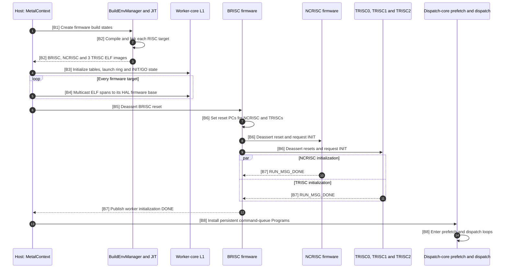

### Direct code links for the B-markers

| Marker in graph | Exact code location | Transition proved |
|---|---|---|
| B1 | [`metal_context.cpp:283–307`](https://github.com/tenstorrent/tt-metal/blob/50a82f835593512c4176546b4af68d7e91315a86/tt_metal/impl/context/metal_context.cpp#L283-L307) and [`build_env_manager.cpp:340–358`](https://github.com/tenstorrent/tt-metal/blob/50a82f835593512c4176546b4af68d7e91315a86/tt_metal/jit_build/build_env_manager.cpp#L340-L358) | Context starts firmware build and chooses precompiled/JIT construction |
| B2 | [`build.cpp:628–790`](https://github.com/tenstorrent/tt-metal/blob/50a82f835593512c4176546b4af68d7e91315a86/tt_metal/jit_build/build.cpp#L628-L790) | Compile, link and weaken firmware symbols |
| B3 | [`risc_firmware_initializer.cpp:1053–1123`](https://github.com/tenstorrent/tt-metal/blob/50a82f835593512c4176546b4af68d7e91315a86/tt_metal/impl/device/firmware/risc_firmware_initializer.cpp#L1053-L1123) | Host initializes tables, launch ring and GO state |
| B4 | [`risc_firmware_initializer.cpp:1143–1199`](https://github.com/tenstorrent/tt-metal/blob/50a82f835593512c4176546b4af68d7e91315a86/tt_metal/impl/device/firmware/risc_firmware_initializer.cpp#L1143-L1199) | Host loads every selected RISC firmware binary |
| B5 | [`risc_firmware_initializer.cpp:1495–1532`](https://github.com/tenstorrent/tt-metal/blob/50a82f835593512c4176546b4af68d7e91315a86/tt_metal/impl/device/firmware/risc_firmware_initializer.cpp#L1495-L1532) | Host releases the worker boot RISC and waits for initialization |
| B6 | [`brisc.cc:181–275`](https://github.com/tenstorrent/tt-metal/blob/50a82f835593512c4176546b4af68d7e91315a86/tt_metal/hw/firmware/src/tt-1xx/brisc.cc#L181-L275) | BRISC sets subordinate PCs and releases NCRISC/TRISCs |
| B7 | [`brisc.cc:354–387`](https://github.com/tenstorrent/tt-metal/blob/50a82f835593512c4176546b4af68d7e91315a86/tt_metal/hw/firmware/src/tt-1xx/brisc.cc#L354-L387) | BRISC waits for and publishes initialization completion |
| B8 | [`dispatch_kernel_initializer.cpp:119–203`](https://github.com/tenstorrent/tt-metal/blob/50a82f835593512c4176546b4af68d7e91315a86/tt_metal/impl/device/firmware/dispatch_kernel_initializer.cpp#L119-L203) | Host constructs and installs persistent CQ Programs |

### Code evidence for sequence 1

#### Chunk B1–B2: firmware build and operation-kernel link contract

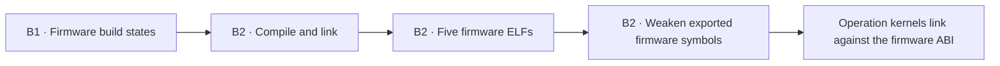

This chunk explains build dependency, not device execution order. Firmware is
available first so later kernels can resolve the resident runtime interfaces.

#### Chunk B3–B4: host placement

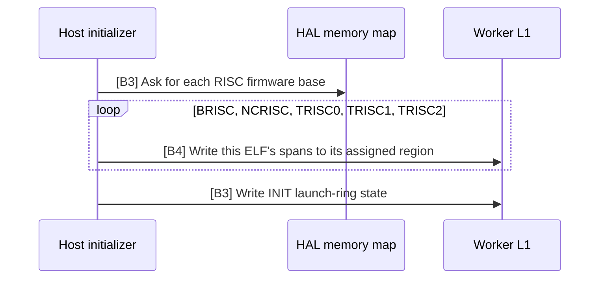

The host is the writer in this chunk. None of the worker RISCs is acting as a
firmware transport processor.

#### Chunk B5–B7: reset and initialization handshake

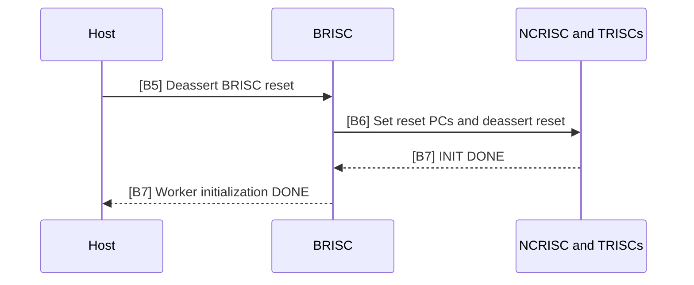

This is the actual supervisor relationship on the inspected Wormhole and
Blackhole worker path: host starts BRISC; BRISC initializes subordinates.

#### Chunk B8: persistent command-queue setup

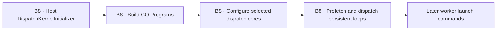

The CQ Programs are a second persistent layer. They are installed after base
RISC firmware and should not be merged with it in a trace.

1. [`MetalContext` startup](https://github.com/tenstorrent/tt-metal/blob/50a82f835593512c4176546b4af68d7e91315a86/tt_metal/impl/context/metal_context.cpp#L283-L307)
   starts the firmware build phase before the launch phase.
2. [`BuildEnvManager::build_firmware`](https://github.com/tenstorrent/tt-metal/blob/50a82f835593512c4176546b4af68d7e91315a86/tt_metal/jit_build/build_env_manager.cpp#L340-L358)
   selects a precompiled image or invokes JIT construction.
3. The compiler/linker pipeline is in
   [`build.cpp`](https://github.com/tenstorrent/tt-metal/blob/50a82f835593512c4176546b4af68d7e91315a86/tt_metal/jit_build/build.cpp#L628-L790).
   Firmware symbols are weakened so operation kernels can link against the
   resident firmware ABI later.
4. [`initialize_firmware`](https://github.com/tenstorrent/tt-metal/blob/50a82f835593512c4176546b4af68d7e91315a86/tt_metal/impl/device/firmware/risc_firmware_initializer.cpp#L1053-L1199)
   initializes launch state and writes every selected firmware binary.
5. The host reset-release and initialization wait are in
   [`risc_firmware_initializer.cpp`](https://github.com/tenstorrent/tt-metal/blob/50a82f835593512c4176546b4af68d7e91315a86/tt_metal/impl/device/firmware/risc_firmware_initializer.cpp#L1495-L1532).
6. BRISC programs subordinate reset PCs, initializes the core and releases the
   other RISCs in
   [`brisc.cc`](https://github.com/tenstorrent/tt-metal/blob/50a82f835593512c4176546b4af68d7e91315a86/tt_metal/hw/firmware/src/tt-1xx/brisc.cc#L181-L275).
   It waits for all initialization acknowledgements in
   [the BRISC startup loop](https://github.com/tenstorrent/tt-metal/blob/50a82f835593512c4176546b4af68d7e91315a86/tt_metal/hw/firmware/src/tt-1xx/brisc.cc#L354-L387).
7. Fast-dispatch Programs are constructed after firmware bring-up in
   [`dispatch_kernel_initializer.cpp`](https://github.com/tenstorrent/tt-metal/blob/50a82f835593512c4176546b4af68d7e91315a86/tt_metal/impl/device/firmware/dispatch_kernel_initializer.cpp#L119-L203).
   The prefetch kernel describes its host-command transport contract in
   [`cq_prefetch.cpp`](https://github.com/tenstorrent/tt-metal/blob/50a82f835593512c4176546b4af68d7e91315a86/tt_metal/impl/dispatch/kernels/cq_prefetch.cpp#L5-L10),
   while the dispatcher decodes packed writes, waits and GO in
   [`cq_dispatch.cpp`](https://github.com/tenstorrent/tt-metal/blob/50a82f835593512c4176546b4af68d7e91315a86/tt_metal/impl/dispatch/kernels/cq_dispatch.cpp#L1338-L1400).

The decisive observation is that the host loops over firmware build states and
writes every image before BRISC starts the subordinate RISCs. There is no
NCRISC-to-BRISC or NCRISC-to-TRISC firmware-copy stage in this boot path.

## How operation kernels are built

A data-movement kernel selects `RISCV_0` or `RISCV_1`, producing a binary for
BRISC/DM0 or NCRISC/DM1. A compute kernel is compiled three times, with build
defines selecting UNPACK/TRISC0, MATH/TRISC1 and PACK/TRISC2.

[`kernel.cpp`](https://github.com/tenstorrent/tt-metal/blob/50a82f835593512c4176546b4af68d7e91315a86/tt_metal/impl/kernels/kernel.cpp#L900-L955)
contains that split. The same file reads the three compute ELF artifacts at
[`kernel.cpp`](https://github.com/tenstorrent/tt-metal/blob/50a82f835593512c4176546b4af68d7e91315a86/tt_metal/impl/kernels/kernel.cpp#L1050-L1077).

The persistent firmware supplies initialization, launch-message handling and
shared runtime support. The small `*k.cc` wrapper calls the user kernel entry
point. This is why the operation ELF is linked against weakened firmware
symbols without becoming the firmware itself.

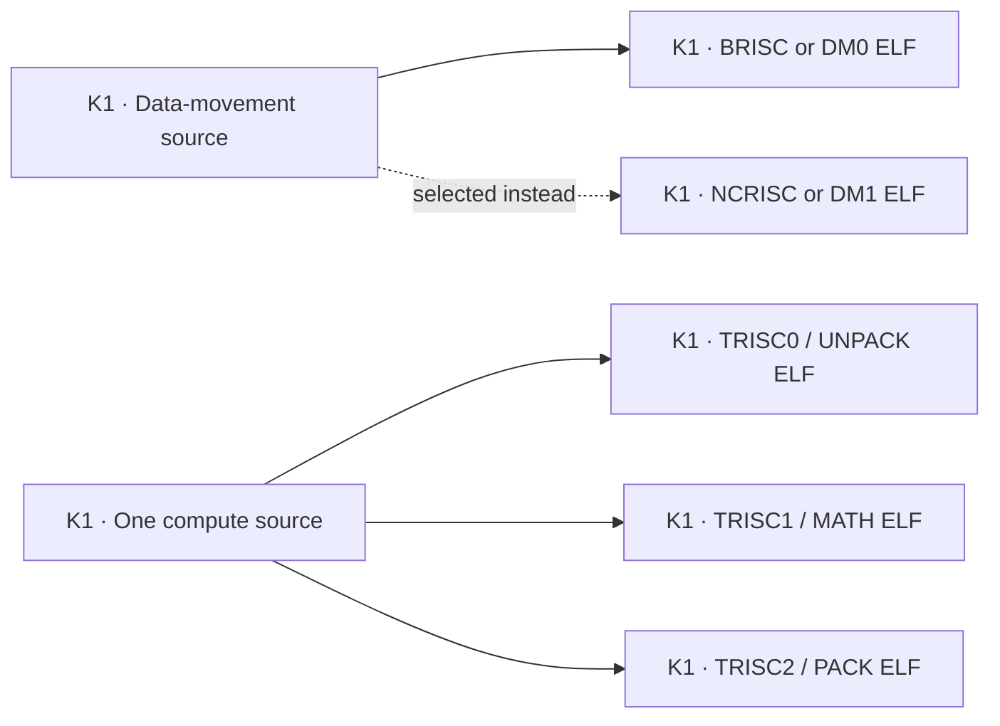

This build graph is deliberately small: it shows binary multiplicity without
mixing in upload or launch order. **K1 code:**
[`kernel.cpp:900–955`](https://github.com/tenstorrent/tt-metal/blob/50a82f835593512c4176546b4af68d7e91315a86/tt_metal/impl/kernels/kernel.cpp#L900-L955)
selects the DM processor and produces the three compute variants.

## Sequence 2: first operation and warm relaunch

This second large diagram shows both the cache-miss branch and the common
worker launch. The chunk diagrams after it isolate binary transport, launch
ordering and worker execution.

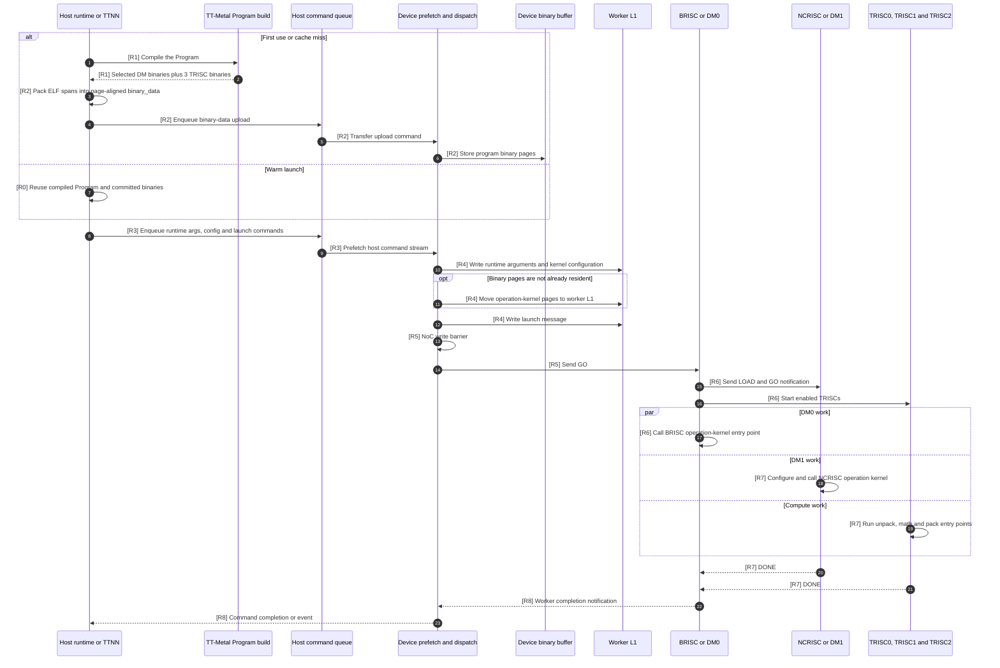

### Direct code links for the R-markers

| Marker in graph | Exact code location | Transition proved |
|---|---|---|
| R0 | [`dispatch.cpp:3246–3261`](https://github.com/tenstorrent/tt-metal/blob/50a82f835593512c4176546b4af68d7e91315a86/tt_metal/impl/program/dispatch.cpp#L3246-L3261) | Committed/warm binary branch can omit binary transfer |
| R1 | [`kernel.cpp:900–955`](https://github.com/tenstorrent/tt-metal/blob/50a82f835593512c4176546b4af68d7e91315a86/tt_metal/impl/kernels/kernel.cpp#L900-L955) | Build selected DM target and three compute variants |
| R2 | [`program.cpp:2134–2225`](https://github.com/tenstorrent/tt-metal/blob/50a82f835593512c4176546b4af68d7e91315a86/tt_metal/impl/program/program.cpp#L2134-L2225) and [`mesh_workload.cpp:124–195`](https://github.com/tenstorrent/tt-metal/blob/50a82f835593512c4176546b4af68d7e91315a86/tt_metal/distributed/mesh_workload.cpp#L124-L195) | Flatten ELF spans and upload the replicated binary buffer |
| R3 | [`dispatch.cpp:3169–3277`](https://github.com/tenstorrent/tt-metal/blob/50a82f835593512c4176546b4af68d7e91315a86/tt_metal/impl/program/dispatch.cpp#L3169-L3277) | Assemble host-CQ runtime/config/binary/launch/GO order |
| R4 | [`dispatch.cpp:1647–1921`](https://github.com/tenstorrent/tt-metal/blob/50a82f835593512c4176546b4af68d7e91315a86/tt_metal/impl/program/dispatch.cpp#L1647-L1921) and [`dispatch.cpp:2128–2336`](https://github.com/tenstorrent/tt-metal/blob/50a82f835593512c4176546b4af68d7e91315a86/tt_metal/impl/program/dispatch.cpp#L2128-L2336) | Build binary-placement and launch-message writes |
| R5 | [`dispatch.cpp:2355–2422`](https://github.com/tenstorrent/tt-metal/blob/50a82f835593512c4176546b4af68d7e91315a86/tt_metal/impl/program/dispatch.cpp#L2355-L2422) | Place NoC ordering barrier before GO |
| R6 | [`brisc.cc:389–542`](https://github.com/tenstorrent/tt-metal/blob/50a82f835593512c4176546b4af68d7e91315a86/tt_metal/hw/firmware/src/tt-1xx/brisc.cc#L389-L542) | BRISC consumes GO, configures the run and starts peers |
| R7 | [`ncrisc.cc:126–192`](https://github.com/tenstorrent/tt-metal/blob/50a82f835593512c4176546b4af68d7e91315a86/tt_metal/hw/firmware/src/tt-1xx/ncrisc.cc#L126-L192) and [`trisc.cc:152–223`](https://github.com/tenstorrent/tt-metal/blob/50a82f835593512c4176546b4af68d7e91315a86/tt_metal/hw/firmware/src/tt-1xx/trisc.cc#L152-L223) | NCRISC and TRISCs call their operation entry points and finish |
| R8 | [`brisc.cc:574–592`](https://github.com/tenstorrent/tt-metal/blob/50a82f835593512c4176546b4af68d7e91315a86/tt_metal/hw/firmware/src/tt-1xx/brisc.cc#L574-L592) | BRISC publishes operation completion |

### Code evidence for sequence 2

#### Chunk R1–R2: cache miss and binary upload

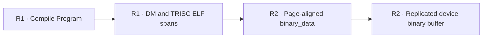

Upload to the device binary buffer and placement into a worker's executable L1
region are different events. Record them separately.

#### Chunk R3–R5: ordered launch transport

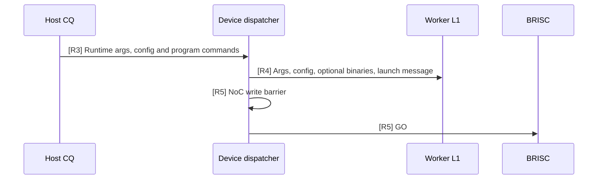

The barrier is the boundary between state placement and execution. A GO before
those writes are ordered would let resident firmware observe incomplete launch
state.

#### Chunk R6–R8: worker execution and completion

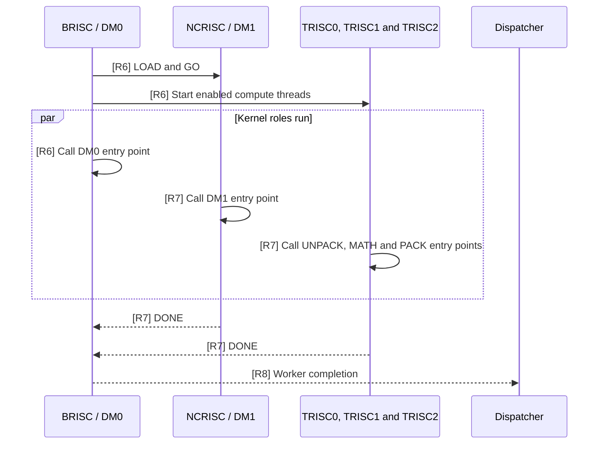

The persistent firmware remains in control around the call. The user operation
kernel is entered and returned from; it is not a new boot image.

#### Cache comparison: first use versus warm use

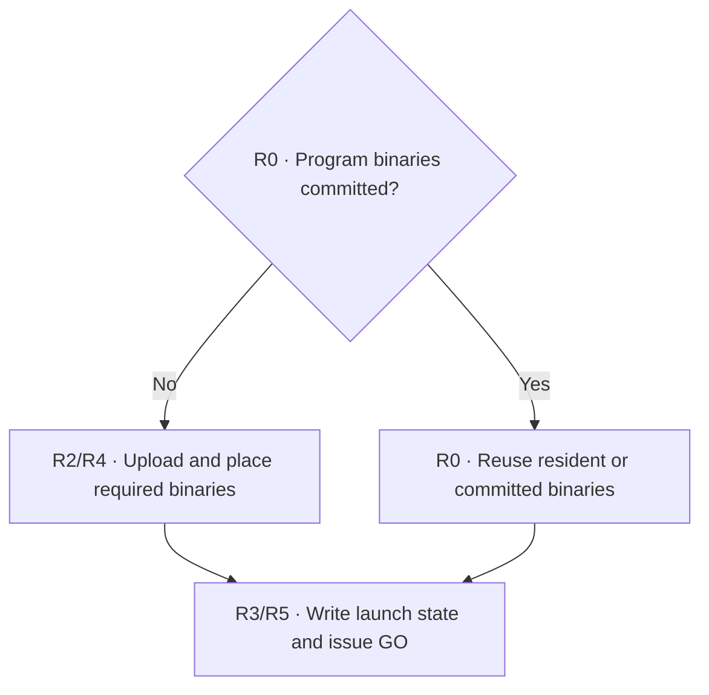

The two branches converge before launch. A cache hit can remove binary traffic,
but it does not remove the runtime arguments, launch message, ordering barrier
or GO required for the new operation instance. The inspected committed-binary
branch is in
[`dispatch.cpp`](https://github.com/tenstorrent/tt-metal/blob/50a82f835593512c4176546b4af68d7e91315a86/tt_metal/impl/program/dispatch.cpp#L3246-L3261).

1. The distributed workload path orders compile, binary loading, command
   generation and enqueue in
   [`distributed.cpp`](https://github.com/tenstorrent/tt-metal/blob/50a82f835593512c4176546b4af68d7e91315a86/tt_metal/distributed/distributed.cpp#L115-L127).
2. `Program` flattens ELF spans into page-aligned `binary_data` and records the
   destination address, size, offset and processor metadata in
   [`program.cpp`](https://github.com/tenstorrent/tt-metal/blob/50a82f835593512c4176546b4af68d7e91315a86/tt_metal/impl/program/program.cpp#L2134-L2225).
3. First use allocates a replicated binary buffer and enqueues its write in
   [`mesh_workload.cpp`](https://github.com/tenstorrent/tt-metal/blob/50a82f835593512c4176546b4af68d7e91315a86/tt_metal/distributed/mesh_workload.cpp#L124-L195).
4. Program-binary dispatch commands move selected pages into worker L1 through
   NoC writes in
   [`dispatch.cpp`](https://github.com/tenstorrent/tt-metal/blob/50a82f835593512c4176546b4af68d7e91315a86/tt_metal/impl/program/dispatch.cpp#L1647-L1921).
5. Launch-message commands are created in
   [`dispatch.cpp`](https://github.com/tenstorrent/tt-metal/blob/50a82f835593512c4176546b4af68d7e91315a86/tt_metal/impl/program/dispatch.cpp#L2128-L2336),
   followed by the NoC barrier and GO sequence at
   [`dispatch.cpp`](https://github.com/tenstorrent/tt-metal/blob/50a82f835593512c4176546b4af68d7e91315a86/tt_metal/impl/program/dispatch.cpp#L2355-L2422).
6. The assembled host-CQ order—runtime arguments, config, optional binaries,
   launch message and GO—is visible in
   [`dispatch.cpp`](https://github.com/tenstorrent/tt-metal/blob/50a82f835593512c4176546b4af68d7e91315a86/tt_metal/impl/program/dispatch.cpp#L3169-L3277).
7. BRISC consumes GO, starts NCRISC/TRISCs, calls its own operation kernel and
   collects completion in
   [`brisc.cc`](https://github.com/tenstorrent/tt-metal/blob/50a82f835593512c4176546b4af68d7e91315a86/tt_metal/hw/firmware/src/tt-1xx/brisc.cc#L389-L592).
8. NCRISC prepares and calls its operation kernel in
   [`ncrisc.cc`](https://github.com/tenstorrent/tt-metal/blob/50a82f835593512c4176546b4af68d7e91315a86/tt_metal/hw/firmware/src/tt-1xx/ncrisc.cc#L126-L192).
9. Each TRISC reads its launch/configuration state, calculates its entry point
   and calls the compiled kernel in
   [`trisc.cc`](https://github.com/tenstorrent/tt-metal/blob/50a82f835593512c4176546b4af68d7e91315a86/tt_metal/hw/firmware/src/tt-1xx/trisc.cc#L152-L223).

### Wormhole NCRISC IRAM nuance

On Wormhole, NCRISC copies its **operation kernel** from shared L1 into NCRISC
IRAM before executing it. The explicit load is visible in
[`ncrisc.cc`](https://github.com/tenstorrent/tt-metal/blob/50a82f835593512c4176546b4af68d7e91315a86/tt_metal/hw/firmware/src/tt-1xx/ncrisc.cc#L95-L187).
That relocation can look like firmware forwarding in a trace. It is not the
cold-boot firmware path and NCRISC does not use it to distribute BRISC or TRISC
firmware.

## Slow dispatch as the control experiment

Slow dispatch bypasses the persistent device prefetch/dispatcher path. The host
configures the Program, writes runtime arguments and kernel binaries directly,
writes launch/GO state and waits. The top-level flow is in
[`tt_metal.cpp`](https://github.com/tenstorrent/tt-metal/blob/50a82f835593512c4176546b4af68d7e91315a86/tt_metal/impl/host_api/tt_metal.cpp#L924-L1017).

Use slow dispatch first because the host call stack maps more directly to each
device write. Then repeat with fast dispatch to identify which direct writes
became command-queue packets and device-side NoC writes.

## What “loading a model” means

```text
TTNN or framework graph
          ↓
ordered tensor operations
          ↓
TT-Metal Programs, one or more per operation
          ↓
compile and upload only on a cache miss
          ↓
runtime arguments + config + launch message + GO
          ↓
resident firmware calls operation kernels
```

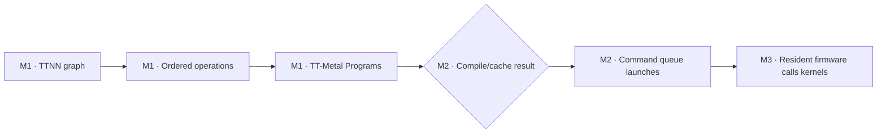

This smaller graph describes the software abstraction boundary. It deliberately
omits individual RISCs because the preceding R3–R8 chunks already explain that
lower layer. **Direct code:** [M1 workload ordering in
`distributed.cpp:115–127`](https://github.com/tenstorrent/tt-metal/blob/50a82f835593512c4176546b4af68d7e91315a86/tt_metal/distributed/distributed.cpp#L115-L127),
[M2 command sequence in `dispatch.cpp:3169–3277`](https://github.com/tenstorrent/tt-metal/blob/50a82f835593512c4176546b4af68d7e91315a86/tt_metal/impl/program/dispatch.cpp#L3169-L3277),
and [M3 worker calls in `brisc.cc:389–592`](https://github.com/tenstorrent/tt-metal/blob/50a82f835593512c4176546b4af68d7e91315a86/tt_metal/hw/firmware/src/tt-1xx/brisc.cc#L389-L592).

Model weights and activation buffers may be uploaded independently of kernel
code. A model does not normally carry a new BRISC/NCRISC/TRISC firmware image
for every operator. The host/device command queues preserve Program order and
events; the operation’s reader, compute and writer kernels implement the local
tile schedule with circular buffers, semaphores and NoC barriers.

## Quasar is a different topology

The previous diagrams apply to the traditional tt-1xx Wormhole/Blackhole
Tensix organization. Quasar/tt-2xx has hardware-thread indices for DM0–DM7 and
four NEO groups, each with TRISC0–TRISC3. The 24-entry layout is in
[`hw_thread.h`](https://github.com/tenstorrent/tt-metal/blob/50a82f835593512c4176546b4af68d7e91315a86/tt_metal/hw/inc/internal/hw_thread.h#L23-L28).

The tt-2xx HAL selects `dm.cc`/`dmk.cc` and `trisc.cc`/`trisck.cc` in
[`hal_2xx_common.cpp`](https://github.com/tenstorrent/tt-metal/blob/50a82f835593512c4176546b4af68d7e91315a86/tt_metal/llrt/hal/tt-2xx/hal_2xx_common.cpp#L99-L117).
DM0 performs supervisory initialization and per-operation coordination in
[`tt-2xx/dm.cc`](https://github.com/tenstorrent/tt-metal/blob/50a82f835593512c4176546b4af68d7e91315a86/tt_metal/hw/firmware/src/tt-2xx/dm.cc#L250-L395).

Therefore, a Quasar trace should use DM and NEO labels. Calling its processors
BRISC, NCRISC and three TRISCs would hide a real architectural change.

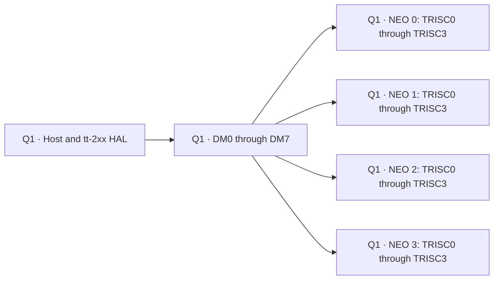

This is a topology cue, not a claim that every DM directly launches every NEO
thread. The detailed Quasar sequence must follow the tt-2xx reset and GO code.
**Q1 code:** [tt-2xx thread indices in `hw_thread.h:23–28`](https://github.com/tenstorrent/tt-metal/blob/50a82f835593512c4176546b4af68d7e91315a86/tt_metal/hw/inc/internal/hw_thread.h#L23-L28)
and [DM0 supervision in `tt-2xx/dm.cc:250–395`](https://github.com/tenstorrent/tt-metal/blob/50a82f835593512c4176546b4af68d7e91315a86/tt_metal/hw/firmware/src/tt-2xx/dm.cc#L250-L395).

## Repeatable validation experiment

Use one program with a DM0 reader, DM1 writer and one compute source.

### Run A: cold boot with slow dispatch

1. Set `TT_METAL_SLOW_DISPATCH_MODE=1` and use one worker core.
2. Break in host GDB at the firmware build/launch phase, Program compile,
   binary configuration and launch-message write.
3. Record the host backtrace, target core, destination address, byte count and
   processor ID for every binary write.
4. Dump the resulting ELF files with `readelf -h -l -s` and disassemble them
   with the TT RISC-V `objdump`.

Expected proof: five persistent firmware targets exist independently of the
operation’s selected DM targets and three compute binaries.

### Run B: device-side waypoints

Add minimal DPRINT/Watcher waypoints around:

```text
BOOT-0  host completed firmware writes
BOOT-1  BRISC entered initialization
BOOT-2  NCRISC and TRISCs reported INIT DONE
RUN-0   BRISC observed GO
RUN-1   each enabled operation-kernel entry point was reached
RUN-2   subordinate DONE reached BRISC
RUN-3   BRISC published worker completion
```

Filter to one worker core. Keep the text short because DPRINT changes the
instrumented binary and can affect timing.

### Run C: fast dispatch, first launch versus second launch

1. Disable slow dispatch and restart the process so CQ kernels initialize.
2. Enqueue the exact same `Program` twice with different runtime-argument data.
3. Capture dispatch command types or add host logging where the program-command
   sequence is assembled.
4. Prove that the first launch includes the required binary transfer while the
   committed/warm launch can omit it.
5. Prove that both launches still write launch state and issue GO.

### Acceptance checklist

- Every ELF is associated with one processor role and one load destination.
- Reset release is distinguished from GO.
- Initialization DONE is distinguished from operation DONE.
- First-use upload is distinguished from worker-L1 placement.
- Slow and fast dispatch show the same logical launch with different transport.
- The second identical launch demonstrates binary caching rather than assumed
  caching.
- Wormhole/Blackhole and Quasar evidence is never merged into one topology.

## Final mental model

```text
COLD BOOT
Host ──writes all persistent RISC firmware──► worker L1
Host ──releases──► BRISC
BRISC ──initializes/releases──► NCRISC + TRISC0/1/2

FAST-DISPATCH SETUP
Host ──installs──► persistent prefetch/dispatch Programs

FIRST PROGRAM USE
Host/JIT ──builds──► DM kernel(s) + three TRISC kernels
Host/CQ ──uploads and dispatches──► worker L1
Dispatcher ──launch message + barrier + GO──► BRISC
BRISC ──coordinates──► NCRISC + TRISC0/1/2

WARM PROGRAM USE
Host/CQ ──new arguments/config + launch + GO──► resident code
```

The key compiler/runtime insight is that Tenstorrent separates persistent
control firmware, persistent command transport, cacheable operation code and
per-launch state. Debugging becomes much clearer once every observed byte or
signal is assigned to one of those four lifetimes.
