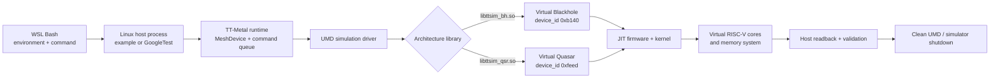
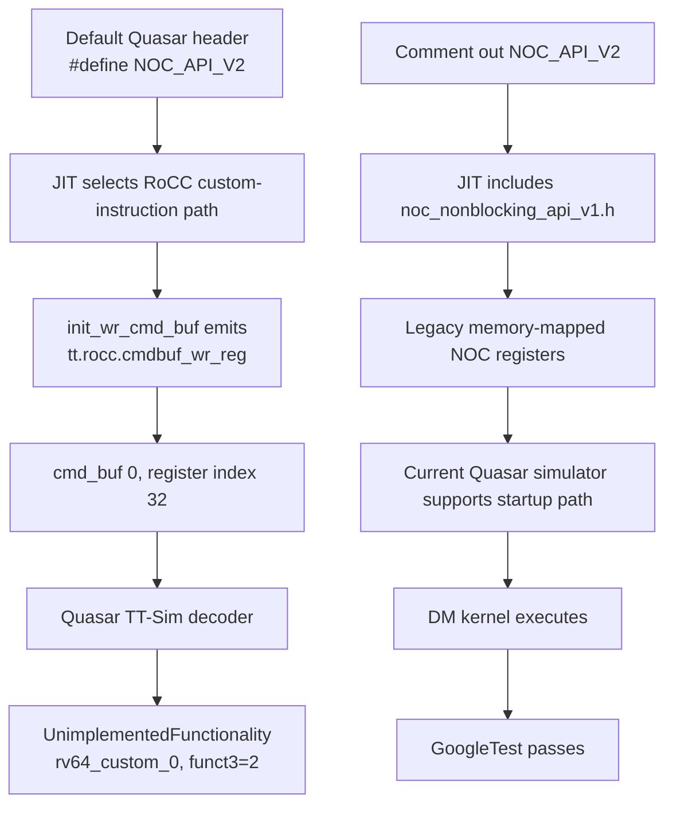

# TT-Sim execution sequences: Blackhole and Quasar

Verified on 16 August 2026 in WSL2 Ubuntu 22.04.5 with TT-Metal commit
`50a82f835593512c4176546b4af68d7e91315a86`.

These diagrams describe control and data ordering. Arrow length is not elapsed time,
and TT-Sim throughput is not silicon performance.

## Big picture



## Blackhole verified sequence: `14 + 7 = 21`

```mermaid
sequenceDiagram
    autonumber
    participant SH as WSL Bash
    participant HOST as Host example
    participant METAL as TT-Metal runtime
    participant SIM as UMD + libttsim_bh
    participant MEM as Virtual DRAM / L1
    participant BR as BRISC RISC-V
    participant CHECK as Host verifier

    SH->>HOST: Launch metal_example_add_2_integers_in_riscv
    Note over SH,HOST: TT_METAL_SIMULATOR=libttsim_bh.so<br/>blackhole_140_arch.yaml + slow dispatch
    HOST->>METAL: MeshDevice::create_unit_mesh(0)
    METAL->>SIM: Open user-mode simulation device
    SIM-->>METAL: TTSimTTDevice device_id=0xb140
    METAL->>METAL: Build one-device mesh control plane
    HOST->>MEM: Allocate src0/src1/dst in DRAM and L1 (six 4-byte buffers)
    HOST->>METAL: EnqueueWrite src0=14 (non-blocking)
    HOST->>METAL: EnqueueWrite src1=7 (non-blocking)
    HOST->>METAL: Create RISCV_0 kernel on core (0,0)
    Note over HOST,METAL: Runtime args contain six DRAM/L1 addresses
    HOST->>METAL: EnqueueMeshWorkload (non-blocking)
    METAL->>SIM: JIT/load firmware and BRISC kernel; dispatch FIFO
    SIM->>BR: Execute kernel_main
    BR->>MEM: noc_async_read both DRAM operands into L1
    BR->>BR: noc_async_read_barrier
    MEM-->>BR: L1 values 14 and 7 are usable
    BR->>BR: RISC-V integer add produces 21
    BR->>MEM: Store 21 in destination L1
    BR->>BR: load_blocking orders CPU store before NoC read
    BR->>MEM: noc_async_write L1 to destination DRAM
    BR->>BR: noc_async_write_barrier
    HOST->>METAL: EnqueueRead destination (blocking)
    Note over HOST,METAL: Same FIFO queue means read follows input writes and workload
    METAL->>MEM: Read destination DRAM
    MEM-->>CHECK: One uint32_t = 21
    CHECK->>CHECK: size == 1 and value == 21
    CHECK-->>SH: Success: Result is 21
    HOST->>SIM: Close MeshDevice
    SIM-->>SH: Clean shutdown + simulator KHz statistic
```

The ordering hinges are:

1. Host writes, workload and host read use the same FIFO command queue.
2. `noc_async_read_barrier()` makes both input values available in L1.
3. `load_blocking()` orders the BRISC CPU store before NoC consumes destination L1.
4. `noc_async_write_barrier()` completes publication to DRAM before kernel exit.
5. The final host read is blocking, so validation sees completed device work.

## Quasar verified sequence: `0 → 0x12345678`

```mermaid
sequenceDiagram
    autonumber
    participant SH as WSL Bash
    participant TEST as GoogleTest fixture
    participant METAL as TT-Metal / Metal 2
    participant SIM as UMD + libttsim_qsr
    participant FW as DM + TRISC firmware
    participant CACHE as L1D / L2 / TL1
    participant ASSERT as GoogleTest assertion

    SH->>TEST: Run QuasarMeshDeviceSingleCardFixture.SingleDmL1Write
    Note over SH,TEST: libttsim_qsr.so + quasar_32_arch.yaml<br/>slow dispatch + DPRINT core 0,0
    TEST->>METAL: Request one Quasar simulated mesh device
    METAL->>SIM: Create Simulation device
    SIM-->>METAL: TTSimTTDevice device_id=0xfeed
    METAL->>METAL: Auto-discover a 1x1 mesh control plane
    METAL->>FW: JIT seven artifacts in fresh cache
    Note over METAL,FW: NOC_API_V2 disabled; legacy NOC V1 MMIO path compiled
    SIM->>FW: Start device and release firmware from reset
    FW-->>TEST: DM0-DM7 initialized
    FW-->>TEST: 16 TRISC hart IDs initialized across N0-N3
    FW-->>METAL: DM0 waits for GO
    TEST->>CACHE: WriteToDeviceL1(address, 0)
    TEST->>METAL: Build ProgramSpec single_dm_l1_write
    Note over TEST,METAL: node (0,0), two DM threads,<br/>address + common value 0x12345678
    TEST->>METAL: EnqueueMeshWorkload (blocking)
    METAL->>FW: Send GO and runtime arguments
    FW->>CACHE: CoreLocalMem[address] = 0x12345678
    Note over FW,CACHE: Initial destination was 0
    FW->>CACHE: fence
    FW->>CACHE: write address to L2_FLUSH64 MMIO register
    FW->>CACHE: fence
    Note over FW,CACHE: Dirty data becomes visible in TL1 node memory
    METAL-->>TEST: Blocking workload complete
    TEST->>CACHE: ReadFromDeviceL1(address, 4 bytes)
    CACHE-->>ASSERT: outputs[0] = 0x12345678
    ASSERT->>ASSERT: ASSERT_EQ(outputs[0], value)
    ASSERT-->>SH: [ PASSED ] 1 test (2329 ms observed)
    TEST->>SIM: Detach DPRINT and close device
    SIM-->>SH: Clean shutdown + 46.0 KHz statistic
```

### Quasar cache visibility


`flush_l2_cache_line(address)` is implemented as a fence, a 64-bit write to the
Quasar L2 cache-controller flush register, and another fence. That operation is
why the host read observes the DM core's cached store.

## Quasar NOC V2 failure and V1 workaround



The failure occurs during NOC command-buffer initialization, before the test
kernel reaches its `flush_l2_cache_line()` call. It is therefore not caused by
WSL, the Quasar descriptor, GoogleTest, or the cache flush itself.

The current TT-Sim README explicitly states that most Quasar tests, including
this test, require `NOC_API_V2` to be disabled. Quasar is pre-silicon and its
simulator is distributed as a binary, so this workaround should be treated as a
bring-up compatibility setting rather than production guidance.

## Architectural comparison

| Boundary | Blackhole smoke test | Quasar single-DM test |
|---|---|---|
| Entry program | Standalone Metalium example | Filtered GoogleTest |
| Virtual device proof | `device_id=0xb140` | `device_id=0xfeed` |
| Device work | One RISCV_0 / BRISC kernel | Quasar DM firmware plus two-thread DM kernel |
| Input | Host vectors `14`, `7` in DRAM | Host seeds unreserved L1 with `0` |
| Core operation | Four-byte RISC-V addition | Four-byte `CoreLocalMem` store |
| Visibility path | DRAM → NoC → L1 → add → NoC → DRAM | DM L1D → L2 flush → TL1 |
| Ordering primitives | NoC read/write barriers and `load_blocking()` | Blocking workload, fences and L2 flush-register write |
| Host validation | Vector size and result equal `21` | `ASSERT_EQ` with `0x12345678` |
| Observed verdict | `Success: Result is 21` | `[ PASSED ] 1 test` |
| Compatibility note | Tested directly with released Blackhole simulator | Requires NOC V1 workaround for current Quasar simulator |

## Primary references

- [TT-Sim README and Quasar known issues](https://github.com/tenstorrent/ttsim#known-issues)
- [Blackhole host example at the verified TT-Metal commit](https://github.com/tenstorrent/tt-metal/blob/50a82f835593512c4176546b4af68d7e91315a86/tt_metal/programming_examples/add_2_integers_in_riscv/add_2_integers_in_riscv.cpp)
- [Blackhole BRISC kernel](https://github.com/tenstorrent/tt-metal/blob/50a82f835593512c4176546b4af68d7e91315a86/tt_metal/programming_examples/add_2_integers_in_riscv/kernels/reader_writer_add_in_riscv.cpp)
- [Quasar host test](https://github.com/tenstorrent/tt-metal/blob/50a82f835593512c4176546b4af68d7e91315a86/tests/tt_metal/tt_metal/test_single_dm_l1_write.cpp)
- [Quasar DM kernel](https://github.com/tenstorrent/tt-metal/blob/50a82f835593512c4176546b4af68d7e91315a86/tests/tt_metal/tt_metal/test_kernels/dataflow/simple_l1_write.cpp)
- [Quasar NOC V1/V2 selection header](https://github.com/tenstorrent/tt-metal/blob/50a82f835593512c4176546b4af68d7e91315a86/tt_metal/hw/inc/internal/tt-2xx/quasar/noc_nonblocking_api.h)
- [Quasar cache-operation implementation](https://github.com/tenstorrent/tt-metal/blob/50a82f835593512c4176546b4af68d7e91315a86/tt_metal/hw/inc/internal/tt-2xx/risc_common.h)
