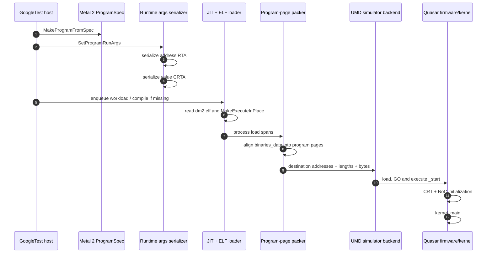
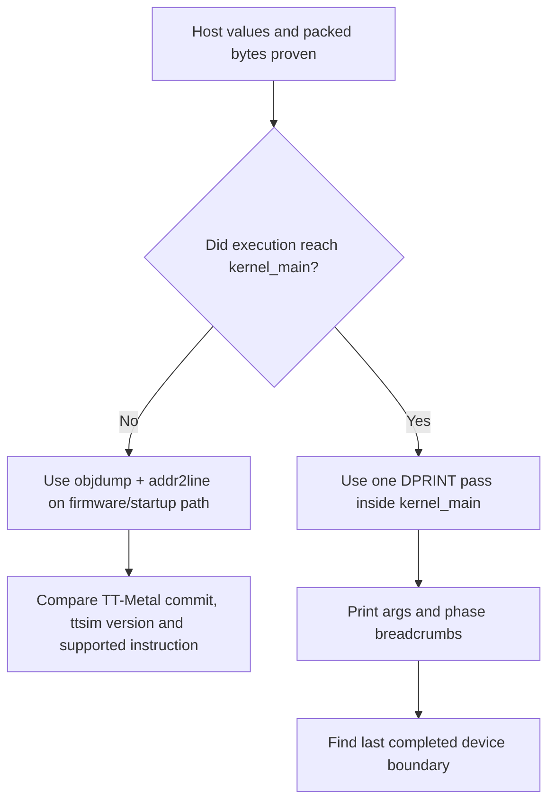

# WSL coding-agent and host-to-device debugging lab

Verified for the following working context on **16 August 2026**:

- WSL2, Ubuntu 22.04;
- TT-Metal checkout: `~/src/tt-metal`;
- TT-Metal commit: `50a82f835593512c4176546b4af68d7e91315a86`;
- Quasar simulator: `~/sim/libttsim_qsr.so` from ttsim v1.10.1;
- target test: `QuasarMeshDeviceSingleCardFixture.SingleDmL1Write`.

This lab answers two related questions:

1. How should Codex or Claude Code run inside WSL so it can edit, build and
   test TT-Metal with the same Linux tools as a human developer?
2. How can GDB, RISC-V ELF tools and DPRINT prove each transition from the
   host test to the simulated device kernel?

The objective is not to collect as many logs as possible. It is to identify
the **last proven-correct boundary** and the **first incorrect boundary**.

## Result first

Use this division of responsibility:

| Boundary | Tool | What it proves |
| --- | --- | --- |
| Agent and editor | Codex or Claude Code launched inside WSL; VS Code WSL window | Edits and commands use Linux paths and Linux toolchains |
| Host C++ call stack | `/usr/bin/gdb` against a `build-debug` executable | Program construction, runtime arguments, ELF packing, dispatch and simulator calls |
| Exact executable image | TT `readelf`, `objdump`, `addr2line`; optionally host GDB on `binaries_data` | Which RISC-V instructions and load spans were prepared for the device |
| Device startup before `kernel_main` | RISC-V disassembly and source mapping | Firmware/CRT/NoC initialization reached before user code |
| Running device kernel | DPRINT on one core and one RISC role | Runtime argument values and phase breadcrumbs inside `kernel_main` |
| Hang or invalid device state | Watcher in a separate run | Last waypoint, active kernel and selected NoC/CB errors |
| Timing chronology | Tracy or Device Profiler in a separate run | Ordering and duration in the observed environment, never silicon speed |

Host GDB does **not** debug the simulated RISC-V processor. DPRINT does **not**
provide a conventional call stack. Treat those as separate debugging domains.

## Logic review of the debugging plan

### Accepted premises

- The Linux host test is a normal x86-64 process, so GDB can inspect its call
  stack and memory.
- The device kernel is a separate RISC-V ELF with its own entry point, startup
  code, address space and runtime arguments.
- TT-Metal transfers kernel code, runtime arguments and launch/dispatch state as
  separate objects.
- An instrumented device kernel is a different binary from the baseline kernel.

### Rejected premises

- **“A breakpoint in `simple_l1_write.cpp` should work in ordinary VS Code
  GDB.”** That breakpoint belongs to simulated RISC-V code, not the x86 host
  process.
- **“If DPRINT shows nothing, the host did not launch the kernel.”** Execution
  may have stopped in firmware or NoC initialization before the first print.
- **“The ELF file size is the number of bytes sent to the device.”** Debug
  sections remain in the file, while TT-Metal parses loadable segments,
  performs the target's XIP transformation and packs aligned program pages.
- **“Enabling GDB, DPRINT, Watcher and the profiler together provides stronger
  evidence.”** Multiple observers change timing, memory use and generated
  binaries, making the result harder to interpret.

### Ordering decision

GDB comes first because it can prove the unmodified host-side inputs without
changing the device kernel. DPRINT comes later, after the host has been cleared,
because enabling it causes a new JIT artifact. RISC-V disassembly bridges the
two domains and is essential when failure occurs before `kernel_main`.

## Phase 0 — keep all development inside WSL

The repository is already in the correct location:

```text
/home/n/src/tt-metal
```

Avoid developing under `/mnt/c`. Linux-native source, build and cache paths
avoid the cross-filesystem performance and permission problems documented by
both coding-agent vendors.

### Audit the current shell

```bash
cd ~/src/tt-metal

printf 'distro=%s\n' "$WSL_DISTRO_NAME"
pwd
git status --short --branch

command -v codex || true
command -v claude || true
command -v code || true
command -v gdb || true
command -v node || true
command -v npm || true
```

The coding agents and debugger should resolve to Linux paths under `/home/n` or
`/usr`. A path under `/mnt/c` identifies a Windows executable leaking into the
WSL `PATH`.

On the audited machine, `codex` and `npm` initially resolved under `/mnt/c`,
`claude` was absent and Linux GDB was absent. `code` resolving to the Windows VS
Code launcher is expected: running `code .` from WSL opens a WSL Remote window.

### Install Linux debugging tools

```bash
sudo apt update
sudo apt install -y \
  gdb \
  gdb-multiarch \
  ripgrep \
  clangd \
  jq \
  less \
  strace \
  ltrace \
  bubblewrap \
  socat
```

### Install Codex inside WSL

```bash
curl -fsSL https://chatgpt.com/codex/install.sh | sh
export PATH="$HOME/.local/bin:$PATH"
hash -r
type -a codex
codex --version
```

The first `codex` entry must no longer be the Windows npm shim. Launch it from
the repository and inspect its scope:

```bash
cd ~/src/tt-metal
codex
```

Inside Codex, use `/status` and `/permissions` before authorizing edits or
commands. The official references are the [Codex WSL guide](https://learn.chatgpt.com/docs/windows/wsl),
[Codex CLI guide](https://learn.chatgpt.com/docs/codex/cli) and
[Codex IDE guide](https://learn.chatgpt.com/docs/codex/ide).

### Install Claude Code inside WSL

```bash
curl -fsSL https://claude.ai/install.sh | bash
export PATH="$HOME/.local/bin:$PATH"
hash -r
type -a claude
claude --version
claude doctor
```

Then launch from the same checkout:

```bash
cd ~/src/tt-metal
claude
```

See Anthropic's [WSL/Linux setup](https://code.claude.com/docs/en/setup) and
[VS Code integration](https://code.claude.com/docs/en/ide-integrations).

### Open the editor from WSL

```bash
cd ~/src/tt-metal

unset TT_METAL_DPRINT_CORES TT_METAL_DPRINT_RISCVS
unset TT_METAL_WATCHER TT_METAL_DEVICE_PROFILER
unset TT_METAL_NOC_DEBUG_DUMP TT_METAL_CHECKPOINT

code .
```

The lower-left status item must say `WSL: Ubuntu-22.04`, and the integrated
terminal must report `/home/n/src/tt-metal` from `pwd`.

Install the C/C++, CMake Tools, Codex and Claude Code extensions in the WSL
remote window. If the C++ extension is already installed only on Windows,
choose **Install in WSL: Ubuntu-22.04**.

## Phase 1 — give both agents one set of rules

Codex reads `AGENTS.md`. Claude Code reads `CLAUDE.md`, but Anthropic supports
importing `AGENTS.md` to avoid duplicated instructions.

At the TT-Metal repository root, create `AGENTS.md`:

```markdown
# TT-Metal Quasar debugging rules

- Run every build and test inside Ubuntu WSL2.
- Never use compilers, Node, npm or shell tools through `/mnt/c`.
- Before editing, record `git status --short` and `git rev-parse HEAD`.
- Preserve unrelated changes; do not reset or clean the worktree.
- Use `build-dev` for routine work and `build-debug` for host GDB.
- Build only the affected target whenever possible.
- Separate x86-64 host debugging from RISC-V device analysis.
- Use an isolated `TT_METAL_CACHE` for every observer mode.
- Never combine DPRINT, Watcher, Device Profiler or NoC Debug Dump.
- Reproduce the baseline before applying an instrumentation patch.
- Show the diff and validation result before committing.
- Do not commit, push or change remotes unless explicitly requested.
```

Create `CLAUDE.md`:

```markdown
@AGENTS.md
```

Read the official [Codex `AGENTS.md` behavior](https://learn.chatgpt.com/docs/agent-configuration/agents-md)
and [Claude Code project-memory behavior](https://code.claude.com/docs/en/memory).

If Codex and Claude Code run simultaneously, give each a separate Git worktree.
Two agents must never edit the same worktree concurrently.

## Phase 2 — build a host binary GDB can inspect

Use `RelWithDebInfo` for ordinary agent-assisted development:

```bash
cd ~/src/tt-metal

./build_metal.sh \
  --development \
  --export-compile-commands \
  --enable-ccache \
  --build-metal-tests \
  --build-dir build-dev
```

Use a separate Debug build for reliable local variables and source lines:

```bash
./build_metal.sh \
  --debug \
  --export-compile-commands \
  --enable-ccache \
  --build-metal-tests \
  --build-dir build-debug \
  --configure-only

cmake --build build-debug \
  --target unit_tests_legacy \
  -j"$(nproc)"
```

Validate the host symbols:

```bash
file build-debug/test/tt_metal/unit_tests_legacy
readelf -S build-debug/test/tt_metal/unit_tests_legacy \
  | grep -E 'debug_info|debug_line'
```

Configure VS Code to use the generated compilation database:

```json
{
  "C_Cpp.default.compileCommands": "${workspaceFolder}/build-debug/compile_commands.json"
}
```

The reusable launch configuration is checked into this guide's repository at
[`examples/vscode/launch.json`](https://github.com/buicongnguyen/tt-sim/blob/main/examples/vscode/launch.json).

## Phase 3 — capture an uninstrumented baseline

Use a new cache directory so every artifact belongs to this experiment:

```bash
cd ~/src/tt-metal

export TT_METAL_SIMULATOR="$HOME/sim/libttsim_qsr.so"
export TT_METAL_SLOW_DISPATCH_MODE=1
export TT_METAL_BACKEND_DUMP_RUN_CMD=1
export TT_METAL_CACHE="$HOME/ttsim-debug/baseline-$(date +%Y%m%d-%H%M%S)"

unset TT_METAL_DPRINT_CORES TT_METAL_DPRINT_RISCVS
unset TT_METAL_WATCHER TT_METAL_DEVICE_PROFILER
unset TT_METAL_NOC_DEBUG_DUMP TT_METAL_CHECKPOINT

cp tt_metal/soc_descriptors/quasar_32_arch.yaml \
  "$HOME/sim/soc_descriptor.yaml"

./build-debug/test/tt_metal/unit_tests_legacy \
  --gtest_filter=QuasarMeshDeviceSingleCardFixture.SingleDmL1Write \
  2>&1 | tee /tmp/quasar-baseline.log
```

Record:

- the complete test command and environment;
- TT-Metal commit and simulator hash;
- the first error, not only the final exception cascade;
- the JIT cache directory;
- whether the user kernel was reached.

## Phase 4 — trace the x86 host call stack with GDB

Run the host test directly before debugging through VS Code:

```bash
cd ~/src/tt-metal

gdb --args \
  ./build-debug/test/tt_metal/unit_tests_legacy \
  --gtest_filter=QuasarMeshDeviceSingleCardFixture.SingleDmL1Write
```

Recommended startup commands:

```text
(gdb) set pagination off
(gdb) set breakpoint pending on
(gdb) catch throw
(gdb) break tests/tt_metal/tt_metal/test_single_dm_l1_write.cpp:80
(gdb) break tests/tt_metal/tt_metal/test_single_dm_l1_write.cpp:88
(gdb) break tests/tt_metal/tt_metal/test_single_dm_l1_write.cpp:93
(gdb) break tt_metal/impl/metal2_host_api/program_run_args.cpp:704
(gdb) break tt_metal/impl/metal2_host_api/program_run_args.cpp:742
(gdb) break tt_metal/impl/kernels/kernel.cpp:984
(gdb) break tt_metal/llrt/tt_memory.cpp:28
(gdb) break tt_metal/llrt/tt_memory.cpp:48
(gdb) break tt_metal/impl/program/program.cpp:2211
(gdb) run
```

At each stop:

```text
(gdb) bt 12
(gdb) frame 0
(gdb) info args
(gdb) info locals
```

The repository also provides a reusable breakpoint file:

```bash
gdb \
  -x /path/to/tt-sim/examples/gdb/quasar-host-device.gdb \
  --args ./build-debug/test/tt_metal/unit_tests_legacy \
  --gtest_filter=QuasarMeshDeviceSingleCardFixture.SingleDmL1Write
```

### Expected host control flow



### Evidence gate A — program construction

At the test-source breakpoints, confirm:

```text
source = simple_l1_write.cpp
node = (0,0)
num_threads = 2
runtime argument = address
common runtime argument = value
value = 0x12345678
```

Do not proceed to device instrumentation if these values are already wrong.

### Evidence gate B — runtime argument serialization

At `program_run_args.cpp:704`:

```text
(gdb) print/x combined
```

`combined` contains the per-node named RTA. At
`program_run_args.cpp:742`:

```text
(gdb) print/x combined_crtas
```

`combined_crtas` must contain `0x12345678`. Runtime arguments are not embedded
as constants inside `dm2.elf`; they are dispatched separately.

### Evidence gate C — ELF and XIP transformation

At `tt_memory.cpp:28`, inspect `path`. It must name the expected `dm2.elf`. The
Quasar HAL selects `CONTIGUOUS_XIP`; `MakeExecuteInPlace()` transforms the
in-memory image, and `dm2.elf.xip.elf` is a diagnostic dump of that transformed
ELF.

### Evidence gate D — exact packed program pages

Stop at `program.cpp:2211`, before the transfer metadata vectors are moved:

```text
(gdb) print binaries_data.size()
(gdb) print/x dst_base_addrs
(gdb) print lengths
(gdb) print page_offsets
(gdb) print processor_ids
(gdb) x/64wx binaries_data._M_impl._M_start

(gdb) set $first = (char*)binaries_data._M_impl._M_start
(gdb) set $last = (char*)binaries_data._M_impl._M_finish
(gdb) dump binary memory /tmp/quasar-program-pages.bin $first $last
```

This dump is closer to the exact host dispatch payload than copying the ELF
file itself: it includes TT-Metal's span packing and program-page alignment.

For the direct slow-load path, also stop in `tt_metal/llrt/llrt.cpp` around the
`cluster.write_core` call and inspect `addr`, `len_words` and `mem_ptr`.

## Phase 5 — map device startup without pretending host GDB can step it

Find the freshly generated kernel:

```bash
find "$TT_METAL_CACHE" -type f \
  -path '*/kernels/simple_l1_write/*/dm2/dm2.elf' \
  -print
```

Set its path and inspect it:

```bash
ELF=/path/from/find/dm2.elf
TC=runtime/sfpi/compiler/bin

"$TC/riscv-tt-elf-readelf" -h -l -S "$ELF"

"$TC/riscv-tt-elf-objdump" \
  -d -C -S --show-raw-insn \
  "$ELF" | less
```

For the audited artifact:

```text
ELF64 little-endian RISC-V
entry point        0x400000
user arg loads     0x400308 and 0x40030c
L1 store           0x400310
cache flush write  0x40031c
```

Resolve the key addresses:

```bash
"$TC/riscv-tt-elf-addr2line" \
  -e "$ELF" -f -C \
  0x400254 0x400308 0x400310 0x40031c
```

The observed simulator error:

```text
UnimplementedFunctionality:
rv64_custom_0: funct3=2 reg_index=32 cmd_buf=0
```

maps to:

```text
0x400254  4005a00b
tt.rocc.cmdbuf_wr_reg zero,0,32,a1,zero
```

`addr2line` maps that instruction to Quasar's `init_wr_cmd_buf()` and the write
of `NOC_V2_MAX_BYTES_IN_PACKET`. It occurs before the inlined `kernel_main` body
at `0x400308`. Therefore a DPRINT inserted only at the start of `kernel_main`
cannot observe this failure.

This is the critical decision gate:



## Phase 6 — use DPRINT as device breadcrumbs

Start a separate experiment with a separate cache:

```bash
export TT_METAL_CACHE="$HOME/ttsim-debug/dprint-$(date +%Y%m%d-%H%M%S)"
export TT_METAL_DPRINT_CORES=0,0
export TT_METAL_DPRINT_ONE_FILE_PER_RISC=1

unset TT_METAL_WATCHER TT_METAL_DEVICE_PROFILER
unset TT_METAL_NOC_DEBUG_DUMP
```

Add minimal breadcrumbs to the device kernel:

```cpp
#include "api/debug/dprint.h"

void kernel_main() {
    uintptr_t dst_addr = get_arg(args::address);
    uint32_t value = get_arg(args::value);
    DPRINT("K0 args dst=0x{:x} value=0x{:x}\n", dst_addr, value);

    CoreLocalMem<uint32_t> buffer(dst_addr);
    DPRINT("K1 before store\n");
    buffer[0] = value;
    DPRINT("K2 after store\n");

    flush_l2_cache_line(dst_addr);
    DPRINT("K3 after flush\n");
}
```

Every line ends in `\n` so the host print server flushes it. The marker names
are intentionally short and ordered.

Interpret the last output:

| Last marker | Narrowed boundary |
| --- | --- |
| No marker | Failure occurred before `kernel_main`, or DPRINT selection is wrong |
| `K0` | Arguments were read; failure occurred before/during local-memory setup or store |
| `K1` | Store is the next suspect |
| `K2` | Store completed; cache flush is the next suspect |
| `K3` | Device body completed; inspect completion, dispatch and host readback |

### Optional device stack-pointer observation

If stack corruption is a real hypothesis, record the RISC-V stack pointer at a
small number of boundaries:

```cpp
uintptr_t current_sp;
asm volatile("mv %0, sp" : "=r"(current_sp));
DPRINT("K0 sp=0x{:x}\n", current_sp);
```

This is not a call stack. Optimized kernel code is heavily inlined and TT-Sim
does not currently expose a conventional RISC-V GDB remote session in this
workflow. Use source-mapped disassembly for static call flow and breadcrumbs for
live flow.

## Phase 7 — use Watcher or profiling only after correctness

Run Watcher as a separate process and cache after removing DPRINT:

```bash
unset TT_METAL_DPRINT_CORES TT_METAL_DPRINT_RISCVS
unset TT_METAL_DEVICE_PROFILER TT_METAL_NOC_DEBUG_DUMP

export TT_METAL_WATCHER=10
export TT_METAL_WATCHER_APPEND=1
export TT_METAL_CACHE="$HOME/ttsim-debug/watcher-$(date +%Y%m%d-%H%M%S)"
```

The pinned Blackhole simulator lane is the verified Watcher practice path. The
pinned Quasar pair reaches the same unsupported custom instruction with Watcher,
so DPRINT plus ELF analysis remains the useful Quasar path.

Use Tracy for host chronology after correctness is understood. Do not interpret
simulator or instrumented durations as hardware performance.

## Phase 8 — minimal code-change loop for an agent

Give Codex or Claude Code this task:

```text
Diagnose QuasarMeshDeviceSingleCardFixture.SingleDmL1Write.

First inspect git status and record the TT-Metal commit. Do not edit yet.
Run one uninstrumented baseline with an isolated TT_METAL_CACHE.
Use host GDB to prove ProgramSpec, RTA, CRTA, ELF path and packed program pages.
Then map the first simulator error with riscv-tt-elf-objdump and addr2line.

State whether failure is before or after kernel_main. Propose one minimal
instrumentation patch at the earliest observable boundary. Wait for approval
before editing. Never combine DPRINT, Watcher, Device Profiler or NoC Debug Dump.
After editing, rebuild only the required target, rerun once and show the diff,
binary hash, last successful marker and complete test verdict.
```

Use this review checklist before accepting the agent's patch:

- [ ] Baseline command and output were saved before editing.
- [ ] The edit targets the earliest unproven boundary.
- [ ] Host and device debugging domains are not confused.
- [ ] A new JIT cache distinguishes the instrumented binary.
- [ ] DPRINT output ends with `\n` and targets one core/RISC.
- [ ] The exact generated ELF and its SHA-256 are recorded.
- [ ] `addr2line` confirms the relevant device source line.
- [ ] The final diff contains no build, cache or generated log files.
- [ ] The agent did not commit or push without explicit authorization.

## Evidence record template

```markdown
# Host-to-device trace — YYYY-MM-DD

- TT-Metal commit:
- ttsim library/version/SHA-256:
- Architecture descriptor:
- Agent and version:
- Build directory/type:
- Observer mode: baseline | GDB | DPRINT | Watcher | profiler
- TT_METAL_CACHE:
- Exact command:

## Host evidence

- ProgramSpec source/core:
- RTA words:
- CRTA words:
- ELF path:
- XIP/packed page bytes and destinations:
- Host backtrace at first failure:

## Device evidence

- ELF SHA-256:
- Entry point:
- First failing PC/raw instruction:
- addr2line result:
- Last DPRINT/waypoint:

## Conclusion

- Last proven-correct boundary:
- First unproven/incorrect boundary:
- Minimal next experiment:
```

## Primary references

- [OpenAI Codex in WSL](https://learn.chatgpt.com/docs/windows/wsl)
- [OpenAI Codex CLI](https://learn.chatgpt.com/docs/codex/cli)
- [OpenAI Codex IDE extension](https://learn.chatgpt.com/docs/codex/ide)
- [OpenAI Codex project instructions](https://learn.chatgpt.com/docs/agent-configuration/agents-md)
- [Claude Code setup](https://code.claude.com/docs/en/setup)
- [Claude Code VS Code integration](https://code.claude.com/docs/en/ide-integrations)
- [Claude Code project memory](https://code.claude.com/docs/en/memory)
- [TT-Metalium debugging tools](https://docs.tenstorrent.com/tt-metal/latest/tt-metalium/tools/index.html)
- [Device Debug Print](https://docs.tenstorrent.com/tt-metal/latest/tt-metalium/tools/device_print.html)
- [Watcher](https://docs.tenstorrent.com/tt-metal/latest/tt-metalium/tools/watcher.html)
- [Tracy Profiler](https://docs.tenstorrent.com/tt-metal/latest/tt-metalium/tools/tracy_profiler.html)
- [TT-Metal pinned host test](https://github.com/tenstorrent/tt-metal/blob/50a82f835593512c4176546b4af68d7e91315a86/tests/tt_metal/tt_metal/test_single_dm_l1_write.cpp)
- [TT-Metal pinned device kernel](https://github.com/tenstorrent/tt-metal/blob/50a82f835593512c4176546b4af68d7e91315a86/tests/tt_metal/tt_metal/test_kernels/dataflow/simple_l1_write.cpp)
- [Pinned runtime-argument serializer](https://github.com/tenstorrent/tt-metal/blob/50a82f835593512c4176546b4af68d7e91315a86/tt_metal/impl/metal2_host_api/program_run_args.cpp)
- [Pinned ELF/XIP loader](https://github.com/tenstorrent/tt-metal/blob/50a82f835593512c4176546b4af68d7e91315a86/tt_metal/llrt/tt_memory.cpp)
- [Pinned program-page packer](https://github.com/tenstorrent/tt-metal/blob/50a82f835593512c4176546b4af68d7e91315a86/tt_metal/impl/program/program.cpp)
- [Pinned Quasar NoC initialization](https://github.com/tenstorrent/tt-metal/blob/50a82f835593512c4176546b4af68d7e91315a86/tt_metal/hw/inc/internal/tt-2xx/quasar/noc_nonblocking_api_v2.h)
