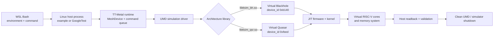
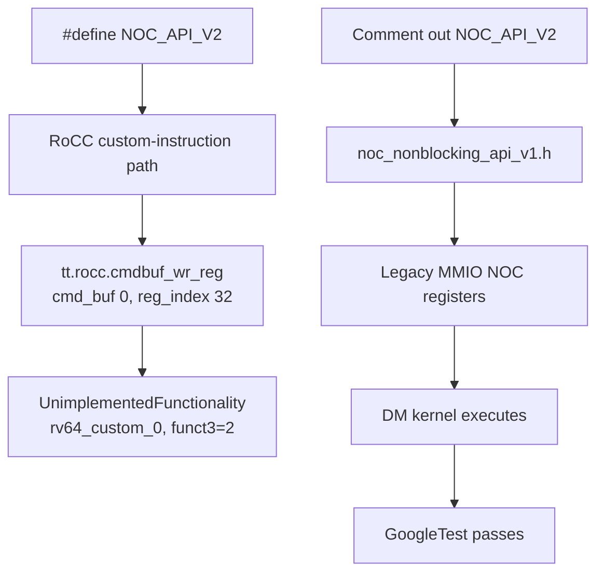

# TT-Sim execution sequences: Blackhole and Quasar

Verified on 16 August 2026 in WSL2 Ubuntu 22.04.5 with TT-Metal commit
`50a82f835593512c4176546b4af68d7e91315a86`.

These diagrams describe control and data ordering. Arrow length is not elapsed time,
and TT-Sim throughput is not silicon performance.

## Big picture



## Blackhole verified sequence: `14 + 7 = 21`

```mermaid
sequenceDiagram
    autonumber
    participant SH as WSL Bash
    participant HOST as Host example
    participant METAL as TT-Metal runtime
    participant SIM as UMD + libttsim_bh
    participant MEM as Virtual DRAM / L1
    participant BR as BRISC RISC-V
    participant CHECK as Host verifier

    SH->>HOST: Launch metal_example_add_2_integers_in_riscv
    Note over SH,HOST: libttsim_bh.so + blackhole_140_arch.yaml + slow dispatch
    HOST->>METAL: MeshDevice::create_unit_mesh(0)
    METAL->>SIM: Open user-mode simulation device
    SIM-->>METAL: TTSimTTDevice device_id=0xb140
    HOST->>MEM: Allocate src0/src1/dst in DRAM and L1
    HOST->>METAL: Enqueue src0=14 and src1=7
    HOST->>METAL: Create RISCV_0 kernel on core (0,0)
    HOST->>METAL: EnqueueMeshWorkload
    METAL->>SIM: JIT/load firmware and dispatch FIFO
    SIM->>BR: Execute kernel_main
    BR->>MEM: NoC read both operands into L1
    BR->>BR: Read barrier; add 14 + 7
    BR->>MEM: Store 21; load_blocking; NoC write to DRAM
    BR->>BR: Write barrier
    HOST->>METAL: Blocking destination read
    MEM-->>CHECK: One uint32_t = 21
    CHECK-->>SH: Success: Result is 21
    HOST->>SIM: Close MeshDevice
```

## Quasar verified sequence: `0 → 0x12345678`

```mermaid
sequenceDiagram
    autonumber
    participant SH as WSL Bash
    participant TEST as GoogleTest fixture
    participant METAL as TT-Metal / Metal 2
    participant SIM as UMD + libttsim_qsr
    participant FW as DM + TRISC firmware
    participant CACHE as L1D / L2 / TL1
    participant ASSERT as GoogleTest assertion

    SH->>TEST: Run SingleDmL1Write
    Note over SH,TEST: libttsim_qsr.so + quasar_32_arch.yaml + NOC V1
    TEST->>METAL: Request one Quasar mesh device
    METAL->>SIM: Create Simulation device
    SIM-->>METAL: device_id=0xfeed
    METAL->>FW: JIT seven artifacts in fresh cache
    SIM->>FW: Release firmware from reset
    FW-->>TEST: DM0-DM7 and sixteen TRISCs initialized
    TEST->>CACHE: Seed unreserved L1 with 0
    TEST->>METAL: ProgramSpec: two DM threads, address, 0x12345678
    TEST->>METAL: Enqueue blocking workload
    METAL->>FW: Send GO
    FW->>CACHE: CoreLocalMem[address] = 0x12345678
    FW->>CACHE: fence; L2_FLUSH64 register write; fence
    TEST->>CACHE: ReadFromDeviceL1(address, 4 bytes)
    CACHE-->>ASSERT: 0x12345678
    ASSERT-->>SH: [ PASSED ] 1 test
    TEST->>SIM: Detach DPRINT and close
```

## Quasar NOC compatibility detour



The failed branch occurs during NOC command-buffer initialization, before the
test kernel reaches `flush_l2_cache_line()`. It is a documented Quasar TT-Sim
limitation, not a WSL or SoC-descriptor failure.

## Comparison

| Boundary | Blackhole | Quasar |
|---|---|---|
| Entry | Standalone Metalium example | Filtered GoogleTest |
| Device proof | `0xb140` | `0xfeed` |
| Worker | RISCV_0 / BRISC | DM firmware + two-thread DM kernel |
| Data path | DRAM → L1 → add → DRAM | DM L1D → L2 flush → TL1 |
| Host proof | `Success: Result is 21` | `[ PASSED ] 1 test` |
| Compatibility | Released path works directly | Current binary requires NOC V1 workaround |

## Primary references

- [TT-Sim README and Quasar known issues](https://github.com/tenstorrent/ttsim#known-issues)
- [Blackhole host example](https://github.com/tenstorrent/tt-metal/blob/50a82f835593512c4176546b4af68d7e91315a86/tt_metal/programming_examples/add_2_integers_in_riscv/add_2_integers_in_riscv.cpp)
- [Blackhole BRISC kernel](https://github.com/tenstorrent/tt-metal/blob/50a82f835593512c4176546b4af68d7e91315a86/tt_metal/programming_examples/add_2_integers_in_riscv/kernels/reader_writer_add_in_riscv.cpp)
- [Quasar host test](https://github.com/tenstorrent/tt-metal/blob/50a82f835593512c4176546b4af68d7e91315a86/tests/tt_metal/tt_metal/test_single_dm_l1_write.cpp)
- [Quasar DM kernel](https://github.com/tenstorrent/tt-metal/blob/50a82f835593512c4176546b4af68d7e91315a86/tests/tt_metal/tt_metal/test_kernels/dataflow/simple_l1_write.cpp)
- [Quasar NOC selection header](https://github.com/tenstorrent/tt-metal/blob/50a82f835593512c4176546b4af68d7e91315a86/tt_metal/hw/inc/internal/tt-2xx/quasar/noc_nonblocking_api.h)
- [Quasar cache operations](https://github.com/tenstorrent/tt-metal/blob/50a82f835593512c4176546b4af68d7e91315a86/tt_metal/hw/inc/internal/tt-2xx/risc_common.h)
